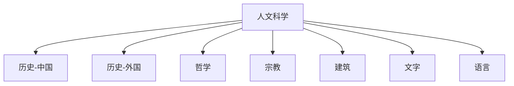

# 人文科学

人文科学目录用于整理历史、哲学、宗教、建筑、文字和语言等主题。整理时优先保留中文语境，并根据主题性质选择时间线、地域传统、体系层级或概念差异作为导航主线。

## 总览

## 核心分支

| 分支 | 整理重点 | 链接 |
| --- | --- | --- |
| 历史-中国 | 中国历史时期、政权演变、制度和民族线索 | [历史-中国](/%E4%BA%BA%E6%96%87%E7%A7%91%E5%AD%A6/%E5%8E%86%E5%8F%B2-%E4%B8%AD%E5%9B%BD/README.md) |
| 历史-外国 | 世界各地区历史、文明演变和国家发展 | [历史-外国](/%E4%BA%BA%E6%96%87%E7%A7%91%E5%AD%A6/%E5%8E%86%E5%8F%B2-%E5%A4%96%E5%9B%BD/README.md) |
| 哲学 | 哲学传统、思想流派和关键概念 | [哲学](/%E4%BA%BA%E6%96%87%E7%A7%91%E5%AD%A6/%E5%93%B2%E5%AD%A6/README.md) |
| 宗教 | 宗教传统、经典体系、教派关系和历史发展 | [宗教](/%E4%BA%BA%E6%96%87%E7%A7%91%E5%AD%A6/%E5%AE%97%E6%95%99/README.md) |
| 建筑 | 建筑风格、地域传统和时代演变 | [建筑](/%E4%BA%BA%E6%96%87%E7%A7%91%E5%AD%A6/%E5%BB%BA%E7%AD%91/README.md) |
| 文字 | 文字系统、谱系关系和传播演变 | [文字](/%E4%BA%BA%E6%96%87%E7%A7%91%E5%AD%A6/%E6%96%87%E5%AD%97/README.md) |
| 语言 | 语系、语族、语支、语言和方言群 | [语言](/%E4%BA%BA%E6%96%87%E7%A7%91%E5%AD%A6/%E8%AF%AD%E8%A8%80/README.md) |

## 整理原则

- 历史类主题优先按时间线和政权关系整理。
- 文字、语言等体系类主题优先按层级、演化和传播关系整理。
- 建筑、哲学、宗教等主题优先按时代、地域传统和概念差异整理。
- 目录 README 只保留总览、主线和入口，细节放入下级笔记。
