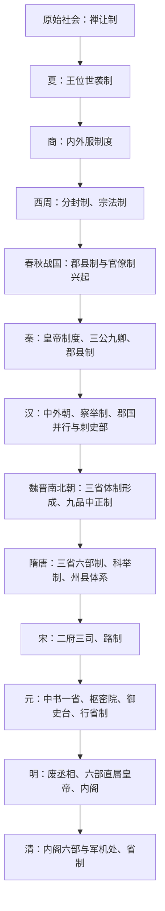

# 中国古代制度

本目录整理中国古代政治制度、中央职官和地方行政区划，并分别呈现宏观制度、中枢职官和地方区划三条线索。

## 目录

| 分类 | 内容 | 入口 |
| --- | --- | --- |
| 政治制度 | 宏观政治体系、中央集权、君主专制与制度演变。 | [政治制度](/%E4%BA%BA%E6%96%87%E7%A7%91%E5%AD%A6/%E5%8E%86%E5%8F%B2-%E4%B8%AD%E5%9B%BD/%E5%88%B6%E5%BA%A6/%E6%94%BF%E6%B2%BB%E5%88%B6%E5%BA%A6/README.md) |
| 中枢与职官 | 三省、六部、枢密院，以及历代中央中枢机构。 | [中枢与职官](/%E4%BA%BA%E6%96%87%E7%A7%91%E5%AD%A6/%E5%8E%86%E5%8F%B2-%E4%B8%AD%E5%9B%BD/%E5%88%B6%E5%BA%A6/%E4%B8%AD%E6%9E%A2%E4%B8%8E%E8%81%8C%E5%AE%98/README.md) |
| 地方行政区划 | 郡县、州郡县、道州县、路府州县、行省等地方层级。 | [地方行政区划](/%E4%BA%BA%E6%96%87%E7%A7%91%E5%AD%A6/%E5%8E%86%E5%8F%B2-%E4%B8%AD%E5%9B%BD/%E5%88%B6%E5%BA%A6/%E5%9C%B0%E6%96%B9%E8%A1%8C%E6%94%BF%E5%8C%BA%E5%88%92/README.md) |

## 总体演变

## 阅读路径

- 宏观制度放入“政治制度”。
- 机构和官职放入“中枢与职官”。
- 地方层级和具体区域沿革放入“地方行政区划”。

## 图示

