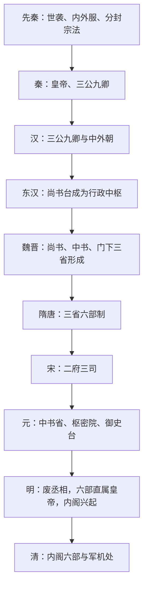

# 中枢与职官

本目录整理中国古代中央机构、官职体系和中枢权力结构。这里的“职官”包括官署、官名、职掌和制度关系。

## 专题笔记

- [三省](/%E4%BA%BA%E6%96%87%E7%A7%91%E5%AD%A6/%E5%8E%86%E5%8F%B2-%E4%B8%AD%E5%9B%BD/%E5%88%B6%E5%BA%A6/%E4%B8%AD%E6%9E%A2%E4%B8%8E%E8%81%8C%E5%AE%98/%E4%B8%89%E7%9C%81.md)
- [六部](/%E4%BA%BA%E6%96%87%E7%A7%91%E5%AD%A6/%E5%8E%86%E5%8F%B2-%E4%B8%AD%E5%9B%BD/%E5%88%B6%E5%BA%A6/%E4%B8%AD%E6%9E%A2%E4%B8%8E%E8%81%8C%E5%AE%98/%E5%85%AD%E9%83%A8.md)
- [枢密院](/%E4%BA%BA%E6%96%87%E7%A7%91%E5%AD%A6/%E5%8E%86%E5%8F%B2-%E4%B8%AD%E5%9B%BD/%E5%88%B6%E5%BA%A6/%E4%B8%AD%E6%9E%A2%E4%B8%8E%E8%81%8C%E5%AE%98/%E6%9E%A2%E5%AF%86%E9%99%A2.md)

## 历代中枢机构

- [先秦中枢与政治结构](/%E4%BA%BA%E6%96%87%E7%A7%91%E5%AD%A6/%E5%8E%86%E5%8F%B2-%E4%B8%AD%E5%9B%BD/%E5%88%B6%E5%BA%A6/%E4%B8%AD%E6%9E%A2%E4%B8%8E%E8%81%8C%E5%AE%98/%E5%8E%86%E4%BB%A3%E4%B8%AD%E6%9E%A2%E6%9C%BA%E6%9E%84/%E5%85%88%E7%A7%A6.md)
- [秦代中枢机构](/%E4%BA%BA%E6%96%87%E7%A7%91%E5%AD%A6/%E5%8E%86%E5%8F%B2-%E4%B8%AD%E5%9B%BD/%E5%88%B6%E5%BA%A6/%E4%B8%AD%E6%9E%A2%E4%B8%8E%E8%81%8C%E5%AE%98/%E5%8E%86%E4%BB%A3%E4%B8%AD%E6%9E%A2%E6%9C%BA%E6%9E%84/%E7%A7%A6.md)
- [西汉中枢机构](/%E4%BA%BA%E6%96%87%E7%A7%91%E5%AD%A6/%E5%8E%86%E5%8F%B2-%E4%B8%AD%E5%9B%BD/%E5%88%B6%E5%BA%A6/%E4%B8%AD%E6%9E%A2%E4%B8%8E%E8%81%8C%E5%AE%98/%E5%8E%86%E4%BB%A3%E4%B8%AD%E6%9E%A2%E6%9C%BA%E6%9E%84/%E8%A5%BF%E6%B1%89.md)
- [东汉中枢机构](/%E4%BA%BA%E6%96%87%E7%A7%91%E5%AD%A6/%E5%8E%86%E5%8F%B2-%E4%B8%AD%E5%9B%BD/%E5%88%B6%E5%BA%A6/%E4%B8%AD%E6%9E%A2%E4%B8%8E%E8%81%8C%E5%AE%98/%E5%8E%86%E4%BB%A3%E4%B8%AD%E6%9E%A2%E6%9C%BA%E6%9E%84/%E4%B8%9C%E6%B1%89.md)
- [两晋中枢机构](/%E4%BA%BA%E6%96%87%E7%A7%91%E5%AD%A6/%E5%8E%86%E5%8F%B2-%E4%B8%AD%E5%9B%BD/%E5%88%B6%E5%BA%A6/%E4%B8%AD%E6%9E%A2%E4%B8%8E%E8%81%8C%E5%AE%98/%E5%8E%86%E4%BB%A3%E4%B8%AD%E6%9E%A2%E6%9C%BA%E6%9E%84/%E6%99%8B.md)
- [隋代中枢机构](/%E4%BA%BA%E6%96%87%E7%A7%91%E5%AD%A6/%E5%8E%86%E5%8F%B2-%E4%B8%AD%E5%9B%BD/%E5%88%B6%E5%BA%A6/%E4%B8%AD%E6%9E%A2%E4%B8%8E%E8%81%8C%E5%AE%98/%E5%8E%86%E4%BB%A3%E4%B8%AD%E6%9E%A2%E6%9C%BA%E6%9E%84/%E9%9A%8B.md)
- [唐代中枢机构](/%E4%BA%BA%E6%96%87%E7%A7%91%E5%AD%A6/%E5%8E%86%E5%8F%B2-%E4%B8%AD%E5%9B%BD/%E5%88%B6%E5%BA%A6/%E4%B8%AD%E6%9E%A2%E4%B8%8E%E8%81%8C%E5%AE%98/%E5%8E%86%E4%BB%A3%E4%B8%AD%E6%9E%A2%E6%9C%BA%E6%9E%84/%E5%94%90.md)
- [宋代中枢机构](/%E4%BA%BA%E6%96%87%E7%A7%91%E5%AD%A6/%E5%8E%86%E5%8F%B2-%E4%B8%AD%E5%9B%BD/%E5%88%B6%E5%BA%A6/%E4%B8%AD%E6%9E%A2%E4%B8%8E%E8%81%8C%E5%AE%98/%E5%8E%86%E4%BB%A3%E4%B8%AD%E6%9E%A2%E6%9C%BA%E6%9E%84/%E5%AE%8B.md)
- [元代中枢机构](/%E4%BA%BA%E6%96%87%E7%A7%91%E5%AD%A6/%E5%8E%86%E5%8F%B2-%E4%B8%AD%E5%9B%BD/%E5%88%B6%E5%BA%A6/%E4%B8%AD%E6%9E%A2%E4%B8%8E%E8%81%8C%E5%AE%98/%E5%8E%86%E4%BB%A3%E4%B8%AD%E6%9E%A2%E6%9C%BA%E6%9E%84/%E5%85%83.md)
- [明代中枢机构](/%E4%BA%BA%E6%96%87%E7%A7%91%E5%AD%A6/%E5%8E%86%E5%8F%B2-%E4%B8%AD%E5%9B%BD/%E5%88%B6%E5%BA%A6/%E4%B8%AD%E6%9E%A2%E4%B8%8E%E8%81%8C%E5%AE%98/%E5%8E%86%E4%BB%A3%E4%B8%AD%E6%9E%A2%E6%9C%BA%E6%9E%84/%E6%98%8E.md)
- [清代中枢机构](/%E4%BA%BA%E6%96%87%E7%A7%91%E5%AD%A6/%E5%8E%86%E5%8F%B2-%E4%B8%AD%E5%9B%BD/%E5%88%B6%E5%BA%A6/%E4%B8%AD%E6%9E%A2%E4%B8%8E%E8%81%8C%E5%AE%98/%E5%8E%86%E4%BB%A3%E4%B8%AD%E6%9E%A2%E6%9C%BA%E6%9E%84/%E6%B8%85.md)

## 演变图

