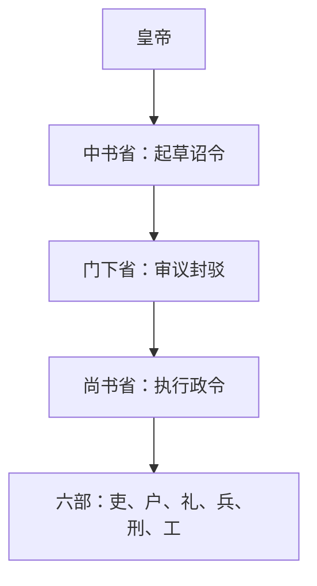

# 三省

三省是隋唐中央政务运作的核心机构，通常概括为“中书出令、门下审驳、尚书执行”。三省分工有助于分散相权，同时也提高了诏令形成和执行的制度化程度。

| 机构 | 职能 | 主要长官 | 说明 |
| --- | --- | --- | --- |
| **中书省** | 起草诏令、参与决策。 | **中书令**，副长官为**中书侍郎**。 | 唐代中后期，中书门下、政事堂等机制使宰相群体化。 |
| **门下省** | 审核诏令、封驳不当政令、参与议政。 | **侍中**，副长官为**门下侍郎**。 | 门下省的封驳权体现对诏令的程序性约束。 |
| **尚书省** | 执行政令，统领六部处理具体行政事务。 | **尚书令**；唐代多虚设，通常以**尚书左仆射**、**尚书右仆射**为实际长官。 | 下设左右丞，分理尚书省事务。 |

## 关系图

