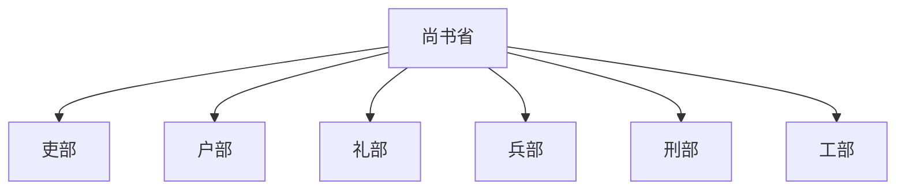

# 六部

六部是尚书省及后世中央行政系统中的六个主要职能部门。隋唐以后，六部逐渐成为中央政务分工的基本框架；明清时期六部直接向皇帝或经内阁、军机处等中枢处理政务。

正官：**尚书**。副官：**侍郎**。

| 部门 | 主要职掌 |
| --- | --- |
| **吏部** | 官员铨选、任免、考课、升降、调动等。 |
| **户部** | 户籍、土地、赋役、财政收支、仓储等。 |
| **礼部** | 礼制、祭祀、学校、科举、朝会、外交礼仪等。 |
| **兵部** | 武官铨选、兵籍、军令、军械、驿传等；实际军权常另由皇帝、枢密院、五军都督府或军机处等掌握。 |
| **刑部** | 法律、刑狱、审判复核等；常与大理寺、都察院合称“三法司”。 |
| **工部** | 工程营造、水利、交通、屯田、官府工匠与器物制造等。 |

## 关系图

