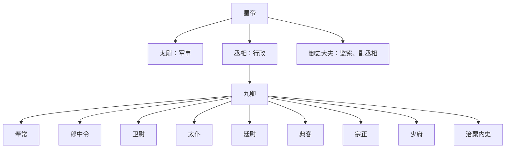

# 秦代中枢机构

秦统一后建立皇帝制度，以三公九卿为中央官制核心，皇帝总揽军政大权，具有皇位独尊、皇权至上、皇位世袭等特征。

## 三公

| 官职 | 职掌 | 说明 |
| --- | --- | --- |
| 太尉 | 军事 | 名义上掌军事；秦朝是否常置太尉存在讨论，常见说法认为秦代太尉多属虚设。 |
| 丞相 | 行政中枢 | 设左丞相、右丞相，右丞相为主，左丞相为副；负责辅佐皇帝处理政务。 |
| 御史大夫 | 副丞相、监察 | 除监察外，也协助丞相统领百官处理朝政。 |

三公九卿由皇帝任命，不世袭；三公之间没有统属关系，最终裁断权在皇帝。

## 九卿

| 官职 | 职掌 |
| --- | --- |
| 奉常 | 宗庙祭祀礼仪。 |
| 郎中令 | 宫廷宿卫、皇帝侍从警卫。 |
| 卫尉 | 宫廷警卫。 |
| 太仆 | 宫廷车马。 |
| 廷尉 | 司法审判。 |
| 典客 | 外交和民族事务。 |
| 宗正 | 皇家宗族事务。 |
| 少府 | 皇家财政。 |
| 治粟内史 | 财政税收。 |

## 中央结构图

## 图示

