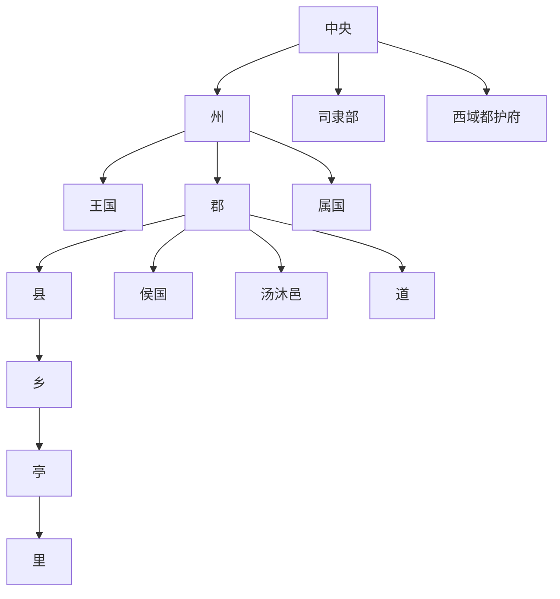

# 东汉地方区划

东汉地方区划沿袭西汉郡国并行格局，但州从监察区逐渐行政化。

## 州郡县三级化

- 东汉前中期，刺史部仍是监察区，不是真正意义上的行政区。
- 东汉后期，汉灵帝选重臣出任刺史，称州牧，掌管一州军民，州从监察区变成行政区，形成州郡县三级制。
- 司隶部管辖近畿各郡，西域都护府继续管辖西域相关事务。
- 属国是外民族聚居区，甚至只是名义上臣服，基本不受中央朝廷直接管束，只设一名都尉。
- 王国一般是皇子的封邑，诸侯王不治民，只收食税租，最高长官称相，级别同太守，代替藩王管理国内事务，由中央直接任命。
- 汤沐邑为列侯封地，皇后、皇太后、公主封地；道为少数民族区。

## 东汉末十三州

徐州、青州、豫州、冀州、并州、幽州、兖州、凉州、益州、荆州、扬州、交州、雍州。

## 层级图

## 图示

