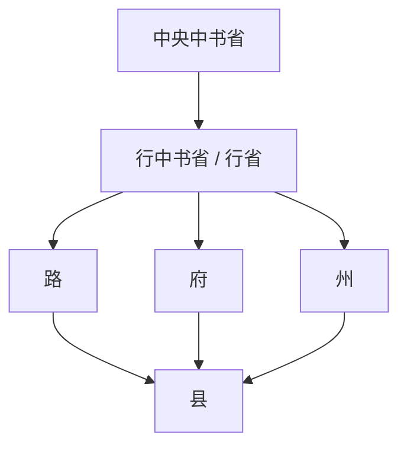

# 元代地方区划

元代地方设行中书省，简称行省。行省初为中书省派出机构，掌管所辖地区内的军政事务，其后发展成为省级地方政府。

## 特点

- 中央设中书省，地方设行中书省。
- 行省之下有路、府、州、县等层级。
- 元代还存在宣政院辖吐蕃事务等特殊制度。

## 层级图

```mermaid
flowchart TD
    A["中央中书省"] --> B["行中书省 / 行省"]
    B --> C["路"]
    B --> D["府"]
    B --> E["州"]
    C --> F["县"]
    D --> F
    E --> F
```

## 图示

