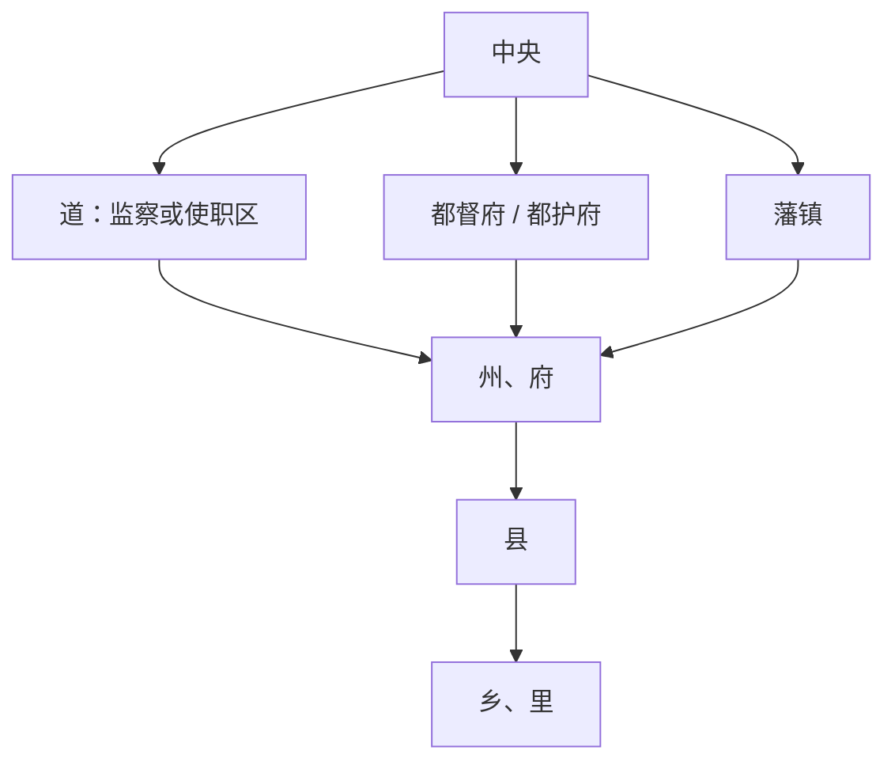

# 唐代地方区划

唐代地方基本层级为州 / 府、县，道最初多为监察区，后来节度、采访等使职强化。

## 道、州府、县

- 唐太宗设十道：关内道、陇右道、河南道、淮南道、河东道、江南道、河北道、剑南道、山南道、岭南道。
- 唐玄宗设十五道：关内道、陇右道、京畿道、淮南道、河南道、江南东道、都畿道、江南西道、河东道、黔中道、河北道、剑南道、山南东道、岭南道、山南西道。
- 安史之乱后，藩镇势力坐大；缘边及禁要地区都护府、唐玄宗以来设置的府等制度共同影响地方体系。
- 重要州命名为府，以示区别，如京兆府、河南府、兴德府、兴元府、凤翔府、成都府、河中府、太原府、兴唐府、江陵府。
- 唐玄宗时有六大都护府：安东、安南、安西、安北、单于、北庭。

## 层级图

## 图示

