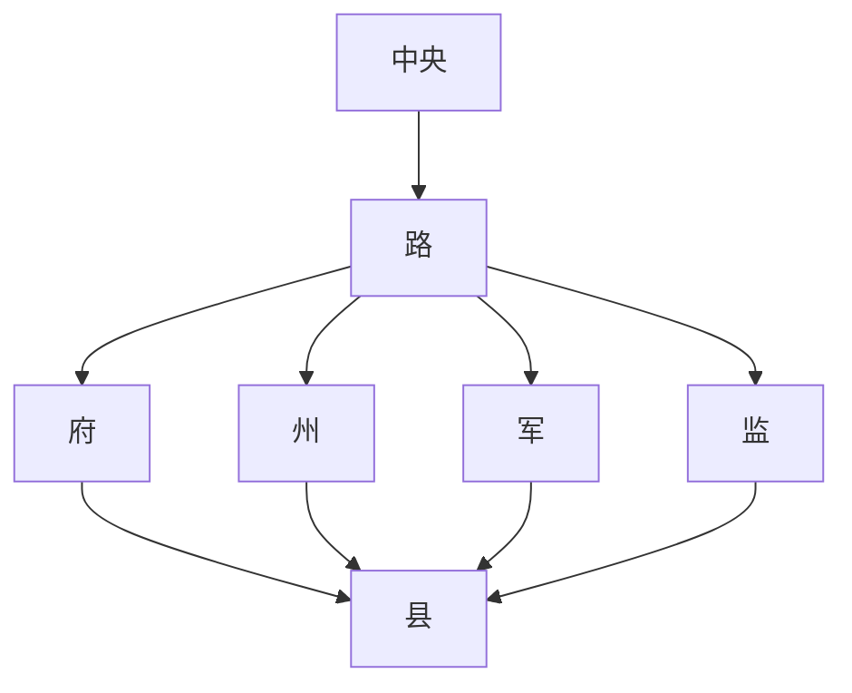

# 宋代地方区划

宋代地方高层为路，路下有府、州、军、监，基层为县。

## 特点

- 路设转运司、提点刑狱司、提举常平司、安抚司等分权机构，以分散地方权力。
- 府、州、军、监是路以下主要行政单位，县为基层行政单位。
- 宋代通过分割地方财政、司法、军事监察权，防止地方割据。

## 层级图

```mermaid
flowchart TD
    A["中央"] --> B["路"]
    B --> C["府"]
    B --> D["州"]
    B --> E["军"]
    B --> F["监"]
    C --> G["县"]
    D --> G
    E --> G
    F --> G
```

## 图示

