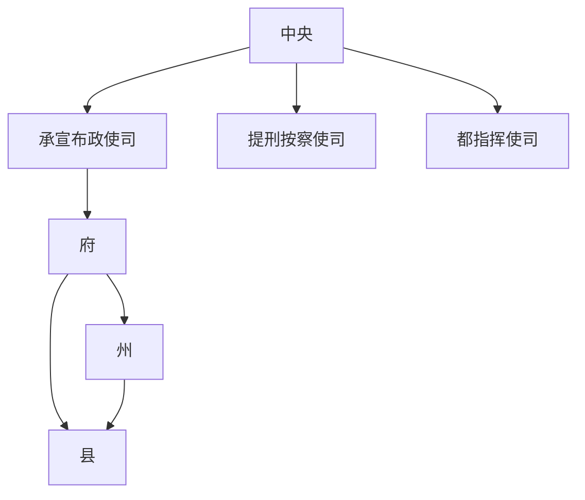

# 明代地方区划

明代地方高层为承宣布政使司，另有提刑按察使司、都指挥使司，合称“三司”。

## 特点

- 承宣布政使司掌民政财政。
- 提刑按察使司掌司法监察。
- 都指挥使司掌军事。
- 下辖府、州、县等层级。

## 层级图

```mermaid
flowchart TD
    A["中央"] --> B["承宣布政使司"]
    A --> C["提刑按察使司"]
    A --> D["都指挥使司"]
    B --> E["府"]
    E --> F["州"]
    E --> G["县"]
    F --> G
```

## 图示

