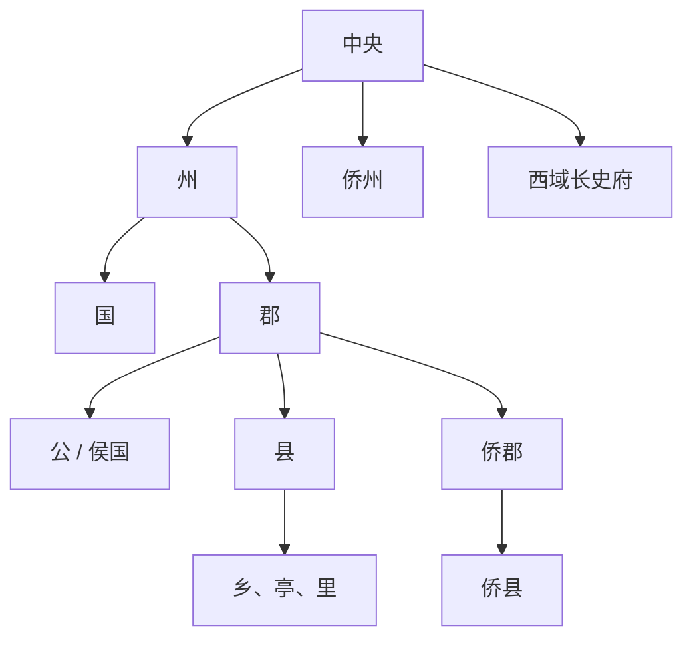

# 两晋地方区划

两晋地方基本为州、郡、县三级，并有侨州、侨郡、侨县等特殊设置。

## 层级和特殊设置

- 晋武帝司马炎即位后，改革分封制度，将祖司马懿以下宗室子弟均封为王，以郡为国。
- 诸侯王不去封地仍在朝廷任职，对于封地仅限财政收入而无实权。
- 按人口分大国、次国、小国：大国二万户，次国万户，小国五千户。
- 西晋对西域的管辖沿袭曹魏旧制，仍在楼兰设置西域长史府；东晋时期西域长史归顺前凉。
- 西晋末年大量流民南渡，东晋朝廷为安抚侨民及侨姓世族，以原籍州郡县名寄治别处，名名前加“南”以示区别，而无实地；安定后实施土断，使其领有实地，户籍和赋役与一般州郡县相同。

## 层级图

## 图示

