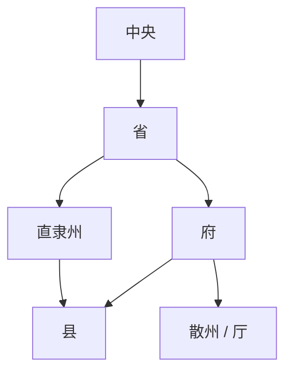

# 清代地方区划

清代地方大体为省、府 / 直隶州、县等层级。省级长官体系包括总督、巡抚、布政使、按察使等，军事、财政、司法监察分工并存。

## 特点

- 省为地方高层行政区。
- 总督、巡抚统辖地方军政，布政使偏财政民政，按察使偏司法监察。
- 下辖府、直隶州、厅、县等层级。

## 层级图

```mermaid
flowchart TD
    A["中央"] --> B["省"]
    B --> C["府"]
    B --> D["直隶州"]
    C --> E["县"]
    C --> F["散州 / 厅"]
    D --> E
```

## 图示

