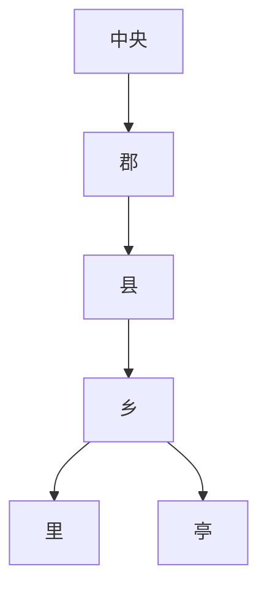

# 秦代地方区划

秦统一后采纳李斯建议，取消西周以来的分封制，在国家管理上推行统一的郡县制。

## 层级

## 内容

- 秦初分天下为三十六郡，后来增加至四十余郡。
- 皇室任免郡县主要官吏，郡县完全由中央和皇帝控制，是中央政府辖下的地方行政单位。
- 郡设郡守主民政、郡尉主军事、监御史监察事务、郡丞为郡守副职。
- 县满万户以上设县令，不满万户设县长；另有县尉掌军事和治安、县丞掌全县司法。
- 县下有乡、里、亭。乡设三老解纠纷教化，有秩 / 啬夫负责税收和分派徭役，游徼负责治安；里设里正，除与乡政权职能相近外，还有组织生产任务。
- 亭不是治民机构，是县政权在基层社会的延伸；亭长负责固定片区，维护治安，兼邮递职能，朝廷文告诏令多贴于亭部。亭之间相隔十里。
- 秦朝首都咸阳及附近关中平原由内史直接管理。

## 图示

