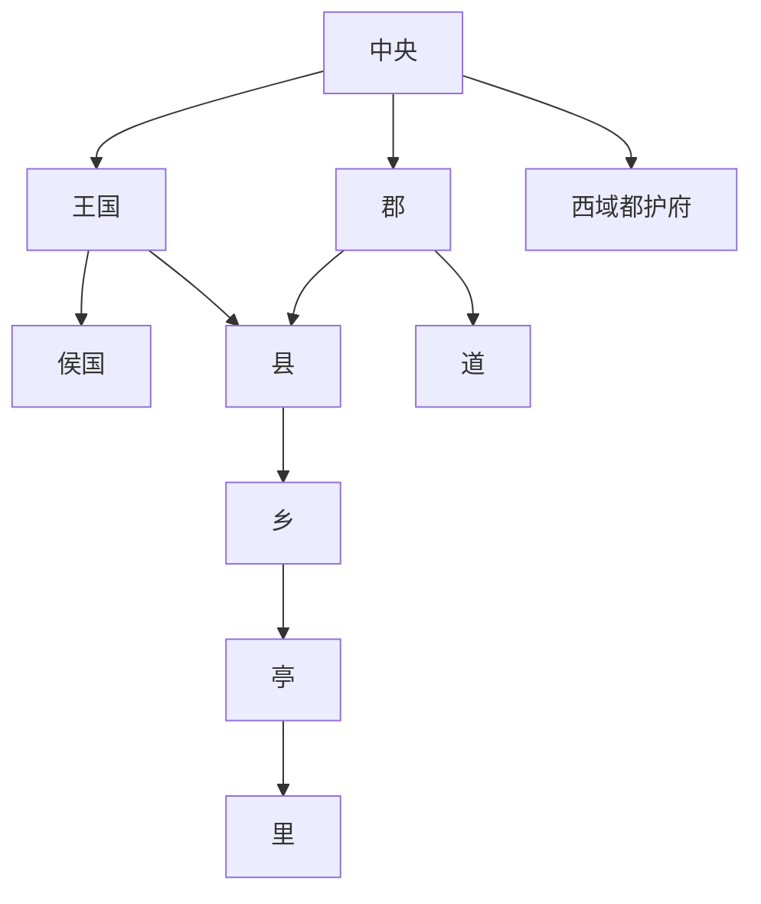

# 西汉地方区划

西汉地方制度以郡国并行和刺史部监察为主要特点。

## 郡国并行

- 汉初王国不但统率侯国或数县，而且常常兼数郡之地，拥有独立政治和军事权力。
- 汉初刘邦封“异姓七国”：韩、赵、燕、楚、梁、淮南、长沙。
- 侯国只享有封地内的税收，无军事和行政权，并受郡管辖。
- 汤沐邑是皇后、公主等封君收取赋税的区划，贵族受封邑，一般食邑制无统治权，只有征敛封邑内民户赋税、食邑随爵位升降损益，可以世袭。
- 汉文帝、汉景帝时期，通过推恩令削减诸侯王国辖区，剥夺诸王军政权力，仅保留财政收入。诸侯王除以嫡长子继承王位外，其余诸子在原封国内封侯，新封侯国不再受王国管辖，直接由各郡管理，地位相当于县。王国辖地因此变得仅有数县，地位与郡无异。

## 刺史部和西域

- 汉武帝设十三刺史部，监察区域内郡国的吏政，初为监察区，不是一级行政区。
- 十三个刺史部中，一部分采用《尚书·禹贡》和《周礼·职方》的传说州名，简称“十三部”，一称“十三州”，包括徐州、豫州、青州、朔方、冀州、并州、兖州、幽州、益州、凉州、扬州、荆州、交趾刺史部。
- 西域都护府是汉朝在西域设置的管辖机构，负责守境安土、协调西域各国矛盾、制止外来势力侵扰、维护丝绸之路畅通，统管大宛以东、乌孙以南的三十多个国家。
- 道设在少数民族聚居的偏远地区，《汉书·地理志》解释为“有蛮夷曰道”。

## 层级图

## 图示

