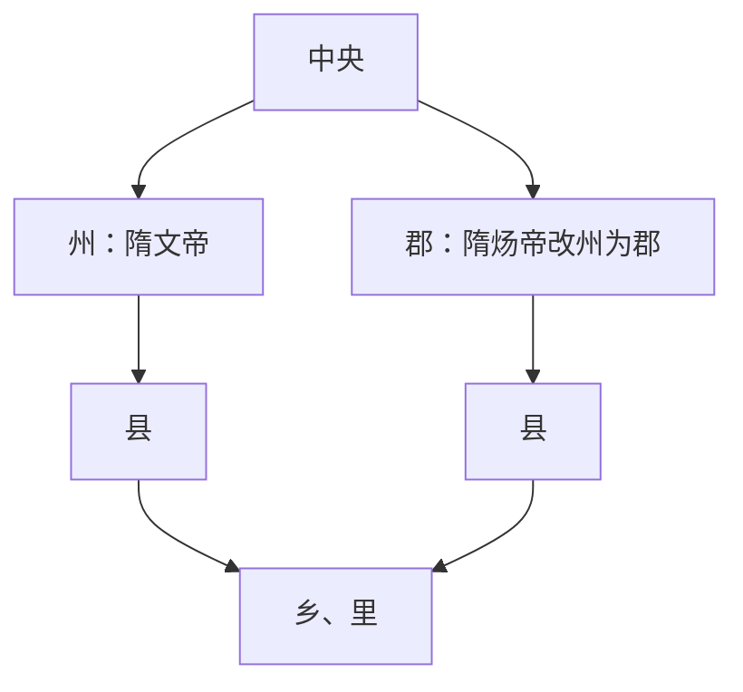

# 隋代地方区划

隋代地方区划从州县二级转为郡县二级。

## 内容

- 总管府是北周开始设置的区域性军事管理机构，至隋朝逐渐由纯军事性质转向兼管军民两政，成为地方上最高统治机关，后被隋炀帝下诏废除。
- 隋文帝基本统一天下后，鉴于从东汉末年开始的州郡县三级制已经混乱不堪，废除天下郡置，改为州县二级，以州直接统县。
- 隋炀帝继位后不久，将所有州改为郡，实行郡县二级制，从形式上恢复秦朝区划架构。
- 隋炀帝效仿汉武帝设置监察州，监督各郡职务，包括雍州、豫州、冀州、兖州、青州、徐州、扬州、荆州、梁州。

## 层级图

## 图示

