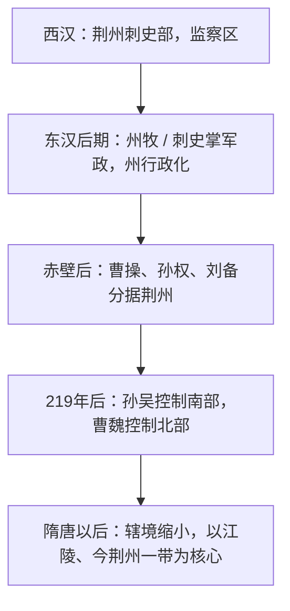

# 荆州

荆州既是古代地理和文化区域名，也是汉以后长期使用的州名。它的含义随时代变化：先秦文献中的“荆州”多为九州之一，汉代以后则逐渐成为监察区、行政区和具体州治区域。

早期荆州范围很大，大体包括今湖北、湖南大部以及河南南部、江西西北、广西东北等邻近区域的一部分。随着历代分置湘州、郢州、江陵府等行政区，荆州辖境逐步缩小；隋唐以后，“荆州”常更接近今湖北荆州一带及周边。

## 时段概览

| 时段 | 性质 | 概括 |
| --- | --- | --- |
| 西汉 | 刺史部 | 主要是监察区，不是普通地方行政区。 |
| 东汉后期 | 州逐渐行政化 | 州牧、刺史掌握地方军政，荆州成为重要一级区域。 |
| 三国 | 魏、吴分领 | 北部多属曹魏，南部多属孙吴，蜀汉曾短期控制部分荆州。 |
| 隋唐以后 | 辖境缩小 | 逐渐转为以江陵、今湖北荆州一带为核心的州府区域。 |

## 演变图

## 相关笔记

- [西汉时期](/%E4%BA%BA%E6%96%87%E7%A7%91%E5%AD%A6/%E5%8E%86%E5%8F%B2-%E4%B8%AD%E5%9B%BD/%E5%88%B6%E5%BA%A6/%E5%9C%B0%E6%96%B9%E8%A1%8C%E6%94%BF%E5%8C%BA%E5%88%92/%E8%8D%86%E5%B7%9E/%E8%A5%BF%E6%B1%89%E6%97%B6%E6%9C%9F.md)
- [东汉时期](/%E4%BA%BA%E6%96%87%E7%A7%91%E5%AD%A6/%E5%8E%86%E5%8F%B2-%E4%B8%AD%E5%9B%BD/%E5%88%B6%E5%BA%A6/%E5%9C%B0%E6%96%B9%E8%A1%8C%E6%94%BF%E5%8C%BA%E5%88%92/%E8%8D%86%E5%B7%9E/%E4%B8%9C%E6%B1%89%E6%97%B6%E6%9C%9F.md)
- [三国时期](/%E4%BA%BA%E6%96%87%E7%A7%91%E5%AD%A6/%E5%8E%86%E5%8F%B2-%E4%B8%AD%E5%9B%BD/%E5%88%B6%E5%BA%A6/%E5%9C%B0%E6%96%B9%E8%A1%8C%E6%94%BF%E5%8C%BA%E5%88%92/%E8%8D%86%E5%B7%9E/%E4%B8%89%E5%9B%BD%E6%97%B6%E6%9C%9F.md)
