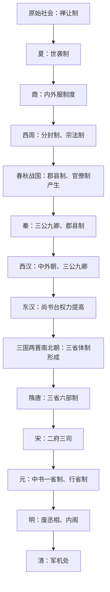

# 中国古代政治制度演变

中国古代政治制度大体经历早期贵族政治与秦汉以后君主专制中央集权制度两个阶段。西周以分封制、宗法制组织政治秩序；秦统一后建立皇帝制度、三公九卿制和郡县制；魏晋南北朝时期三省体制逐渐形成，隋唐三省六部制成熟。整体趋势是皇权不断强化，相权逐步分散、削弱，明代废丞相，清代军机处成为处理机要军政的中枢，专制皇权达到高峰。

## 演变总览

| 时期 / 朝代 | 关键制度 | 主要措施 | 权力变化 / 影响 |
| --- | --- | --- | --- |
| 原始社会 | 禅让制 | 部落联盟首领通过推举等方式更替。 | 尚未形成世袭王权。 |
| 夏 | 世袭制 | 王位世袭逐渐取代禅让。 | 形成“家天下”格局。 |
| 商 | 内外服制度 | 王畿为内服，外围方国为外服。 | 王权控制王畿，外围方国保持一定独立性。 |
| 西周 | 分封制、宗法制 | 周天子分封同姓宗族、功臣和先代贵族，以嫡长子继承制维系等级秩序。 | 以血缘和等级秩序组织政治关系，形成贵族政治结构。 |
| 春秋战国 | 郡县制、官僚制产生 | 各国变法，削弱旧贵族分封秩序，设置郡县和官僚机构。 | 君主专制加强，官僚政治发展。 |
| 秦 | 皇帝制度、三公九卿制、郡县制 | 统一后废分封、行郡县，建立三公九卿中央官制。 | 加强皇权和中央对地方的控制，中央集权官僚体系定型。 |
| 西汉 | 三公九卿制、中外朝制 | 汉承秦制；汉武帝设中朝，使近臣参与决策。 | 加强皇权，削弱外朝相权。 |
| 东汉 | 尚书台权力提高 | 尚书台逐渐成为行政中枢。 | 皇权加强，三公权力下降。 |
| 三国两晋南北朝 | 三省体制逐渐形成、九品中正制 | 尚书、中书、门下等机构地位变化；士族门第影响选官。 | 中央中枢分工逐渐形成，相权结构继续变化。 |
| 隋唐 | 三省六部制、科举制 | 中书、门下、尚书分工，尚书省下辖六部；科举逐渐取代九品中正制。 | 三省分工牵制，是中央行政制度成熟的重要表现，有助于削弱相权、加强皇权。 |
| 宋 | 二府三司体制 | 中书门下、枢密院、三司等分权，分别处理政务、军政和财政。 | 分割宰相军政财权，加强皇权。 |
| 元 | 中书一省制、行省制 | 中书省为中央政务中枢，地方设置行省。 | 中央政务集中于中书省，地方行政以行省为高层区划。 |
| 明 | 废丞相、六部直隶皇帝、设内阁 | 胡惟庸案后废中书省和丞相，六部直接向皇帝负责；后设内阁。 | 皇权加强；内阁起初为顾问机构，后权势上升但非法定宰相机构。 |
| 清 | 军机处 | 雍正年间设军机处，承旨处理机要军政。 | 机要军政高度集中，专制皇权发展到高峰。 |

## 演变图

## 图示

