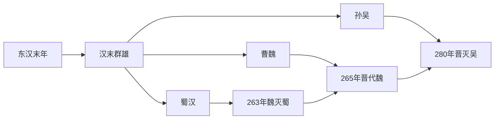

# 三国

## 时间

220年-280年

## 概括

三国是东汉灭亡后魏、蜀汉、吴三大政权并立的时期。其实际形成可追溯到东汉末年黄巾起义、董卓乱政和群雄割据；正式以220年曹丕代汉建魏为开端，至280年西晋灭吴、重新统一中国为止。

三国并不是同时从220年开始：曹魏建于220年，蜀汉建于221年，孙吴称帝于229年。263年曹魏灭蜀汉，265年司马炎代魏建晋，280年晋灭吴，三国时代结束。

## 目录

| 笔记 | 政权 | 时间 | 简要概括 |
|---|---|---|---|
| [魏（曹）](%E4%BA%BA%E6%96%87%E7%A7%91%E5%AD%A6/%E5%8E%86%E5%8F%B2-%E4%B8%AD%E5%9B%BD/%E6%9C%9D%E4%BB%A3/%E4%B8%89%E5%9B%BD/%E9%AD%8F%EF%BC%88%E6%9B%B9%EF%BC%89.md) | 曹魏 | 220年-265年 | 由曹丕代汉建立，控制北方，是三国中实力最强的政权；后被司马氏取代。 |
| [蜀汉（刘）](%E4%BA%BA%E6%96%87%E7%A7%91%E5%AD%A6/%E5%8E%86%E5%8F%B2-%E4%B8%AD%E5%9B%BD/%E6%9C%9D%E4%BB%A3/%E4%B8%89%E5%9B%BD/%E8%9C%80%E6%B1%89%EF%BC%88%E5%88%98%EF%BC%89.md) | 蜀汉 | 221年-263年 | 刘备以延续汉室为号召建立，控制益州，诸葛亮、姜维多次北伐。 |
| [东吴（孙）](%E4%BA%BA%E6%96%87%E7%A7%91%E5%AD%A6/%E5%8E%86%E5%8F%B2-%E4%B8%AD%E5%9B%BD/%E6%9C%9D%E4%BB%A3/%E4%B8%89%E5%9B%BD/%E4%B8%9C%E5%90%B4%EF%BC%88%E5%AD%99%EF%BC%89.md) | 孙吴 / 东吴 | 222年-280年 | 孙权以江东为基础，先为吴王，229年称帝；是三国中最后灭亡的政权。 |

## 演变流程

## 阶段表

| 顺序 | 阶段 | 时间 | 简要概括 |
|---:|---|---|---|
| 1 | 汉末群雄 | 184年-220年 | 黄巾起义、董卓乱政后地方割据形成，曹操统一北方，孙权据江东，刘备入益州。 |
| 2 | 曹丕代汉 | 220年 | 曹丕逼汉献帝禅让，建立曹魏，东汉灭亡。 |
| 3 | 刘备称帝 | 221年 | 刘备在成都称帝，国号汉，后世称蜀汉。 |
| 4 | 孙权称王、称帝 | 222年、229年 | 孙权先受魏封为吴王，后于229年称帝，孙吴政权正式完成帝国化。 |
| 5 | 魏蜀吴鼎立 | 229年-263年 | 三国长期对峙，战争集中在魏蜀边境、荆州、淮南和江汉地区。 |
| 6 | 魏灭蜀 | 263年 | 邓艾、钟会伐蜀，刘禅投降，蜀汉灭亡。 |
| 7 | 晋代魏 | 265年 | 司马炎代魏称帝，建立西晋。 |
| 8 | 晋灭吴 | 280年 | 西晋灭孙吴，结束三国分裂局面。 |

## 三方比较

| 项目 | 曹魏 | 蜀汉 | 孙吴 |
|---|---|---|---|
| 核心区域 | 黄河流域、华北、中原 | 益州、汉中 | 江东、荆扬交界、长江下游 |
| 政治来源 | 曹操控制汉廷，曹丕代汉 | 刘备以汉室宗亲身份延续汉统 | 孙氏经营江东，逐步独立成国 |
| 优势 | 人口、粮食、官僚体系和北方资源最多 | 益州地形险固，汉室名义号召力强 | 长江防线、水军和江东地方基础稳固 |
| 弱点 | 后期司马氏专权，曹氏皇权被架空 | 地狭人少，北伐消耗大 | 内部继承斗争严重，后期政治腐败 |
| 结局 | 265年被西晋取代 | 263年被曹魏灭亡 | 280年被西晋灭亡 |

## 说明

- 三国时期的正式起点通常取220年曹丕代汉，但政治格局形成应上溯到东汉末年。
- “蜀汉”自称“汉”，曹魏、孙吴文献中常称其为“蜀”。
- “东吴”也称“孙吴”，用来区别春秋时期吴国。
- 后续进入西晋统一阶段。

## 相关

- [../汉/汉末群雄.md](%E4%BA%BA%E6%96%87%E7%A7%91%E5%AD%A6/%E5%8E%86%E5%8F%B2-%E4%B8%AD%E5%9B%BD/%E6%9C%9D%E4%BB%A3/%E6%B1%89/%E6%B1%89%E6%9C%AB%E7%BE%A4%E9%9B%84.md)
