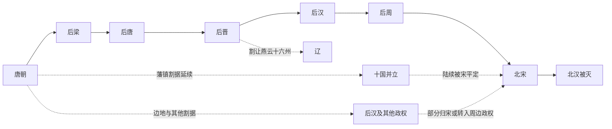

# 五代十国

## 概括

五代十国（907年-979年）是唐朝灭亡后到北宋基本统一之间的分裂时期。中原地区先后出现后梁、后唐、后晋、后汉、后周五个短命王朝，史称“五代”；南方和河东等地并立若干割据政权，其中十个较主要政权合称“十国”。

这一时期本质上延续了唐末藩镇割据格局：军人集团掌握政权，政权更替频繁，契丹势力南下并取得燕云十六州，南方则相对形成若干较稳定区域政权。960年赵匡胤建立北宋，979年宋太宗灭北汉，五代十国格局结束。

## 演进流程

## 目录

- [五代](/%E4%BA%BA%E6%96%87%E7%A7%91%E5%AD%A6/%E5%8E%86%E5%8F%B2-%E4%B8%AD%E5%9B%BD/%E6%9C%9D%E4%BB%A3/%E4%BA%94%E4%BB%A3/%E4%BA%94%E4%BB%A3/README.md)：中原五个连续政权的演变。
- [十国](/%E4%BA%BA%E6%96%87%E7%A7%91%E5%AD%A6/%E5%8E%86%E5%8F%B2-%E4%B8%AD%E5%9B%BD/%E6%9C%9D%E4%BB%A3/%E4%BA%94%E4%BB%A3/%E5%8D%81%E5%9B%BD/README.md)：地方割据政权的并立与归宋。
- [后汉及其他政权](/%E4%BA%BA%E6%96%87%E7%A7%91%E5%AD%A6/%E5%8E%86%E5%8F%B2-%E4%B8%AD%E5%9B%BD/%E6%9C%9D%E4%BB%A3/%E4%BA%94%E4%BB%A3/%E5%90%8E%E6%B1%89%E5%8F%8A%E5%85%B6%E4%BB%96%E6%94%BF%E6%9D%83/README.md)：岐、燕、赵、定难军、归义军、静海军、清源军等节点。
- [五代十国时空图](/%E4%BA%BA%E6%96%87%E7%A7%91%E5%AD%A6/%E5%8E%86%E5%8F%B2-%E4%B8%AD%E5%9B%BD/%E6%9C%9D%E4%BB%A3/%E4%BA%94%E4%BB%A3/%E4%BA%94%E4%BB%A3%E5%8D%81%E5%9B%BD%E6%97%B6%E7%A9%BA%E5%9B%BE.md)：原有图示资料。

## 历史顺序

| 顺序 | 名称 | 时间 | 简要概括 |
|---:|---|---|---|
| 1 | [后梁](/%E4%BA%BA%E6%96%87%E7%A7%91%E5%AD%A6/%E5%8E%86%E5%8F%B2-%E4%B8%AD%E5%9B%BD/%E6%9C%9D%E4%BB%A3/%E4%BA%94%E4%BB%A3/%E4%BA%94%E4%BB%A3/%E6%A2%81%EF%BC%88%E6%9C%B1%EF%BC%89.md) | 907年-923年 | 朱温篡唐建立，开启五代；以汴州、洛阳为核心，与河东李氏长期对抗。 |
| 2 | [吴](/%E4%BA%BA%E6%96%87%E7%A7%91%E5%AD%A6/%E5%8E%86%E5%8F%B2-%E4%B8%AD%E5%9B%BD/%E6%9C%9D%E4%BB%A3/%E4%BA%94%E4%BB%A3/%E5%8D%81%E5%9B%BD/%E5%90%B4.md) | 902年-937年 | 杨氏据淮南、江淮，后被权臣徐知诰取代为南唐。 |
| 3 | [前蜀](/%E4%BA%BA%E6%96%87%E7%A7%91%E5%AD%A6/%E5%8E%86%E5%8F%B2-%E4%B8%AD%E5%9B%BD/%E6%9C%9D%E4%BB%A3/%E4%BA%94%E4%BB%A3/%E5%8D%81%E5%9B%BD/%E5%89%8D%E8%9C%80.md) | 907年-925年 | 王建据四川建立，后被后唐攻灭。 |
| 4 | [吴越](/%E4%BA%BA%E6%96%87%E7%A7%91%E5%AD%A6/%E5%8E%86%E5%8F%B2-%E4%B8%AD%E5%9B%BD/%E6%9C%9D%E4%BB%A3/%E4%BA%94%E4%BB%A3/%E5%8D%81%E5%9B%BD/%E5%90%B4%E8%B6%8A.md) | 907年-978年 | 钱氏据两浙，长期奉中原正朔，最终纳土归宋。 |
| 5 | [闽](/%E4%BA%BA%E6%96%87%E7%A7%91%E5%AD%A6/%E5%8E%86%E5%8F%B2-%E4%B8%AD%E5%9B%BD/%E6%9C%9D%E4%BB%A3/%E4%BA%94%E4%BB%A3/%E5%8D%81%E5%9B%BD/%E9%97%BD.md) | 909年-945年 | 王氏据福建，后期内乱，最终被南唐吞并。 |
| 6 | [南汉](/%E4%BA%BA%E6%96%87%E7%A7%91%E5%AD%A6/%E5%8E%86%E5%8F%B2-%E4%B8%AD%E5%9B%BD/%E6%9C%9D%E4%BB%A3/%E4%BA%94%E4%BB%A3/%E5%8D%81%E5%9B%BD/%E5%8D%97%E6%B1%89.md) | 917年-971年 | 刘氏据岭南，后被北宋攻灭。 |
| 7 | [荆南](/%E4%BA%BA%E6%96%87%E7%A7%91%E5%AD%A6/%E5%8E%86%E5%8F%B2-%E4%B8%AD%E5%9B%BD/%E6%9C%9D%E4%BB%A3/%E4%BA%94%E4%BB%A3/%E5%8D%81%E5%9B%BD/%E8%8D%86%E5%8D%97.md) | 924年-963年 | 高氏据江陵，夹在中原、南方诸国之间，后归宋。 |
| 8 | [楚](/%E4%BA%BA%E6%96%87%E7%A7%91%E5%AD%A6/%E5%8E%86%E5%8F%B2-%E4%B8%AD%E5%9B%BD/%E6%9C%9D%E4%BB%A3/%E4%BA%94%E4%BB%A3/%E5%8D%81%E5%9B%BD/%E6%A5%9A.md) | 927年-951年 | 马氏据湖南，后因内乱被南唐攻灭。 |
| 9 | [后唐](/%E4%BA%BA%E6%96%87%E7%A7%91%E5%AD%A6/%E5%8E%86%E5%8F%B2-%E4%B8%AD%E5%9B%BD/%E6%9C%9D%E4%BB%A3/%E4%BA%94%E4%BB%A3/%E4%BA%94%E4%BB%A3/%E5%94%90%EF%BC%88%E6%9D%8E%EF%BC%89.md) | 923年-937年 | 李存勖灭后梁建立，承沙陀河东集团，后被石敬瑭借契丹兵攻灭。 |
| 10 | [后蜀](/%E4%BA%BA%E6%96%87%E7%A7%91%E5%AD%A6/%E5%8E%86%E5%8F%B2-%E4%B8%AD%E5%9B%BD/%E6%9C%9D%E4%BB%A3/%E4%BA%94%E4%BB%A3/%E5%8D%81%E5%9B%BD/%E5%90%8E%E8%9C%80.md) | 934年-965年 | 孟知祥据四川建立，后被北宋攻灭。 |
| 11 | [后晋](/%E4%BA%BA%E6%96%87%E7%A7%91%E5%AD%A6/%E5%8E%86%E5%8F%B2-%E4%B8%AD%E5%9B%BD/%E6%9C%9D%E4%BB%A3/%E4%BA%94%E4%BB%A3/%E4%BA%94%E4%BB%A3/%E6%99%8B%EF%BC%88%E7%9F%B3%EF%BC%89.md) | 936年-947年 | 石敬瑭依契丹灭后唐，割让燕云十六州；后因契晋关系恶化被契丹灭亡。 |
| 12 | [南唐](/%E4%BA%BA%E6%96%87%E7%A7%91%E5%AD%A6/%E5%8E%86%E5%8F%B2-%E4%B8%AD%E5%9B%BD/%E6%9C%9D%E4%BB%A3/%E4%BA%94%E4%BB%A3/%E5%8D%81%E5%9B%BD/%E5%8D%97%E5%94%90.md) | 937年-975年 | 李昪取代吴建立，江南强国之一，后主李煜时亡于北宋。 |
| 13 | [后汉](/%E4%BA%BA%E6%96%87%E7%A7%91%E5%AD%A6/%E5%8E%86%E5%8F%B2-%E4%B8%AD%E5%9B%BD/%E6%9C%9D%E4%BB%A3/%E4%BA%94%E4%BB%A3/%E4%BA%94%E4%BB%A3/%E6%B1%89%EF%BC%88%E5%88%98%EF%BC%89.md) | 947年-951年 | 刘知远趁契丹北撤据中原，国祚极短，后被郭威取代。 |
| 14 | [后周](/%E4%BA%BA%E6%96%87%E7%A7%91%E5%AD%A6/%E5%8E%86%E5%8F%B2-%E4%B8%AD%E5%9B%BD/%E6%9C%9D%E4%BB%A3/%E4%BA%94%E4%BB%A3/%E4%BA%94%E4%BB%A3/%E5%91%A8%EF%BC%88%E9%83%AD%EF%BC%89.md) | 951年-960年 | 郭威建立，柴荣改革与北伐奠定统一基础，后被赵匡胤取代。 |
| 15 | [北汉](/%E4%BA%BA%E6%96%87%E7%A7%91%E5%AD%A6/%E5%8E%86%E5%8F%B2-%E4%B8%AD%E5%9B%BD/%E6%9C%9D%E4%BB%A3/%E4%BA%94%E4%BB%A3/%E5%8D%81%E5%9B%BD/%E5%8C%97%E6%B1%89.md) | 951年-979年 | 后汉刘氏余部据河东，依辽抗宋，979年被北宋攻灭。 |

## 相关政权

| 名称 | 时间 | 简要概括 |
|---|---|---|
| [岐](/%E4%BA%BA%E6%96%87%E7%A7%91%E5%AD%A6/%E5%8E%86%E5%8F%B2-%E4%B8%AD%E5%9B%BD/%E6%9C%9D%E4%BB%A3/%E4%BA%94%E4%BB%A3/%E5%90%8E%E6%B1%89%E5%8F%8A%E5%85%B6%E4%BB%96%E6%94%BF%E6%9D%83/%E5%B2%90.md) | 887年-924年 | 李茂贞据凤翔形成的唐末五代地方政权。 |
| [燕](/%E4%BA%BA%E6%96%87%E7%A7%91%E5%AD%A6/%E5%8E%86%E5%8F%B2-%E4%B8%AD%E5%9B%BD/%E6%9C%9D%E4%BB%A3/%E4%BA%94%E4%BB%A3/%E5%90%8E%E6%B1%89%E5%8F%8A%E5%85%B6%E4%BB%96%E6%94%BF%E6%9D%83/%E7%87%95.md) | 911年-913年 | 刘守光据幽州称帝，后被李存勖灭亡。 |
| [赵](/%E4%BA%BA%E6%96%87%E7%A7%91%E5%AD%A6/%E5%8E%86%E5%8F%B2-%E4%B8%AD%E5%9B%BD/%E6%9C%9D%E4%BB%A3/%E4%BA%94%E4%BB%A3/%E5%90%8E%E6%B1%89%E5%8F%8A%E5%85%B6%E4%BB%96%E6%94%BF%E6%9D%83/%E8%B5%B5.md) | 910年-921年 | 王镕据成德、镇州一带的河北割据政权。 |
| [定难军](/%E4%BA%BA%E6%96%87%E7%A7%91%E5%AD%A6/%E5%8E%86%E5%8F%B2-%E4%B8%AD%E5%9B%BD/%E6%9C%9D%E4%BB%A3/%E4%BA%94%E4%BB%A3/%E5%90%8E%E6%B1%89%E5%8F%8A%E5%85%B6%E4%BB%96%E6%94%BF%E6%9D%83/%E5%AE%9A%E9%9A%BE%E5%86%9B.md) | 881年-982年左右 | 党项李氏据夏州，是西夏的重要前身。 |
| [归义军](/%E4%BA%BA%E6%96%87%E7%A7%91%E5%AD%A6/%E5%8E%86%E5%8F%B2-%E4%B8%AD%E5%9B%BD/%E6%9C%9D%E4%BB%A3/%E4%BA%94%E4%BB%A3/%E5%90%8E%E6%B1%89%E5%8F%8A%E5%85%B6%E4%BB%96%E6%94%BF%E6%9D%83/%E5%BD%92%E4%B9%89%E5%86%9B.md) | 848年-1036年左右 | 张氏、曹氏据敦煌河西的地方军镇。 |
| [静海军](/%E4%BA%BA%E6%96%87%E7%A7%91%E5%AD%A6/%E5%8E%86%E5%8F%B2-%E4%B8%AD%E5%9B%BD/%E6%9C%9D%E4%BB%A3/%E4%BA%94%E4%BB%A3/%E5%90%8E%E6%B1%89%E5%8F%8A%E5%85%B6%E4%BB%96%E6%94%BF%E6%9D%83/%E9%9D%99%E6%B5%B7%E5%86%9B.md) | 905年-938年 | 交趾地方势力逐步脱离中原直接控制。 |
| [清源军](/%E4%BA%BA%E6%96%87%E7%A7%91%E5%AD%A6/%E5%8E%86%E5%8F%B2-%E4%B8%AD%E5%9B%BD/%E6%9C%9D%E4%BB%A3/%E4%BA%94%E4%BB%A3/%E5%90%8E%E6%B1%89%E5%8F%8A%E5%85%B6%E4%BB%96%E6%94%BF%E6%9D%83/%E6%B8%85%E6%BA%90%E5%86%9B.md) | 949年-978年 | 闽南泉州、漳州一带的地方割据政权，后归宋。 |

## 说明

- 五代政权都在中原相继称帝，但统治范围有限，难以恢复唐朝式全国控制。
- 十国并非同一时间全部存在，而是不同地方政权在五代前后相继出现、并立或被兼并。
- 契丹在这一时期崛起为辽，并因后晋割让取得燕云十六州，深刻影响宋辽关系。
- 河西、交趾等边缘地区在此时期进一步离心，交趾最终走向独立。
