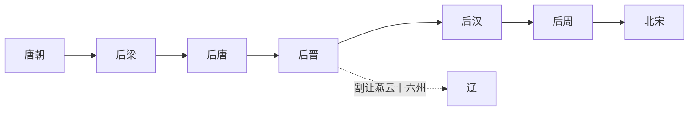

# 五代

## 概括

五代指唐亡后中原地区先后更替的五个政权：后梁、后唐、后晋、后汉、后周。它们都以掌握中原正统为目标，但军镇基础强、继承秩序弱，政权寿命普遍较短。

## 演进流程

## 历史顺序

| 顺序 | 名称 | 时间 | 建立者 | 简要概括 |
|---:|---|---|---|---|
| 1 | [后梁](/%E4%BA%BA%E6%96%87%E7%A7%91%E5%AD%A6/%E5%8E%86%E5%8F%B2-%E4%B8%AD%E5%9B%BD/%E6%9C%9D%E4%BB%A3/%E4%BA%94%E4%BB%A3/%E4%BA%94%E4%BB%A3/%E6%A2%81%EF%BC%88%E6%9C%B1%EF%BC%89.md) | 907年-923年 | 朱温 | 篡唐而立，开启五代；后被后唐灭亡。 |
| 2 | [后唐](/%E4%BA%BA%E6%96%87%E7%A7%91%E5%AD%A6/%E5%8E%86%E5%8F%B2-%E4%B8%AD%E5%9B%BD/%E6%9C%9D%E4%BB%A3/%E4%BA%94%E4%BB%A3/%E4%BA%94%E4%BB%A3/%E5%94%90%EF%BC%88%E6%9D%8E%EF%BC%89.md) | 923年-937年 | 李存勖 | 河东沙陀集团灭后梁建立，明宗时期国力较强，后被后晋取代。 |
| 3 | [后晋](/%E4%BA%BA%E6%96%87%E7%A7%91%E5%AD%A6/%E5%8E%86%E5%8F%B2-%E4%B8%AD%E5%9B%BD/%E6%9C%9D%E4%BB%A3/%E4%BA%94%E4%BB%A3/%E4%BA%94%E4%BB%A3/%E6%99%8B%EF%BC%88%E7%9F%B3%EF%BC%89.md) | 936年-947年 | 石敬瑭 | 借契丹兵灭后唐，割让燕云十六州，后为契丹所灭。 |
| 4 | [后汉](/%E4%BA%BA%E6%96%87%E7%A7%91%E5%AD%A6/%E5%8E%86%E5%8F%B2-%E4%B8%AD%E5%9B%BD/%E6%9C%9D%E4%BB%A3/%E4%BA%94%E4%BB%A3/%E4%BA%94%E4%BB%A3/%E6%B1%89%EF%BC%88%E5%88%98%EF%BC%89.md) | 947年-951年 | 刘知远 | 契丹北撤后据中原，国祚短促，后被郭威取代。 |
| 5 | [后周](/%E4%BA%BA%E6%96%87%E7%A7%91%E5%AD%A6/%E5%8E%86%E5%8F%B2-%E4%B8%AD%E5%9B%BD/%E6%9C%9D%E4%BB%A3/%E4%BA%94%E4%BB%A3/%E4%BA%94%E4%BB%A3/%E5%91%A8%EF%BC%88%E9%83%AD%EF%BC%89.md) | 951年-960年 | 郭威 | 政治军事整顿成效明显，柴荣时期具备统一趋势，后由北宋承接。 |

## 说明

- 后唐、后晋、后汉都与河东沙陀军事集团关系密切。
- 五代更替多由军队拥立、兵变、篡夺或外援介入完成，体现唐末藩镇政治的延续。
- 后周的整顿和扩张为北宋统一提供了直接基础。
