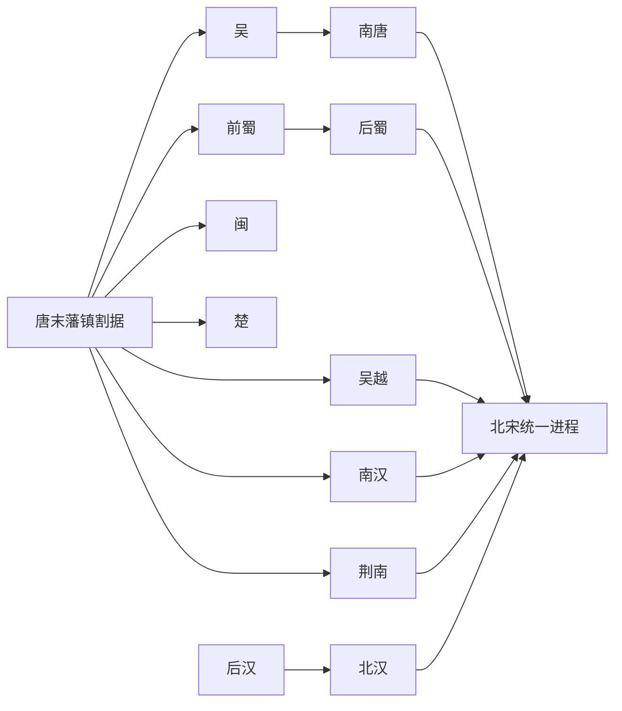

# 十国

## 概括

十国是五代十国时期较主要的地方割据政权统称，包括前蜀、后蜀、吴、南唐、吴越、闽、楚、南汉、荆南、北汉。它们主要分布在南方、四川、岭南和河东等地，存在时间并不完全重叠。

## 演进流程

## 历史顺序

| 顺序 | 名称 | 时间 | 地域核心 | 简要概括 |
|---:|---|---|---|---|
| 1 | [吴](/%E4%BA%BA%E6%96%87%E7%A7%91%E5%AD%A6/%E5%8E%86%E5%8F%B2-%E4%B8%AD%E5%9B%BD/%E6%9C%9D%E4%BB%A3/%E4%BA%94%E4%BB%A3/%E5%8D%81%E5%9B%BD/%E5%90%B4.md) | 902年-937年 | 淮南、江淮 | 杨氏政权，后被徐知诰取代为南唐。 |
| 2 | [前蜀](/%E4%BA%BA%E6%96%87%E7%A7%91%E5%AD%A6/%E5%8E%86%E5%8F%B2-%E4%B8%AD%E5%9B%BD/%E6%9C%9D%E4%BB%A3/%E4%BA%94%E4%BB%A3/%E5%8D%81%E5%9B%BD/%E5%89%8D%E8%9C%80.md) | 907年-925年 | 四川 | 王建据蜀建立，后被后唐灭亡。 |
| 3 | [吴越](/%E4%BA%BA%E6%96%87%E7%A7%91%E5%AD%A6/%E5%8E%86%E5%8F%B2-%E4%B8%AD%E5%9B%BD/%E6%9C%9D%E4%BB%A3/%E4%BA%94%E4%BB%A3/%E5%8D%81%E5%9B%BD/%E5%90%B4%E8%B6%8A.md) | 907年-978年 | 两浙 | 钱氏长期保境安民，最终纳土归宋。 |
| 4 | [闽](/%E4%BA%BA%E6%96%87%E7%A7%91%E5%AD%A6/%E5%8E%86%E5%8F%B2-%E4%B8%AD%E5%9B%BD/%E6%9C%9D%E4%BB%A3/%E4%BA%94%E4%BB%A3/%E5%8D%81%E5%9B%BD/%E9%97%BD.md) | 909年-945年 | 福建 | 王氏政权，后期内乱严重，最终为南唐所并。 |
| 5 | [南汉](/%E4%BA%BA%E6%96%87%E7%A7%91%E5%AD%A6/%E5%8E%86%E5%8F%B2-%E4%B8%AD%E5%9B%BD/%E6%9C%9D%E4%BB%A3/%E4%BA%94%E4%BB%A3/%E5%8D%81%E5%9B%BD/%E5%8D%97%E6%B1%89.md) | 917年-971年 | 岭南 | 刘氏据广州称帝，后被北宋攻灭。 |
| 6 | [荆南](/%E4%BA%BA%E6%96%87%E7%A7%91%E5%AD%A6/%E5%8E%86%E5%8F%B2-%E4%B8%AD%E5%9B%BD/%E6%9C%9D%E4%BB%A3/%E4%BA%94%E4%BB%A3/%E5%8D%81%E5%9B%BD/%E8%8D%86%E5%8D%97.md) | 924年-963年 | 江陵 | 高氏小国，处多方夹缝中，后归宋。 |
| 7 | [楚](/%E4%BA%BA%E6%96%87%E7%A7%91%E5%AD%A6/%E5%8E%86%E5%8F%B2-%E4%B8%AD%E5%9B%BD/%E6%9C%9D%E4%BB%A3/%E4%BA%94%E4%BB%A3/%E5%8D%81%E5%9B%BD/%E6%A5%9A.md) | 927年-951年 | 湖南 | 马氏据湖南，后因内乱被南唐攻灭。 |
| 8 | [后蜀](/%E4%BA%BA%E6%96%87%E7%A7%91%E5%AD%A6/%E5%8E%86%E5%8F%B2-%E4%B8%AD%E5%9B%BD/%E6%9C%9D%E4%BB%A3/%E4%BA%94%E4%BB%A3/%E5%8D%81%E5%9B%BD/%E5%90%8E%E8%9C%80.md) | 934年-965年 | 四川 | 孟氏据蜀建立，后被北宋攻灭。 |
| 9 | [南唐](/%E4%BA%BA%E6%96%87%E7%A7%91%E5%AD%A6/%E5%8E%86%E5%8F%B2-%E4%B8%AD%E5%9B%BD/%E6%9C%9D%E4%BB%A3/%E4%BA%94%E4%BB%A3/%E5%8D%81%E5%9B%BD/%E5%8D%97%E5%94%90.md) | 937年-975年 | 江南 | 取代吴而立，是南方强国之一，最终亡于北宋。 |
| 10 | [北汉](/%E4%BA%BA%E6%96%87%E7%A7%91%E5%AD%A6/%E5%8E%86%E5%8F%B2-%E4%B8%AD%E5%9B%BD/%E6%9C%9D%E4%BB%A3/%E4%BA%94%E4%BB%A3/%E5%8D%81%E5%9B%BD/%E5%8C%97%E6%B1%89.md) | 951年-979年 | 河东 | 后汉刘氏余部建立，依辽抗宋，最后被北宋攻灭。 |

## 说明

- “十国”是后世归纳的史学概念，并非十个政权同时并立。
- 多数十国政权源于唐末地方节度使或军政集团。
- 南方诸国在战乱中维持区域经济与文化发展，也为宋代南方经济上升保留基础。
