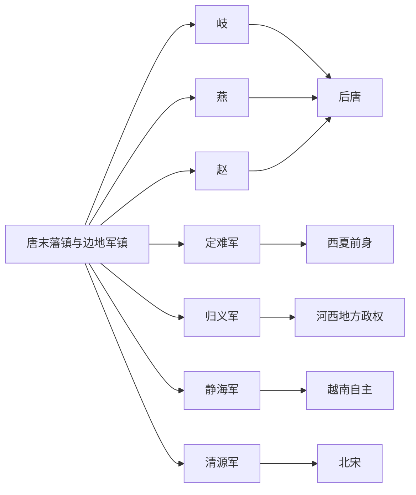

# 后汉及其他政权

## 概括

本目录收录五代十国时期不宜单纯归入“中原五代”或传统“十国”的政权、军镇和边地政治实体。

这些节点多数源自唐末藩镇、边地军镇或地方豪强。它们有的短暂称帝或称王，有的长期保持半独立状态，有的最终并入辽、北宋或周边区域政权。

## 演进流程

## 节点顺序

| 顺序 | 名称 | 时间 | 类型 | 简要概括 |
|---:|---|---|---|---|
| 1 | [岐](/%E4%BA%BA%E6%96%87%E7%A7%91%E5%AD%A6/%E5%8E%86%E5%8F%B2-%E4%B8%AD%E5%9B%BD/%E6%9C%9D%E4%BB%A3/%E4%BA%94%E4%BB%A3/%E5%90%8E%E6%B1%89%E5%8F%8A%E5%85%B6%E4%BB%96%E6%94%BF%E6%9D%83/%E5%B2%90.md) | 887年-924年 | 唐末藩镇 / 岐王政权 | 李茂贞据凤翔，长期周旋于唐、后梁、后唐之间。 |
| 2 | [燕](/%E4%BA%BA%E6%96%87%E7%A7%91%E5%AD%A6/%E5%8E%86%E5%8F%B2-%E4%B8%AD%E5%9B%BD/%E6%9C%9D%E4%BB%A3/%E4%BA%94%E4%BB%A3/%E5%90%8E%E6%B1%89%E5%8F%8A%E5%85%B6%E4%BB%96%E6%94%BF%E6%9D%83/%E7%87%95.md) | 911年-913年 | 短命称帝政权 | 刘守光据幽州称帝，后被李存勖灭亡。 |
| 3 | [赵](/%E4%BA%BA%E6%96%87%E7%A7%91%E5%AD%A6/%E5%8E%86%E5%8F%B2-%E4%B8%AD%E5%9B%BD/%E6%9C%9D%E4%BB%A3/%E4%BA%94%E4%BB%A3/%E5%90%8E%E6%B1%89%E5%8F%8A%E5%85%B6%E4%BB%96%E6%94%BF%E6%9D%83/%E8%B5%B5.md) | 910年-921年 | 河北藩镇政权 | 王镕据成德，夹在梁、晋势力之间，后归入晋 / 后唐体系。 |
| 4 | [定难军](/%E4%BA%BA%E6%96%87%E7%A7%91%E5%AD%A6/%E5%8E%86%E5%8F%B2-%E4%B8%AD%E5%9B%BD/%E6%9C%9D%E4%BB%A3/%E4%BA%94%E4%BB%A3/%E5%90%8E%E6%B1%89%E5%8F%8A%E5%85%B6%E4%BB%96%E6%94%BF%E6%9D%83/%E5%AE%9A%E9%9A%BE%E5%86%9B.md) | 881年-982年左右 | 边地军镇 | 党项李氏据夏州，是后来西夏政权的重要前身。 |
| 5 | [归义军](/%E4%BA%BA%E6%96%87%E7%A7%91%E5%AD%A6/%E5%8E%86%E5%8F%B2-%E4%B8%AD%E5%9B%BD/%E6%9C%9D%E4%BB%A3/%E4%BA%94%E4%BB%A3/%E5%90%8E%E6%B1%89%E5%8F%8A%E5%85%B6%E4%BB%96%E6%94%BF%E6%9D%83/%E5%BD%92%E4%B9%89%E5%86%9B.md) | 848年-1036年左右 | 河西军镇 | 张氏、曹氏据敦煌河西，长期维持地方自治。 |
| 6 | [静海军](/%E4%BA%BA%E6%96%87%E7%A7%91%E5%AD%A6/%E5%8E%86%E5%8F%B2-%E4%B8%AD%E5%9B%BD/%E6%9C%9D%E4%BB%A3/%E4%BA%94%E4%BB%A3/%E5%90%8E%E6%B1%89%E5%8F%8A%E5%85%B6%E4%BB%96%E6%94%BF%E6%9D%83/%E9%9D%99%E6%B5%B7%E5%86%9B.md) | 905年-938年 | 交趾地方政权 | 曲氏、杨氏、吴氏推动交趾脱离中原直接控制。 |
| 7 | [清源军](/%E4%BA%BA%E6%96%87%E7%A7%91%E5%AD%A6/%E5%8E%86%E5%8F%B2-%E4%B8%AD%E5%9B%BD/%E6%9C%9D%E4%BB%A3/%E4%BA%94%E4%BB%A3/%E5%90%8E%E6%B1%89%E5%8F%8A%E5%85%B6%E4%BB%96%E6%94%BF%E6%9D%83/%E6%B8%85%E6%BA%90%E5%86%9B.md) | 949年-978年 | 闽南割据政权 | 留从效据泉州、漳州一带，后归宋。 |

## 说明

- 本目录中的政权不全部属于传统“十国”，但对理解五代十国时期的地方分裂很重要。
- 后汉仍是“五代”之一，主笔记保留在 [五代/汉（刘）](/%E4%BA%BA%E6%96%87%E7%A7%91%E5%AD%A6/%E5%8E%86%E5%8F%B2-%E4%B8%AD%E5%9B%BD/%E6%9C%9D%E4%BB%A3/%E4%BA%94%E4%BB%A3/%E4%BA%94%E4%BB%A3/%E6%B1%89%EF%BC%88%E5%88%98%EF%BC%89.md)；北汉主笔记保留在 [十国/北汉](/%E4%BA%BA%E6%96%87%E7%A7%91%E5%AD%A6/%E5%8E%86%E5%8F%B2-%E4%B8%AD%E5%9B%BD/%E6%9C%9D%E4%BB%A3/%E4%BA%94%E4%BB%A3/%E5%8D%81%E5%9B%BD/%E5%8C%97%E6%B1%89.md)。
- 定难军、归义军、静海军等属于边地或半独立军镇，时间跨度可能跨越五代十国前后。
