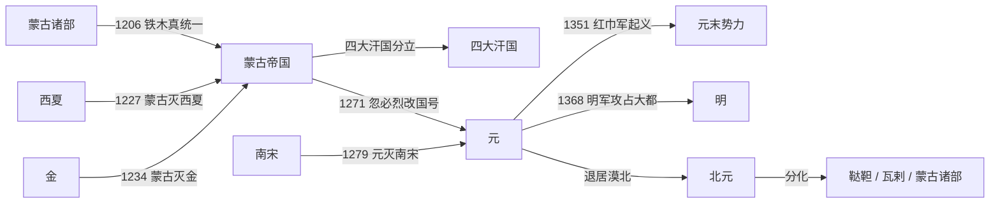

# 元

## 时间

1271年-1368年。其前身是1206年建立的[蒙古帝国](/%E4%BA%BA%E6%96%87%E7%A7%91%E5%AD%A6/%E5%8E%86%E5%8F%B2-%E4%B8%AD%E5%9B%BD/%E6%9C%9D%E4%BB%A3/%E5%85%83/%E8%92%99%E5%8F%A4%E5%B8%9D%E5%9B%BD.md)；1368年元廷退回漠北后，史称[北元](/%E4%BA%BA%E6%96%87%E7%A7%91%E5%AD%A6/%E5%8E%86%E5%8F%B2-%E4%B8%AD%E5%9B%BD/%E6%9C%9D%E4%BB%A3/%E5%85%83/%E5%8C%97%E5%85%83.md)。

## 别称

大元、元朝。蒙古帝国时期常称大蒙古国。

## 概括

元朝是蒙古贵族建立的中国大一统王朝。1206年，铁木真统一蒙古诸部，建立大蒙古国。忽必烈在与阿里不哥争位后取得汗位，1260年建元“中统”，1271年取《易经》“大哉乾元”之义改国号为大元，定都大都。1279年元灭南宋，完成对中国本部的统一。

元朝疆域辽阔，中央以中书省为最高行政中枢，地方推行行省制度，对后世行政区划影响深远。元代商品经济和海外贸易继续发展，元曲、散曲等文学形式兴盛。后期财政、吏治、皇位继承、民族等级、灾荒和民变问题加剧，1351年红巾军起义爆发。1368年明军攻占大都，元朝在中原的统治结束，元廷北退漠北。

## 演进流程

## 阶段

| 顺序 | 名称 | 时间 | 简要概括 |
|---:|---|---|---|
| 1 | [蒙古帝国](/%E4%BA%BA%E6%96%87%E7%A7%91%E5%AD%A6/%E5%8E%86%E5%8F%B2-%E4%B8%AD%E5%9B%BD/%E6%9C%9D%E4%BB%A3/%E5%85%83/%E8%92%99%E5%8F%A4%E5%B8%9D%E5%9B%BD.md) | 1206年-1271年 | 成吉思汗建立大蒙古国，先后灭西夏、金，并向欧亚扩张。 |
| 2 | 元朝建立与统一 | 1260年-1279年 | 忽必烈取得汗位，1271年改国号大元，1279年灭南宋。 |
| 3 | 元朝中前期 | 1279年-1320年 | 行省制度、中书省体制和多民族帝国治理框架形成。 |
| 4 | 元朝中后期 | 1320年-1368年 | 皇位争夺、财政危机、灾荒和民变加剧，红巾军起义后元廷失去中原。 |
| 5 | [北元](/%E4%BA%BA%E6%96%87%E7%A7%91%E5%AD%A6/%E5%8E%86%E5%8F%B2-%E4%B8%AD%E5%9B%BD/%E6%9C%9D%E4%BB%A3/%E5%85%83/%E5%8C%97%E5%85%83.md) | 1368年-1388年或至1402年 | 元廷退居漠北后延续国号和汗统，后来分化为鞑靼、瓦剌等蒙古势力。 |

## 统治结构

| 角色 | 说明 |
|---|---|
| 君主 | 大汗 / 皇帝，兼具蒙古汗权和中原皇帝身份。 |
| 中书省 | 元朝最高行政中枢，丞相、平章政事等处理政务。 |
| 枢密院 | 掌军事。 |
| 御史台 | 掌监察。 |
| 行省 | 地方最高行政单位，开后世省制先河。 |
| 宣政院 | 管理吐蕃地区和全国佛教事务，是元代治理西藏的重要机构。 |

## 说明

- 元朝并非从蒙古帝国中突然出现，而是忽必烈在大蒙古国框架下建立的中原王朝化政权。
- 四大汗国与元朝同源于蒙古帝国，但政治上逐渐分立，元朝皇帝名义上仍保有大汗地位。
- 元朝后期的红巾军、朱元璋、陈友谅、张士诚、明玉珍等势力共同构成元末政治格局。
- 1368年以后，元廷退居漠北，仍维持一段时间的元朝正统自我认同。

## 相关

- [元皇帝与蒙古大汗世系](/%E4%BA%BA%E6%96%87%E7%A7%91%E5%AD%A6/%E5%8E%86%E5%8F%B2-%E4%B8%AD%E5%9B%BD/%E6%9C%9D%E4%BB%A3/%E5%85%83/%E4%B8%96%E7%B3%BB.md)
- [蒙古帝国](/%E4%BA%BA%E6%96%87%E7%A7%91%E5%AD%A6/%E5%8E%86%E5%8F%B2-%E4%B8%AD%E5%9B%BD/%E6%9C%9D%E4%BB%A3/%E5%85%83/%E8%92%99%E5%8F%A4%E5%B8%9D%E5%9B%BD.md)
- [四大汗国](/%E4%BA%BA%E6%96%87%E7%A7%91%E5%AD%A6/%E5%8E%86%E5%8F%B2-%E4%B8%AD%E5%9B%BD/%E6%9C%9D%E4%BB%A3/%E5%85%83/%E5%9B%9B%E5%A4%A7%E6%B1%97%E5%9B%BD.md)
- [元末势力](/%E4%BA%BA%E6%96%87%E7%A7%91%E5%AD%A6/%E5%8E%86%E5%8F%B2-%E4%B8%AD%E5%9B%BD/%E6%9C%9D%E4%BB%A3/%E5%85%83/%E5%85%83%E6%9C%AB%E5%8A%BF%E5%8A%9B.md)
- [北元](/%E4%BA%BA%E6%96%87%E7%A7%91%E5%AD%A6/%E5%8E%86%E5%8F%B2-%E4%B8%AD%E5%9B%BD/%E6%9C%9D%E4%BB%A3/%E5%85%83/%E5%8C%97%E5%85%83.md)
- [蒙古诸部](/%E4%BA%BA%E6%96%87%E7%A7%91%E5%AD%A6/%E5%8E%86%E5%8F%B2-%E4%B8%AD%E5%9B%BD/%E6%9C%9D%E4%BB%A3/%E5%85%83/%E8%92%99%E5%8F%A4%E8%AF%B8%E9%83%A8.md)
