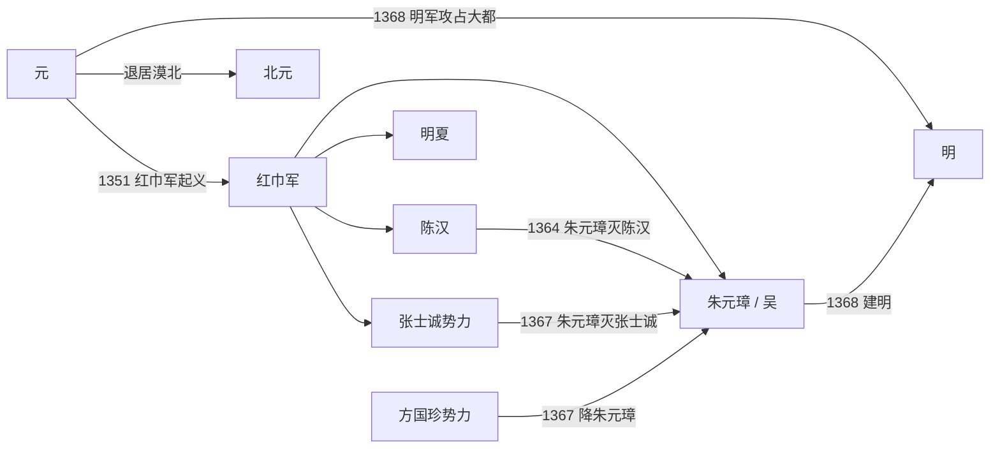

# 元末势力

## 时间

约1351年-1368年。

## 概括

元末势力是元朝后期统治瓦解过程中出现的农民军、地方割据政权和元廷军事集团的统称。1351年，治理黄河和征发民力引发红巾军起义，元朝各地叛乱扩大。朱元璋、陈友谅、张士诚、明玉珍、方国珍等势力先后崛起，最终朱元璋统一江南并北伐，1368年建立明朝、攻占大都。

## 主要势力

| 势力 | 时间 | 代表人物 | 简要概括 |
|---|---|---|---|
| 元廷 | 1271年-1368年 | 元惠宗妥欢帖睦尔、脱脱 | 后期财政、治河、党争、军政失控，依靠地方军阀镇压起义。 |
| 红巾军 | 1351年起 | 刘福通、韩林儿、徐寿辉等 | 元末农民战争主线，带有白莲教和弥勒信仰色彩。 |
| 朱元璋势力 / 吴 | 1350年代-1368年 | 朱元璋 | 由红巾军分支发展，先据应天，后击败陈友谅、张士诚，建立明朝。 |
| 陈汉 | 1360年-1364年 | 陈友谅 | 占据长江中游，鄱阳湖之战败于朱元璋。 |
| 张士诚势力 | 1353年-1367年 | 张士诚 | 起于盐民，控制苏州和江浙富庶地区，后被朱元璋灭。 |
| 明夏 | 1363年-1371年 | 明玉珍、明升 | 占据四川重庆一带，明朝建立后被并入。 |
| 方国珍势力 | 1348年-1367年 | 方国珍 | 活动于浙东沿海，善于海上割据和降附周旋。 |

## 演进关系

## 说明

- 元末起义不是单一集团行动，而是多地民变、宗教动员、地方武装和军阀割据叠加。
- 朱元璋能够胜出，与其控制江南财赋、建立较稳定政权、先南后北的战略有关。
- 鄱阳湖之战击败陈友谅，是朱元璋取得长江流域优势的关键。
- 平定张士诚后，朱元璋取得江南经济核心区，具备北伐元廷的基础。

## 相关

- [元](/%E4%BA%BA%E6%96%87%E7%A7%91%E5%AD%A6/%E5%8E%86%E5%8F%B2-%E4%B8%AD%E5%9B%BD/%E6%9C%9D%E4%BB%A3/%E5%85%83/README.md)
- [明](/%E4%BA%BA%E6%96%87%E7%A7%91%E5%AD%A6/%E5%8E%86%E5%8F%B2-%E4%B8%AD%E5%9B%BD/%E6%9C%9D%E4%BB%A3/%E6%98%8E/README.md)
