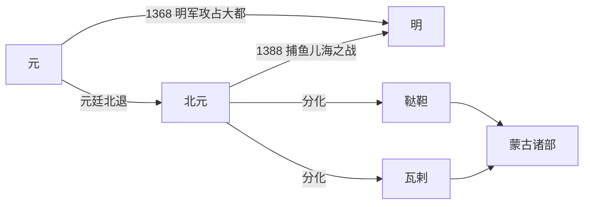

# 北元

## 时间

1368年-1388年；也有叙述将北元延续至1402年鬼力赤篡位前。

## 概括

北元是1368年元廷退出大都、退居漠北后延续的蒙古政权。元惠宗妥欢帖睦尔北逃后仍使用元朝国号和皇帝 / 大汗身份，其后昭宗爱猷识理达腊、天元帝脱古思帖木儿继续与明朝对抗。

1388年捕鱼儿海之战后，明军重创北元，脱古思帖木儿被杀，北元国号和中原王朝式正统受到严重打击。此后蒙古高原诸部逐渐分化为鞑靼、瓦剌等力量，明朝与蒙古诸部长期处于战争、互市、册封和边境对峙关系中。

## 演进流程

## 说明

- 1368年，徐达率明军攻占大都，元惠宗北逃。
- 北元仍以元朝法统自居，试图恢复对中原的统治。
- 1370年元惠宗死后，爱猷识理达腊即位，是为元昭宗。
- 1388年捕鱼儿海之战后，北元遭明军重创，脱古思帖木儿败亡。
- 1402年鬼力赤篡位后，蒙古政权进入鞑靼、瓦剌等部族政治阶段。

## 演变关系

| 关系 | 内容 |
|---|---|
| 前一节点 | [元](/%E4%BA%BA%E6%96%87%E7%A7%91%E5%AD%A6/%E5%8E%86%E5%8F%B2-%E4%B8%AD%E5%9B%BD/%E6%9C%9D%E4%BB%A3/%E5%85%83/README.md)。 |
| 并列 / 后续节点 | [鞑靼](/%E4%BA%BA%E6%96%87%E7%A7%91%E5%AD%A6/%E5%8E%86%E5%8F%B2-%E4%B8%AD%E5%9B%BD/%E6%9C%9D%E4%BB%A3/%E5%85%83/%E9%9E%91%E9%9D%BC.md)、[瓦剌](/%E4%BA%BA%E6%96%87%E7%A7%91%E5%AD%A6/%E5%8E%86%E5%8F%B2-%E4%B8%AD%E5%9B%BD/%E6%9C%9D%E4%BB%A3/%E5%85%83/%E7%93%A6%E5%89%8C.md)、[蒙古诸部](/%E4%BA%BA%E6%96%87%E7%A7%91%E5%AD%A6/%E5%8E%86%E5%8F%B2-%E4%B8%AD%E5%9B%BD/%E6%9C%9D%E4%BB%A3/%E5%85%83/%E8%92%99%E5%8F%A4%E8%AF%B8%E9%83%A8.md)。 |
| 主要对手 | 明朝。 |

## 统治结构

| 角色 | 说明 |
|---|---|
| 大汗 / 皇帝 | 元廷北退后的蒙古最高统治者，兼具元朝皇帝和蒙古大汗身份。 |
| 宗王贵族 | 成吉思汗后裔和蒙古贵族分掌部众，对汗权形成制约。 |
| 部族联盟 | 北元后期中央权威下降，蒙古诸部联盟化、分裂化趋势增强。 |
