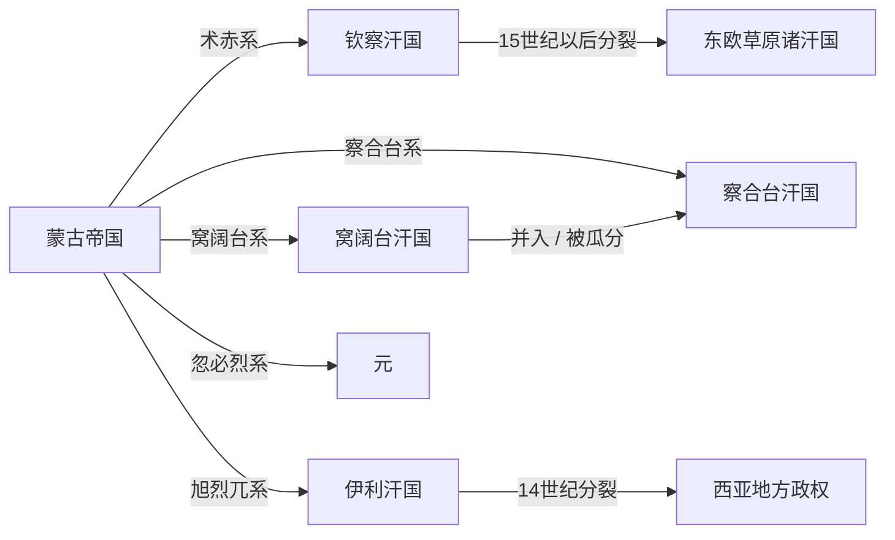

# 四大汗国

## 时间

13世纪中期以后逐渐形成，延续时间因汗国而异。

## 概括

四大汗国是蒙古帝国西方和中亚诸王领地逐渐独立后形成的政权体系，通常指钦察汗国、察合台汗国、窝阔台汗国和伊利汗国。它们与元朝同源于成吉思汗家族分封，但在蒙哥死后和忽必烈、阿里不哥争位后，政治上逐渐分立。

## 演进流程

## 汗国

| 名称 | 系统 | 大致区域 | 简要概括 |
|---|---|---|---|
| 钦察汗国 | 术赤系 | 东欧草原、伏尔加河流域 | 又称金帐汗国，对罗斯诸公国和东欧草原影响很大。 |
| 察合台汗国 | 察合台系 | 中亚、天山南北 | 后来分裂为东西两部，对中亚突厥化和蒙古化影响深远。 |
| 窝阔台汗国 | 窝阔台系 | 阿尔泰、额尔齐斯河一带 | 与元朝和察合台汗国关系复杂，后逐渐被并入或瓜分。 |
| 伊利汗国 | 旭烈兀系 | 伊朗、两河流域和西亚 | 由旭烈兀建立，统治西亚，后期逐渐伊斯兰化。 |

## 说明

- “四大汗国”不是同一天整齐建立的四个国家，而是蒙古帝国分封和内战后逐渐形成的政治格局。
- 元朝皇帝名义上仍保有大汗地位，但对西方汗国的实际控制逐渐减弱。
- 各汗国在当地接受突厥、伊斯兰、波斯、罗斯等区域传统，发展出不同政治文化。

## 相关

- [蒙古帝国](/%E4%BA%BA%E6%96%87%E7%A7%91%E5%AD%A6/%E5%8E%86%E5%8F%B2-%E4%B8%AD%E5%9B%BD/%E6%9C%9D%E4%BB%A3/%E5%85%83/%E8%92%99%E5%8F%A4%E5%B8%9D%E5%9B%BD.md)
- [元](/%E4%BA%BA%E6%96%87%E7%A7%91%E5%AD%A6/%E5%8E%86%E5%8F%B2-%E4%B8%AD%E5%9B%BD/%E6%9C%9D%E4%BB%A3/%E5%85%83/README.md)
