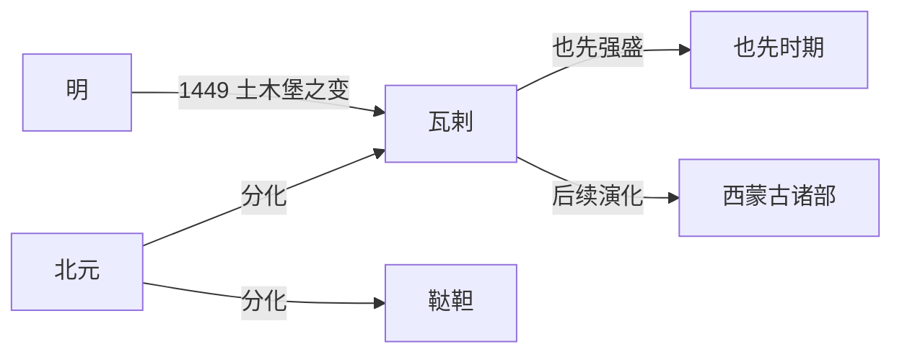

# 瓦剌

## 时间

明代主要活跃于15世纪，后续可联系到西蒙古诸部和准噶尔等线索。

## 概括

瓦剌是北元以后西蒙古部族联盟的重要称呼，与明代所称鞑靼相对。瓦剌并非单一固定国家，而是西蒙古贵族和部族联盟。15世纪中期也先掌权时，瓦剌一度强盛，1449年土木堡之变中俘获明英宗，成为明代北方政治的重大转折。

## 演进流程

## 说明

- 瓦剌是西蒙古诸部的明代常见称呼。
- 也先时期瓦剌一度压制东蒙古，并大举南下明朝边境。
- 1449年土木堡之变中，明英宗被瓦剌俘获，明朝由前期盛势转入更谨慎的北方防御格局。
- 瓦剌后续与西蒙古、卫拉特、准噶尔等历史线索有关，但不应简单等同于某一个固定政权。

## 演变关系

| 关系 | 内容 |
|---|---|
| 前一节点 | [北元](/%E4%BA%BA%E6%96%87%E7%A7%91%E5%AD%A6/%E5%8E%86%E5%8F%B2-%E4%B8%AD%E5%9B%BD/%E6%9C%9D%E4%BB%A3/%E5%85%83/%E5%8C%97%E5%85%83.md)。 |
| 并列节点 | [鞑靼](/%E4%BA%BA%E6%96%87%E7%A7%91%E5%AD%A6/%E5%8E%86%E5%8F%B2-%E4%B8%AD%E5%9B%BD/%E6%9C%9D%E4%BB%A3/%E5%85%83/%E9%9E%91%E9%9D%BC.md)。 |
| 相关节点 | 明朝北方边防、土木堡之变、西蒙古诸部。 |
