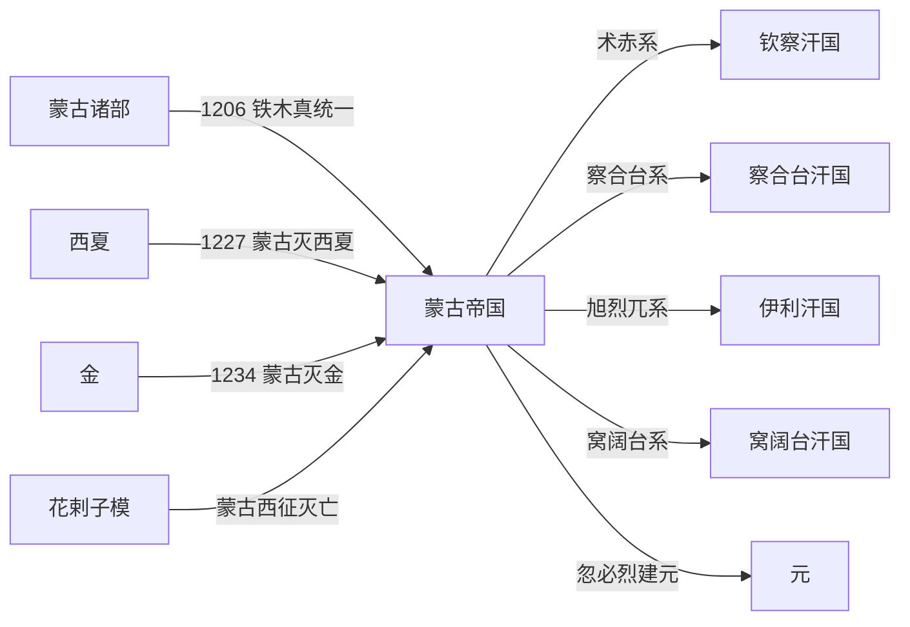

# 蒙古帝国

## 时间

1206年-1271年。1271年以后，忽必烈建立的大元成为蒙古帝国东部和中原部分的王朝化延续；欧亚草原和西方领地逐渐形成[四大汗国](/%E4%BA%BA%E6%96%87%E7%A7%91%E5%AD%A6/%E5%8E%86%E5%8F%B2-%E4%B8%AD%E5%9B%BD/%E6%9C%9D%E4%BB%A3/%E5%85%83/%E5%9B%9B%E5%A4%A7%E6%B1%97%E5%9B%BD.md)。

## 别称

大蒙古国、蒙古汗国。

## 概括

蒙古帝国由铁木真统一蒙古诸部后建立。1206年，铁木真在斡难河大会上被推举为成吉思汗，建立大蒙古国。此后蒙古先后征服西夏、金、花剌子模和欧亚多地，形成横跨欧亚的帝国。

蒙古帝国的继承和分封结构以成吉思汗家族为核心。窝阔台、贵由、蒙哥时期继续扩张；蒙哥死后，忽必烈与阿里不哥争夺汗位，蒙古帝国实际分裂。忽必烈在中原建立元朝，西方诸王领地则发展为相对独立的汗国。

## 演进流程

## 说明

- 1206年，铁木真统一蒙古诸部，建立大蒙古国。
- 1227年，蒙古灭西夏；1234年，蒙古联合南宋灭金。
- 蒙古西征使帝国扩展到中亚、西亚、东欧等地。
- 1259年蒙哥在攻宋战争中去世，汗位继承危机引发忽必烈与阿里不哥内战。
- 1271年忽必烈改国号大元，蒙古帝国在东部转化为元朝体制。

## 演变关系

| 关系 | 内容 |
|---|---|
| 前一节点 | [蒙古诸部](/%E4%BA%BA%E6%96%87%E7%A7%91%E5%AD%A6/%E5%8E%86%E5%8F%B2-%E4%B8%AD%E5%9B%BD/%E6%9C%9D%E4%BB%A3/%E5%85%83/%E8%92%99%E5%8F%A4%E8%AF%B8%E9%83%A8.md)。 |
| 后一节点 | [元](/%E4%BA%BA%E6%96%87%E7%A7%91%E5%AD%A6/%E5%8E%86%E5%8F%B2-%E4%B8%AD%E5%9B%BD/%E6%9C%9D%E4%BB%A3/%E5%85%83/README.md)、[四大汗国](/%E4%BA%BA%E6%96%87%E7%A7%91%E5%AD%A6/%E5%8E%86%E5%8F%B2-%E4%B8%AD%E5%9B%BD/%E6%9C%9D%E4%BB%A3/%E5%85%83/%E5%9B%9B%E5%A4%A7%E6%B1%97%E5%9B%BD.md)。 |
| 并列关系 | 元朝与西方汗国同源于蒙古帝国，但政治上逐渐分立。 |

## 统治结构

| 角色 | 说明 |
|---|---|
| 大汗 | 成吉思汗家族最高统治者，需通过忽里勒台等贵族政治形式确认。 |
| 黄金家族 | 成吉思汗后裔，是帝国统治合法性的核心。 |
| 千户制 | 军政合一的组织方式，将部众编入十户、百户、千户、万户体系。 |
| 诸王封地 | 成吉思汗诸子和宗王分领草原与征服地，后来发展出汗国分立。 |
