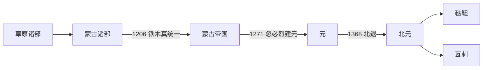

# 蒙古诸部

## 时间

12世纪以前至明清时期长期存在。

## 概括

蒙古诸部是蒙古高原上不同部族、部落联盟和贵族集团的统称。成吉思汗以前，蒙古高原存在蒙古、克烈、乃蛮、蔑儿乞、塔塔儿等多种势力。1206年铁木真统一诸部，建立蒙古帝国。元朝退居漠北后，蒙古政治再次部族化和联盟化，明代常见鞑靼、瓦剌等称呼。

## 演进流程

## 说明

- “蒙古诸部”不是单一政权，而是不同历史阶段草原政治共同体的概括性名称。
- 成吉思汗统一前，蒙古高原的部族联盟经常互相征战、通婚和结盟。
- 蒙古帝国建立后，原有部族被纳入千户制和黄金家族统治结构。
- 北元衰落后，蒙古高原长期呈现鞑靼、瓦剌等部族联盟并立格局。

## 相关

- [蒙古帝国](/%E4%BA%BA%E6%96%87%E7%A7%91%E5%AD%A6/%E5%8E%86%E5%8F%B2-%E4%B8%AD%E5%9B%BD/%E6%9C%9D%E4%BB%A3/%E5%85%83/%E8%92%99%E5%8F%A4%E5%B8%9D%E5%9B%BD.md)
- [北元](/%E4%BA%BA%E6%96%87%E7%A7%91%E5%AD%A6/%E5%8E%86%E5%8F%B2-%E4%B8%AD%E5%9B%BD/%E6%9C%9D%E4%BB%A3/%E5%85%83/%E5%8C%97%E5%85%83.md)
- [鞑靼](/%E4%BA%BA%E6%96%87%E7%A7%91%E5%AD%A6/%E5%8E%86%E5%8F%B2-%E4%B8%AD%E5%9B%BD/%E6%9C%9D%E4%BB%A3/%E5%85%83/%E9%9E%91%E9%9D%BC.md)
- [瓦剌](/%E4%BA%BA%E6%96%87%E7%A7%91%E5%AD%A6/%E5%8E%86%E5%8F%B2-%E4%B8%AD%E5%9B%BD/%E6%9C%9D%E4%BB%A3/%E5%85%83/%E7%93%A6%E5%89%8C.md)
