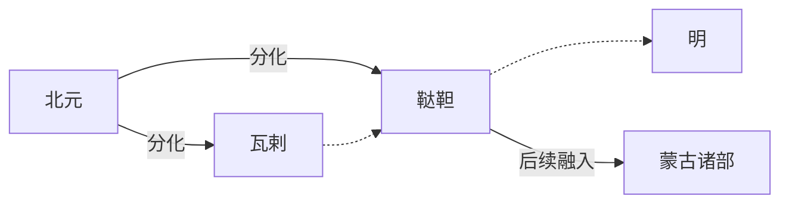

# 鞑靼

## 时间

明代主要指东蒙古诸部，约15世纪以后长期存在。

## 概括

鞑靼在明代文献中常用来称呼北元以后蒙古高原东部的蒙古诸部。它并不是一个始终统一的国家，而是多个部族联盟、汗权集团和贵族势力的泛称。北元衰落后，东蒙古和瓦剌相互竞争，也与明朝发生战争、朝贡、互市和册封关系。

## 演进流程

## 说明

- “鞑靼”在不同历史文献中含义不完全相同，明代常指东蒙古而非所有蒙古人。
- 鞑靼与瓦剌是明代北方边患和草原政治的两条重要线索。
- 达延汗时期东蒙古再度整合，对后来蒙古各部格局有重要影响。
- 明朝对鞑靼既有军事防御，也有朝贡、互市和封贡政策。

## 演变关系

| 关系 | 内容 |
|---|---|
| 前一节点 | [北元](/%E4%BA%BA%E6%96%87%E7%A7%91%E5%AD%A6/%E5%8E%86%E5%8F%B2-%E4%B8%AD%E5%9B%BD/%E6%9C%9D%E4%BB%A3/%E5%85%83/%E5%8C%97%E5%85%83.md)。 |
| 并列节点 | [瓦剌](/%E4%BA%BA%E6%96%87%E7%A7%91%E5%AD%A6/%E5%8E%86%E5%8F%B2-%E4%B8%AD%E5%9B%BD/%E6%9C%9D%E4%BB%A3/%E5%85%83/%E7%93%A6%E5%89%8C.md)。 |
| 后续节点 | 明清时期的蒙古诸部格局。 |
