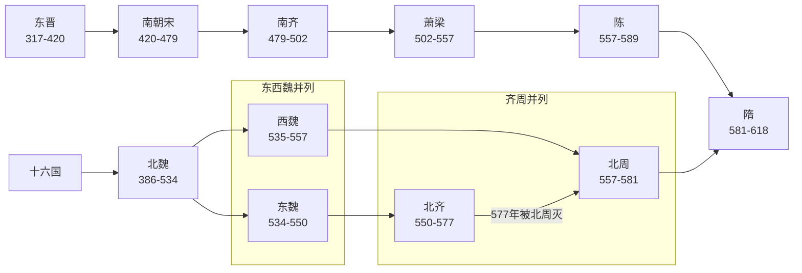

# 南北朝

> 导航：[南北朝](/%E4%BA%BA%E6%96%87%E7%A7%91%E5%AD%A6/%E5%8E%86%E5%8F%B2-%E4%B8%AD%E5%9B%BD/%E6%9C%9D%E4%BB%A3/%E5%8D%97%E5%8C%97%E6%9C%9D/README.md) / [南朝](/%E4%BA%BA%E6%96%87%E7%A7%91%E5%AD%A6/%E5%8E%86%E5%8F%B2-%E4%B8%AD%E5%9B%BD/%E6%9C%9D%E4%BB%A3/%E5%8D%97%E5%8C%97%E6%9C%9D/%E5%8D%97%E6%9C%9D/README.md) / [北朝](/%E4%BA%BA%E6%96%87%E7%A7%91%E5%AD%A6/%E5%8E%86%E5%8F%B2-%E4%B8%AD%E5%9B%BD/%E6%9C%9D%E4%BB%A3/%E5%8D%97%E5%8C%97%E6%9C%9D/%E5%8C%97%E6%9C%9D/README.md)

## 概括

南北朝（420年—589年）是中国历史上的南北对峙时期，上承[东晋](/%E4%BA%BA%E6%96%87%E7%A7%91%E5%AD%A6/%E5%8E%86%E5%8F%B2-%E4%B8%AD%E5%9B%BD/%E6%9C%9D%E4%BB%A3/%E6%99%8B/%E4%B8%9C%E6%99%8B.md)与[十六国](/%E4%BA%BA%E6%96%87%E7%A7%91%E5%AD%A6/%E5%8E%86%E5%8F%B2-%E4%B8%AD%E5%9B%BD/%E6%9C%9D%E4%BB%A3/%E6%99%8B/%E5%8D%81%E5%85%AD%E5%9B%BD/README.md)，下接隋朝。南方从刘裕代晋建立南朝宋开始，依次经历宋、齐、梁、陈；北方从北魏统一华北开始，后分裂为东魏、西魏，再分别演变为北齐、北周，最终北周由隋取代，隋灭陈后重新统一南北。

## 演进流程

## 阶段导览

| 顺序 | 阶段 | 时间 | 都城 | 简要概括 |
|---:|---|---|---|---|
| 1 | [南朝](/%E4%BA%BA%E6%96%87%E7%A7%91%E5%AD%A6/%E5%8E%86%E5%8F%B2-%E4%B8%AD%E5%9B%BD/%E6%9C%9D%E4%BB%A3/%E5%8D%97%E5%8C%97%E6%9C%9D/%E5%8D%97%E6%9C%9D/README.md) | 420年—589年 | 建康为主 | 宋、齐、梁、陈相继更替，南方政权以江南为根基，与北方长期对峙。 |
| 2 | [北朝](/%E4%BA%BA%E6%96%87%E7%A7%91%E5%AD%A6/%E5%8E%86%E5%8F%B2-%E4%B8%AD%E5%9B%BD/%E6%9C%9D%E4%BB%A3/%E5%8D%97%E5%8C%97%E6%9C%9D/%E5%8C%97%E6%9C%9D/README.md) | 439年—581年 | 平城、洛阳、邺、长安等 | 北魏统一华北后分裂为东魏、西魏，又演变为北齐、北周；北周灭北齐后统一北方。 |
| 3 | 隋灭陈 | 589年 | 大兴、建康 | 隋朝南下灭陈，结束南北朝分裂局面。 |

## 核心线索

- **南北对峙**：南方以建康为政治中心，北方以北魏及其后继政权为主轴。
- **门阀与皇权**：南朝承接东晋门阀政治，但寒门军功集团和皇权逐渐上升。
- **民族融合**：北朝以鲜卑政权为核心，北魏孝文帝改革推动汉化与制度整合。
- **分裂中的统一趋势**：北朝军政整合能力逐渐增强，最终由北周—隋系统完成统一。
- **灭亡原因**：门阀与皇权矛盾、地方军人势力兴起、皇室内斗、外部军事压力和财政民力消耗共同削弱南北政权。

## 相关笔记

- [南朝](/%E4%BA%BA%E6%96%87%E7%A7%91%E5%AD%A6/%E5%8E%86%E5%8F%B2-%E4%B8%AD%E5%9B%BD/%E6%9C%9D%E4%BB%A3/%E5%8D%97%E5%8C%97%E6%9C%9D/%E5%8D%97%E6%9C%9D/README.md)
- [北朝](/%E4%BA%BA%E6%96%87%E7%A7%91%E5%AD%A6/%E5%8E%86%E5%8F%B2-%E4%B8%AD%E5%9B%BD/%E6%9C%9D%E4%BB%A3/%E5%8D%97%E5%8C%97%E6%9C%9D/%E5%8C%97%E6%9C%9D/README.md)
- [晋](/%E4%BA%BA%E6%96%87%E7%A7%91%E5%AD%A6/%E5%8E%86%E5%8F%B2-%E4%B8%AD%E5%9B%BD/%E6%9C%9D%E4%BB%A3/%E6%99%8B/README.md)
- [十六国](/%E4%BA%BA%E6%96%87%E7%A7%91%E5%AD%A6/%E5%8E%86%E5%8F%B2-%E4%B8%AD%E5%9B%BD/%E6%9C%9D%E4%BB%A3/%E6%99%8B/%E5%8D%81%E5%85%AD%E5%9B%BD/README.md)
