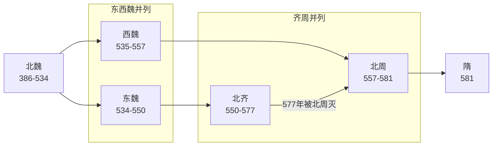

# 北朝

> 导航：[南北朝](../README.md) / [北朝](README.md) / [北魏、东魏、西魏](%E9%AD%8F%EF%BC%88%E6%8B%93%E8%B7%8B%EF%BC%89.md) / [北齐](%E9%BD%90%EF%BC%88%E9%AB%98%EF%BC%89.md) / [北周](%E5%91%A8%EF%BC%88%E5%AE%87%E6%96%87%EF%BC%89.md)

## 概括

北朝（439年—581年）以北魏统一华北为起点。北魏后期因六镇之乱、尔朱荣入洛和权臣争夺而分裂为东魏、西魏；东魏由高氏控制，后被北齐取代；西魏由宇文氏控制，后被北周取代。577年北周灭北齐，统一北方；581年杨坚代周建隋，北朝结束。

## 演进流程

## 政权导览

| 顺序 | 政权 | 时间 | 都城 | 简要概括 |
|---:|---|---|---|---|
| 1 | [魏（拓跋）](%E9%AD%8F%EF%BC%88%E6%8B%93%E8%B7%8B%EF%BC%89.md) | 386年—534年；东魏534年—550年；西魏535年—557年 | 平城、洛阳、邺、长安 | 北魏统一华北，后分裂为东魏、西魏。 |
| 2 | [齐（高）](%E9%BD%90%EF%BC%88%E9%AB%98%EF%BC%89.md) | 550年—577年 | 邺 | 高洋代东魏建立，承接高欢集团，后被北周灭。 |
| 3 | [周（宇文）](%E5%91%A8%EF%BC%88%E5%AE%87%E6%96%87%EF%BC%89.md) | 557年—581年 | 长安 | 宇文觉代西魏建立，北周武帝灭北齐统一北方，后被隋取代。 |

## 核心线索

- **北魏统一华北**：439年北魏太武帝灭北凉，结束十六国以来北方长期分裂。
- **孝文帝改革**：迁都洛阳、改姓、制度汉化，推动北方民族融合。
- **六镇之乱**：北魏军事边镇失衡，引发政权崩溃。
- **东西分裂**：高欢控制东魏，宇文泰控制西魏，形成东西对峙。
- **北周—隋系统统一**：北周灭北齐后统一北方，隋继承其基础灭陈统一全国。

## 相关笔记

- [南北朝](../README.md)
- [魏（拓跋）](%E9%AD%8F%EF%BC%88%E6%8B%93%E8%B7%8B%EF%BC%89.md)
- [齐（高）](%E9%BD%90%EF%BC%88%E9%AB%98%EF%BC%89.md)
- [周（宇文）](%E5%91%A8%EF%BC%88%E5%AE%87%E6%96%87%EF%BC%89.md)
