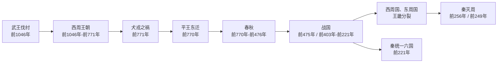

# 周朝

## 时间

公元前1046年－公元前256年；前1046年－前771年为西周，前770年－前256年为东周。前221年秦灭六国，结束战国时代。

## 概括

周朝为姬姓王朝，约传30代37王，是中国古代封建、宗法、礼乐制度最典型的王朝之一。周人崛起于周原，武王伐纣后建立西周，定都镐京；成康时期通过分封、营建洛邑与礼乐制度完成统治秩序。西周后期王室财政、军事与宗法秩序逐渐动摇，国人暴动、共和行政、宣王后期挫败与犬戎之祸共同导致西周灭亡。平王东迁后进入东周，周天子保有名义共主地位，实际政治主导权逐步转向诸侯与卿大夫，最终经春秋争霸、战国兼并而由秦统一。

## 演进流程

## 阶段导览

| 顺序 | 阶段 | 时间 | 简要概括 |
|---:|---|---|---|
| 1 | 西周王朝 | 前1046年－前771年 | 周武王灭商建国，周公、成康时期完成分封与礼乐秩序，后因王室衰微与犬戎之祸而亡。 |
| 2 | [春秋](%E6%98%A5%E7%A7%8B/README.md) | 前770年－前476年 | 周王室东迁后权威下降，齐、晋、楚、秦、宋、吴、越等诸侯先后争霸。 |
| 3 | [战国](%E6%88%98%E5%9B%BD/README.md) | 前475年 / 前403年－前221年 | 大国兼并与变法竞争加剧，七雄并立，秦最终统一六国。 |
| 4 | [西周国、东周国](%E8%A5%BF%E5%91%A8%E5%9B%BD%E3%80%81%E4%B8%9C%E5%91%A8%E5%9B%BD.md) | 前440年－前249年 | 东周末年王畿分裂出的两个小政权，不等同于西周王朝、东周王朝。 |

## 目录

| 笔记 | 内容 |
|---|---|
| [事件](%E4%BA%8B%E4%BB%B6/README.md) | 西周建国、制度奠基、王室衰微与平王东迁。 |
| [周王室世系](%E5%91%A8%E7%8E%8B%E5%AE%A4%E4%B8%96%E7%B3%BB.md) | 先周世系、西周诸王、共和行政、东周诸王、并立与僭立者。 |
| [春秋](%E6%98%A5%E7%A7%8B/README.md) | 春秋霸政、尊王攘夷与周王室名义共主秩序。 |
| [战国](%E6%88%98%E5%9B%BD/README.md) | 战国兼并、变法、秦灭周与秦灭六国。 |
| [先秦诸侯](%E5%85%88%E7%A7%A6%E8%AF%B8%E4%BE%AF/README.md) | 周代主要诸侯国及其世系。 |
| [西周国、东周国](%E8%A5%BF%E5%91%A8%E5%9B%BD%E3%80%81%E4%B8%9C%E5%91%A8%E5%9B%BD.md) | 东周末年王畿内部的西周国、东周国及其君主世系。 |

## 制度与社会

| 主题 | 要点 |
|---|---|
| 王权 | 周王是周室最高权力者，也是姬姓宗族和诸侯体系的名义宗主。 |
| 分封制 | 通过宗室、功臣、先代贵族分封来控制战略区域，形成周王室与诸侯国的政治网络。 |
| 宗法制 | 以血缘和嫡长继承维系统治等级，是诸侯、卿大夫与士族秩序的基础。 |
| 礼乐制度 | 用礼仪、乐制、等级规范维系贵族政治秩序，春秋中后期逐渐瓦解。 |
| 井田与赋役 | 西周以井田、贡赋、劳役为基础；春秋战国逐渐转向土地私有、税亩、郡县和户籍管理。 |
| 文化 | 周代是华夏族与周边族群交流融合的重要时期，散文、史书、诗歌和诸子思想均在此基础上发展。 |

## 灭亡线索

- 西周后期自然灾害、外族压力与王室财政危机叠加，削弱镐京政权。
- 周厉王专利、弭谤导致国人暴动，王权威信受损。
- 周幽王废申后与太子宜臼，破坏宗法继承秩序，引发申侯与犬戎联合攻周。
- 平王东迁后，周王室失去关中根基，只保有洛邑周边王畿，诸侯逐渐成为实际政治中心。
- 战国后期王畿又分裂为西周国、东周国，周赧王迁居西周国。
- 前256年秦灭西周国与周王室；前249年秦灭东周国；前221年秦灭六国，以郡县制和中央集权国家形态取代周代封建秩序。
