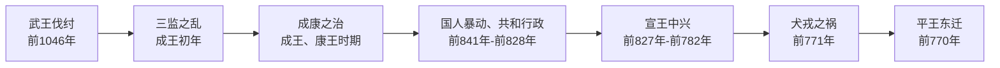

# 周代事件

## 概括

本目录收录周朝从灭商建国、西周制度奠基，到王室衰微、平王东迁的关键事件。阅读顺序以历史先后为主：先看西周建国与制度形成，再看厉宣幽平时期的危机与转折。

## 演进流程

## 事件导览

| 顺序 | 事件 | 时间 | 简要概括 |
|---:|---|---|---|
| 1 | [武王伐纣](/%E4%BA%BA%E6%96%87%E7%A7%91%E5%AD%A6/%E5%8E%86%E5%8F%B2-%E4%B8%AD%E5%9B%BD/%E6%9C%9D%E4%BB%A3/%E5%91%A8/%E4%BA%8B%E4%BB%B6/%E6%AD%A6%E7%8E%8B%E4%BC%90%E7%BA%A3.md) | 前1046年 | 周武王率联军击败商纣，牧野之战后建立周朝。 |
| 2 | [三监之乱](/%E4%BA%BA%E6%96%87%E7%A7%91%E5%AD%A6/%E5%8E%86%E5%8F%B2-%E4%B8%AD%E5%9B%BD/%E6%9C%9D%E4%BB%A3/%E5%91%A8/%E4%BA%8B%E4%BB%B6/%E4%B8%89%E7%9B%91%E4%B9%8B%E4%B9%B1.md) | 周成王初年 | 管叔、蔡叔联合武庚与东方方国反周，周公平乱并加强东土控制。 |
| 3 | [成康之治](/%E4%BA%BA%E6%96%87%E7%A7%91%E5%AD%A6/%E5%8E%86%E5%8F%B2-%E4%B8%AD%E5%9B%BD/%E6%9C%9D%E4%BB%A3/%E5%91%A8/%E4%BA%8B%E4%BB%B6/%E6%88%90%E5%BA%B7%E4%B9%8B%E6%B2%BB.md) | 周成王、周康王时期 | 周室完成洛邑经营、分封东方大国，西周进入稳定与扩张阶段。 |
| 4 | [国人暴动、共和行政](/%E4%BA%BA%E6%96%87%E7%A7%91%E5%AD%A6/%E5%8E%86%E5%8F%B2-%E4%B8%AD%E5%9B%BD/%E6%9C%9D%E4%BB%A3/%E5%91%A8/%E4%BA%8B%E4%BB%B6/%E5%9B%BD%E4%BA%BA%E6%9A%B4%E5%8A%A8%E3%80%81%E5%85%B1%E5%92%8C%E8%A1%8C%E6%94%BF.md) | 前841年-前828年 | 周厉王专利、弭谤引发国人暴动，厉王出奔，周室进入共和行政。 |
| 5 | [宣王中兴](/%E4%BA%BA%E6%96%87%E7%A7%91%E5%AD%A6/%E5%8E%86%E5%8F%B2-%E4%B8%AD%E5%9B%BD/%E6%9C%9D%E4%BB%A3/%E5%91%A8/%E4%BA%8B%E4%BB%B6/%E5%AE%A3%E7%8E%8B%E4%B8%AD%E5%85%B4.md) | 前827年-前782年 | 周宣王前期恢复王室威望，后期军事失败与制度干预加深危机。 |
| 6 | [犬戎之祸](/%E4%BA%BA%E6%96%87%E7%A7%91%E5%AD%A6/%E5%8E%86%E5%8F%B2-%E4%B8%AD%E5%9B%BD/%E6%9C%9D%E4%BB%A3/%E5%91%A8/%E4%BA%8B%E4%BB%B6/%E7%8A%AC%E6%88%8E%E4%B9%8B%E7%A5%B8.md) | 前771年 | 申侯联合犬戎攻破镐京，周幽王被杀，西周灭亡。 |
| 7 | [平王东迁](/%E4%BA%BA%E6%96%87%E7%A7%91%E5%AD%A6/%E5%8E%86%E5%8F%B2-%E4%B8%AD%E5%9B%BD/%E6%9C%9D%E4%BB%A3/%E5%91%A8/%E4%BA%8B%E4%BB%B6/%E5%B9%B3%E7%8E%8B%E4%B8%9C%E8%BF%81.md) | 前770年 | 周平王迁都洛邑，东周开始，周王室权威进一步下降。 |

## 相关笔记

- [周朝](/%E4%BA%BA%E6%96%87%E7%A7%91%E5%AD%A6/%E5%8E%86%E5%8F%B2-%E4%B8%AD%E5%9B%BD/%E6%9C%9D%E4%BB%A3/%E5%91%A8/README.md)
- [春秋](/%E4%BA%BA%E6%96%87%E7%A7%91%E5%AD%A6/%E5%8E%86%E5%8F%B2-%E4%B8%AD%E5%9B%BD/%E6%9C%9D%E4%BB%A3/%E5%91%A8/%E6%98%A5%E7%A7%8B/README.md)
- [战国](/%E4%BA%BA%E6%96%87%E7%A7%91%E5%AD%A6/%E5%8E%86%E5%8F%B2-%E4%B8%AD%E5%9B%BD/%E6%9C%9D%E4%BB%A3/%E5%91%A8/%E6%88%98%E5%9B%BD/README.md)
- [周王室世系](/%E4%BA%BA%E6%96%87%E7%A7%91%E5%AD%A6/%E5%8E%86%E5%8F%B2-%E4%B8%AD%E5%9B%BD/%E6%9C%9D%E4%BB%A3/%E5%91%A8/%E5%91%A8%E7%8E%8B%E5%AE%A4%E4%B8%96%E7%B3%BB.md)
