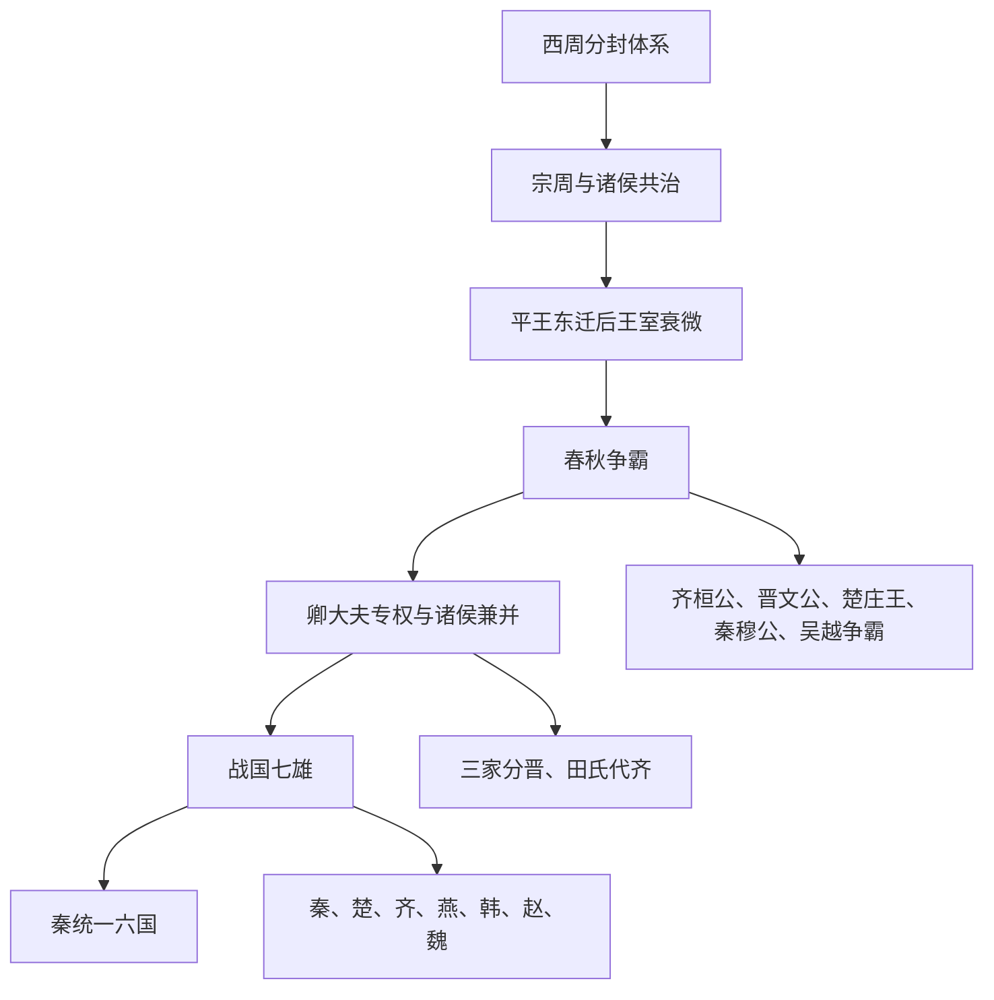

# 先秦诸侯

先秦诸侯是周代分封制、宗法制与区域政治长期演变的结果。西周初年，周王室通过封建亲族、功臣与前代贵族后裔来控制天下；东周以后，王室衰微，诸侯国逐渐从宗法秩序中的地方封国，演变为春秋霸主和战国兼并战争中的独立强国。

## 演进流程

## 诸侯国总览

|  顺序 | 名称                                                        | 时间                         | 简要概括                                     |
| --: | --------------------------------------------------------- | -------------------------- | ---------------------------------------- |
|   1 | [齐](/%E4%BA%BA%E6%96%87%E7%A7%91%E5%AD%A6/%E5%8E%86%E5%8F%B2-%E4%B8%AD%E5%9B%BD/%E6%9C%9D%E4%BB%A3/%E5%91%A8/%E5%85%88%E7%A7%A6%E8%AF%B8%E4%BE%AF/%E9%BD%90/README.md)                                  | 约前11世纪-前221年               | 姜齐由姜太公受封建国，春秋时齐桓公称霸；战国时田氏代齐，后为战国七雄之一。    |
|   2 | [鲁](/%E4%BA%BA%E6%96%87%E7%A7%91%E5%AD%A6/%E5%8E%86%E5%8F%B2-%E4%B8%AD%E5%9B%BD/%E6%9C%9D%E4%BB%A3/%E5%91%A8/%E5%85%88%E7%A7%A6%E8%AF%B8%E4%BE%AF/%E9%B2%81/README.md)                                  | 约前11世纪-前256年               | 周公旦后裔封国，礼乐传统浓厚，是保存周礼与儒家文化的重要地区。          |
|   3 | [燕](/%E4%BA%BA%E6%96%87%E7%A7%91%E5%AD%A6/%E5%8E%86%E5%8F%B2-%E4%B8%AD%E5%9B%BD/%E6%9C%9D%E4%BB%A3/%E5%91%A8/%E5%85%88%E7%A7%A6%E8%AF%B8%E4%BE%AF/%E7%87%95/README.md)                                  | 约前11世纪-前222年               | 北方姬姓诸侯国，战国时经燕昭王改革强盛，后被秦灭。                |
|   4 | [卫](/%E4%BA%BA%E6%96%87%E7%A7%91%E5%AD%A6/%E5%8E%86%E5%8F%B2-%E4%B8%AD%E5%9B%BD/%E6%9C%9D%E4%BB%A3/%E5%91%A8/%E5%85%88%E7%A7%A6%E8%AF%B8%E4%BE%AF/%E5%8D%AB/README.md)                                  | 约前11世纪-前209年               | 周公弟康叔受封，春秋后期衰弱，长期依附大国，是少数延续到秦末的周代封国。     |
|   5 | [宋](/%E4%BA%BA%E6%96%87%E7%A7%91%E5%AD%A6/%E5%8E%86%E5%8F%B2-%E4%B8%AD%E5%9B%BD/%E6%9C%9D%E4%BB%A3/%E5%91%A8/%E5%85%88%E7%A7%A6%E8%AF%B8%E4%BE%AF/%E5%AE%8B/README.md)                                  | 约前11世纪-前286年               | 商王族后裔封国，春秋时宋襄公一度争霸，战国时被齐、楚、魏共灭。          |
|   6 | [晋与三晋](/%E4%BA%BA%E6%96%87%E7%A7%91%E5%AD%A6/%E5%8E%86%E5%8F%B2-%E4%B8%AD%E5%9B%BD/%E6%9C%9D%E4%BB%A3/%E5%91%A8/%E5%85%88%E7%A7%A6%E8%AF%B8%E4%BE%AF/%E6%99%8B%26%E8%B5%B5%E9%AD%8F%E9%9F%A9/README.md) | 约前11世纪-前376年；三晋至前230-前225年 | 晋为姬姓大国，春秋中后期长期称霸；后来韩、赵、魏三家分晋，成为战国七雄中的三国。 |
|   7 | [曹](/%E4%BA%BA%E6%96%87%E7%A7%91%E5%AD%A6/%E5%8E%86%E5%8F%B2-%E4%B8%AD%E5%9B%BD/%E6%9C%9D%E4%BB%A3/%E5%91%A8/%E5%85%88%E7%A7%A6%E8%AF%B8%E4%BE%AF/%E6%9B%B9/README.md)                                  | 约前11世纪-前487年               | 姬姓小国，夹在鲁、宋、卫、郑等国之间，春秋后期被宋灭。              |
|   8 | [蔡](/%E4%BA%BA%E6%96%87%E7%A7%91%E5%AD%A6/%E5%8E%86%E5%8F%B2-%E4%B8%AD%E5%9B%BD/%E6%9C%9D%E4%BB%A3/%E5%91%A8/%E5%85%88%E7%A7%A6%E8%AF%B8%E4%BE%AF/%E8%94%A1/README.md)                                  | 约前11世纪-前447年               | 周文王子蔡叔度后裔封国，地处中原与楚之间，多次迁徙，最终为楚所灭。        |
|   9 | [陈](/%E4%BA%BA%E6%96%87%E7%A7%91%E5%AD%A6/%E5%8E%86%E5%8F%B2-%E4%B8%AD%E5%9B%BD/%E6%9C%9D%E4%BB%A3/%E5%91%A8/%E5%85%88%E7%A7%A6%E8%AF%B8%E4%BE%AF/%E9%99%88/README.md)                                  | 约前11世纪-前478年               | 舜后裔妫姓封国，春秋后期内乱频仍，最终为楚所灭。                 |
|  10 | [楚](/%E4%BA%BA%E6%96%87%E7%A7%91%E5%AD%A6/%E5%8E%86%E5%8F%B2-%E4%B8%AD%E5%9B%BD/%E6%9C%9D%E4%BB%A3/%E5%91%A8/%E5%85%88%E7%A7%A6%E8%AF%B8%E4%BE%AF/%E6%A5%9A/README.md)                                  | 约前11世纪-前223年               | 南方大国，从子爵封国扩张为春秋霸主和战国七雄之一，后被秦灭。           |
|  11 | [秦](/%E4%BA%BA%E6%96%87%E7%A7%91%E5%AD%A6/%E5%8E%86%E5%8F%B2-%E4%B8%AD%E5%9B%BD/%E6%9C%9D%E4%BB%A3/%E5%91%A8/%E5%85%88%E7%A7%A6%E8%AF%B8%E4%BE%AF/%E7%A7%A6/README.md)                                  | 前905年受封秦邑；前770年正式列诸侯-前221年 | 嬴姓西陲封国，护送平王东迁后正式成为诸侯，商鞅变法后崛起并统一六国。       |
|  12 | [郑](/%E4%BA%BA%E6%96%87%E7%A7%91%E5%AD%A6/%E5%8E%86%E5%8F%B2-%E4%B8%AD%E5%9B%BD/%E6%9C%9D%E4%BB%A3/%E5%91%A8/%E5%85%88%E7%A7%A6%E8%AF%B8%E4%BE%AF/%E9%83%91/README.md)                                  | 前806年-前375年                | 周宣王弟郑桓公受封，春秋初年郑庄公“小霸”，后被韩国灭。             |
|  13 | [吴](/%E4%BA%BA%E6%96%87%E7%A7%91%E5%AD%A6/%E5%8E%86%E5%8F%B2-%E4%B8%AD%E5%9B%BD/%E6%9C%9D%E4%BB%A3/%E5%91%A8/%E5%85%88%E7%A7%A6%E8%AF%B8%E4%BE%AF/%E5%90%B4/README.md)                                  | 约前12世纪-前473年               | 长江下游诸侯国，春秋晚期阖闾、夫差时期争霸中原，后被越灭。            |
|  14 | [越](/%E4%BA%BA%E6%96%87%E7%A7%91%E5%AD%A6/%E5%8E%86%E5%8F%B2-%E4%B8%AD%E5%9B%BD/%E6%9C%9D%E4%BB%A3/%E5%91%A8/%E5%85%88%E7%A7%A6%E8%AF%B8%E4%BE%AF/%E8%B6%8A/README.md)                                  | 约前20世纪传说起源；周代至前306年        | 会稽一带诸侯国，勾践灭吴后称霸，战国时被楚击破。                 |

## 关键关系

- 春秋霸主主要出自齐、晋、楚、秦、吴、越等强国，代表周王室权威衰落后的区域秩序重组。
- 战国七雄包括秦、楚、齐、燕、韩、赵、魏，其中韩、赵、魏来自晋国分裂，田齐来自齐国内部政权更替。
- 周代诸侯的灭亡大多不是一次性消失，而是经历迁都、称臣、内乱、卿族专权、被大国吞并等阶段。

## 相关事件

- [齐桓公称霸](/%E4%BA%BA%E6%96%87%E7%A7%91%E5%AD%A6/%E5%8E%86%E5%8F%B2-%E4%B8%AD%E5%9B%BD/%E6%9C%9D%E4%BB%A3/%E5%91%A8/%E6%98%A5%E7%A7%8B/%E9%BD%90%E6%A1%93%E5%85%AC%E7%A7%B0%E9%9C%B8.md)
- [晋文公称霸](/%E4%BA%BA%E6%96%87%E7%A7%91%E5%AD%A6/%E5%8E%86%E5%8F%B2-%E4%B8%AD%E5%9B%BD/%E6%9C%9D%E4%BB%A3/%E5%91%A8/%E6%98%A5%E7%A7%8B/%E6%99%8B%E6%96%87%E5%85%AC%E7%A7%B0%E9%9C%B8.md)
- [楚庄王称霸](/%E4%BA%BA%E6%96%87%E7%A7%91%E5%AD%A6/%E5%8E%86%E5%8F%B2-%E4%B8%AD%E5%9B%BD/%E6%9C%9D%E4%BB%A3/%E5%91%A8/%E6%98%A5%E7%A7%8B/%E6%A5%9A%E5%BA%84%E7%8E%8B%E7%A7%B0%E9%9C%B8.md)
- [秦穆公独霸西戎](/%E4%BA%BA%E6%96%87%E7%A7%91%E5%AD%A6/%E5%8E%86%E5%8F%B2-%E4%B8%AD%E5%9B%BD/%E6%9C%9D%E4%BB%A3/%E5%91%A8/%E6%98%A5%E7%A7%8B/%E7%A7%A6%E7%A9%86%E5%85%AC%E7%8B%AC%E9%9C%B8%E8%A5%BF%E6%88%8E.md)
- [吴越争霸](/%E4%BA%BA%E6%96%87%E7%A7%91%E5%AD%A6/%E5%8E%86%E5%8F%B2-%E4%B8%AD%E5%9B%BD/%E6%9C%9D%E4%BB%A3/%E5%91%A8/%E6%98%A5%E7%A7%8B/%E5%90%B4%E8%B6%8A%E4%BA%89%E9%9C%B8.md)
- [三家分晋](/%E4%BA%BA%E6%96%87%E7%A7%91%E5%AD%A6/%E5%8E%86%E5%8F%B2-%E4%B8%AD%E5%9B%BD/%E6%9C%9D%E4%BB%A3/%E5%91%A8/%E6%88%98%E5%9B%BD/%E4%B8%89%E5%AE%B6%E5%88%86%E6%99%8B.md)
- [田氏代齐](/%E4%BA%BA%E6%96%87%E7%A7%91%E5%AD%A6/%E5%8E%86%E5%8F%B2-%E4%B8%AD%E5%9B%BD/%E6%9C%9D%E4%BB%A3/%E5%91%A8/%E6%88%98%E5%9B%BD/%E7%94%B0%E6%B0%8F%E4%BB%A3%E9%BD%90.md)
- [秦灭六国之战](/%E4%BA%BA%E6%96%87%E7%A7%91%E5%AD%A6/%E5%8E%86%E5%8F%B2-%E4%B8%AD%E5%9B%BD/%E6%9C%9D%E4%BB%A3/%E5%91%A8/%E6%88%98%E5%9B%BD/%E7%A7%A6%E7%81%AD%E5%85%AD%E5%9B%BD%E4%B9%8B%E6%88%98.md)
