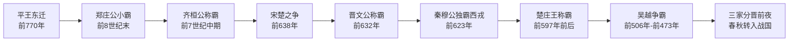

# 春秋

## 时间

公元前770年－公元前476年，一说可下延至前453年三家灭智或前403年三家分晋。

## 概括

春秋是东周前半段。平王东迁后，周王室失去关中根基，只保有洛邑周边王畿，诸侯逐渐拥有实际军事与政治主导权。早期诸侯仍以“尊王攘夷”为共同语言，霸主通过会盟、救援、征伐来维持中原秩序；到后期，大国兼并、小国消亡，卿大夫权力上升，春秋秩序逐步走向战国兼并格局。

## 演进流程

## 事件导览

| 顺序 | 事件 | 时间 | 简要概括 |
|---:|---|---|---|
| 1 | [小霸郑庄公](/%E4%BA%BA%E6%96%87%E7%A7%91%E5%AD%A6/%E5%8E%86%E5%8F%B2-%E4%B8%AD%E5%9B%BD/%E6%9C%9D%E4%BB%A3/%E5%91%A8/%E6%98%A5%E7%A7%8B/%E5%B0%8F%E9%9C%B8%E9%83%91%E5%BA%84%E5%85%AC.md) | 前8世纪末-前707年 | 郑国强盛并与周王室冲突，𦈡葛之战中王师受挫，周天子权威下降。 |
| 2 | [齐桓公称霸](/%E4%BA%BA%E6%96%87%E7%A7%91%E5%AD%A6/%E5%8E%86%E5%8F%B2-%E4%B8%AD%E5%9B%BD/%E6%9C%9D%E4%BB%A3/%E5%91%A8/%E6%98%A5%E7%A7%8B/%E9%BD%90%E6%A1%93%E5%85%AC%E7%A7%B0%E9%9C%B8.md) | 前685年-前643年 | 齐桓公任用管仲变法，以尊王攘夷号召诸侯，成为春秋首霸。 |
| 3 | [宋楚之争](/%E4%BA%BA%E6%96%87%E7%A7%91%E5%AD%A6/%E5%8E%86%E5%8F%B2-%E4%B8%AD%E5%9B%BD/%E6%9C%9D%E4%BB%A3/%E5%91%A8/%E6%98%A5%E7%A7%8B/%E5%AE%8B%E6%A5%9A%E4%B9%8B%E4%BA%89.md) | 前638年 | 宋襄公试图继承霸业，在泓水之战败于楚国，宋国霸业失败。 |
| 4 | [晋文公称霸](/%E4%BA%BA%E6%96%87%E7%A7%91%E5%AD%A6/%E5%8E%86%E5%8F%B2-%E4%B8%AD%E5%9B%BD/%E6%9C%9D%E4%BB%A3/%E5%91%A8/%E6%98%A5%E7%A7%8B/%E6%99%8B%E6%96%87%E5%85%AC%E7%A7%B0%E9%9C%B8.md) | 前636年-前628年 | 晋文公回国即位后改革内政，在城濮之战击败楚军，确立中原霸主地位。 |
| 5 | [秦穆公独霸西戎](/%E4%BA%BA%E6%96%87%E7%A7%91%E5%AD%A6/%E5%8E%86%E5%8F%B2-%E4%B8%AD%E5%9B%BD/%E6%9C%9D%E4%BB%A3/%E5%91%A8/%E6%98%A5%E7%A7%8B/%E7%A7%A6%E7%A9%86%E5%85%AC%E7%8B%AC%E9%9C%B8%E8%A5%BF%E6%88%8E.md) | 前627年-前623年 | 秦国东进受晋阻挡后转向西方，兼并戎狄部族，奠定关中强国基础。 |
| 6 | [楚庄王称霸](/%E4%BA%BA%E6%96%87%E7%A7%91%E5%AD%A6/%E5%8E%86%E5%8F%B2-%E4%B8%AD%E5%9B%BD/%E6%9C%9D%E4%BB%A3/%E5%91%A8/%E6%98%A5%E7%A7%8B/%E6%A5%9A%E5%BA%84%E7%8E%8B%E7%A7%B0%E9%9C%B8.md) | 前613年-前591年 | 楚庄王改革内政、北上问鼎，并在邲之战击败晋国，楚国称霸中原。 |
| 7 | [吴越争霸](/%E4%BA%BA%E6%96%87%E7%A7%91%E5%AD%A6/%E5%8E%86%E5%8F%B2-%E4%B8%AD%E5%9B%BD/%E6%9C%9D%E4%BB%A3/%E5%91%A8/%E6%98%A5%E7%A7%8B/%E5%90%B4%E8%B6%8A%E4%BA%89%E9%9C%B8.md) | 前506年-前473年 | 吴、越在江淮与江浙地区先后崛起，越王勾践灭吴后成为春秋末期霸主。 |

## 说明

- “春秋”得名于鲁国编年史《春秋》，其记事自鲁隐公元年（前722年）至鲁哀公十四年（前481年）。
- 传统春秋五霸常列为齐桓公、宋襄公、晋文公、秦穆公、楚庄王；不同文献也会将吴王阖闾、越王勾践列入霸主序列。
- 春秋时期诸侯朝聘、盟会、征伐频繁，周天子仍具名义共主地位，但实际秩序主要由大国霸主维持。
- 春秋后期，晋国六卿、齐国田氏等卿大夫势力坐大，是战国时期“下克上”和变法竞争的前奏。

## 图片

## 相关笔记

- [周朝](/%E4%BA%BA%E6%96%87%E7%A7%91%E5%AD%A6/%E5%8E%86%E5%8F%B2-%E4%B8%AD%E5%9B%BD/%E6%9C%9D%E4%BB%A3/%E5%91%A8/README.md)
- [事件](/%E4%BA%BA%E6%96%87%E7%A7%91%E5%AD%A6/%E5%8E%86%E5%8F%B2-%E4%B8%AD%E5%9B%BD/%E6%9C%9D%E4%BB%A3/%E5%91%A8/%E4%BA%8B%E4%BB%B6/README.md)
- [战国](/%E4%BA%BA%E6%96%87%E7%A7%91%E5%AD%A6/%E5%8E%86%E5%8F%B2-%E4%B8%AD%E5%9B%BD/%E6%9C%9D%E4%BB%A3/%E5%91%A8/%E6%88%98%E5%9B%BD/README.md)
- [先秦诸侯](/%E4%BA%BA%E6%96%87%E7%A7%91%E5%AD%A6/%E5%8E%86%E5%8F%B2-%E4%B8%AD%E5%9B%BD/%E6%9C%9D%E4%BB%A3/%E5%91%A8/%E5%85%88%E7%A7%A6%E8%AF%B8%E4%BE%AF/README.md)
