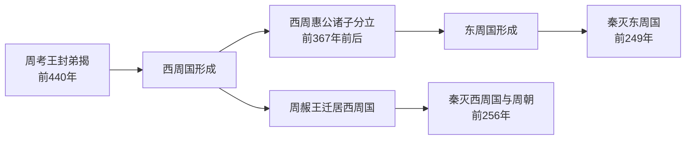

# 西周国、东周国

## 时间

西周国约前440年－前256年；东周国约前367年－前249年。

## 概括

西周国、东周国是东周末年由周王畿分裂出的两个小政权。西周国始于周考王封弟姬揭于王畿，东周国则由西周惠公少子姬根在巩地自立而成。周赧王后期迁居西周国，前256年秦灭西周国并终结周王室；前249年秦又灭东周国，周代王畿残余政权全部消失。

## 演进流程

## 统治结构

| 层级 / 角色 | 西周国 | 东周国 | 说明 |
|---|---|---|---|
| 名义天下共主 | 周王室，晚期周赧王迁居西周国 | 无 | 周王室与西周国关系最密切，但西周国君不等同于周天子。 |
| 地方君主 | 西周公 / 西周君 | 东周公 / 东周君 | 均为周王畿内的小政权君主，实际控制范围有限。 |
| 外部压力 | 秦、韩、赵、魏等战国强国 | 秦、韩、赵等战国强国 | 两国都处在大国夹缝中，主要依赖外交与王室名义维持存在。 |
| 终结方式 | 前256年被秦昭襄王攻灭 | 前249年被秦庄襄王攻灭 | 两国灭亡分别标志周王室终结和王畿残余政权消失。 |

## 西周国君主世系

|  顺序 | 姓名  | 谥号 / 称号 | 在位时间        | 与前任关系  | 关键事件 / 备注                        |
| --: | --- | ------- | ----------- | ------ | -------------------------------- |
|   1 | 姬揭  | 西周桓公    | 前440年－前415年 | 周考王之弟  | 周考王封其于王畿，续周公之职，西周国形成。            |
|   2 | 不详  | 西周威公    | 前414年－前367年 | 西周桓公之子 | 西周国继续控制王畿西部。                     |
|   3 | 不详  | 西周惠公    | 前366年－不详    | 西周威公之子 | 其少子姬根在巩地自立，分裂出东周国。               |
|   4 | 不详  | 西周武公    | 不详          | 西周惠公长子 | 周赧王时期，周王室迁居西周国。                  |
|   5 | 不详  | 西周文公    | 不详－前256年    | 西周武公之子 | 西周国末任君主；秦昭襄王使将军摎攻西周国，西周国与周朝同年灭亡。 |

## 东周国君主世系

| 顺序 | 姓名 | 谥号 / 称号 | 在位时间 | 与前任关系 | 关键事件 / 备注 |
|---:|---|---|---|---|---|
| 1 | 姬根 | 东周惠公 | 前367年－前360年 | 西周惠公少子 | 在巩地自立，赵、韩以武力支持，东周国形成。 |
| 2 | 不详 | 东周武公 | 不详 | 东周惠公后继者 | 资料不详。 |
| 3 | 不详 | 东周昭文君 | 不详 | 不详 | 资料不详。 |
| 4 | 不详 | 东周君 / 东周靖公 | 不详－前249年 | 不详 | 为诸侯谋伐秦，秦庄襄王使吕不韦攻灭东周国。 |

## 说明

- 西周国、东周国的“西周”“东周”不是通常所说的西周王朝、东周王朝，而是东周末年王畿内部的小政权。
- 周赧王虽为周天子，但晚期寄居西周国；因此前256年秦灭西周国时，周王室也随之终结。
- 东周国在周王室灭亡后仍存在数年，至前249年被秦灭。
- 两国世系资料较少，部分君主姓名、在位时间不详，表中以“不详”标出。

## 演变关系

- 前一节点：[周王室世系](%E5%91%A8%E7%8E%8B%E5%AE%A4%E4%B8%96%E7%B3%BB.md)中的周考王、周显王、周赧王时期。
- 后一节点：[秦灭周之战](%E6%88%98%E5%9B%BD/%E7%A7%A6%E7%81%AD%E5%91%A8%E4%B9%8B%E6%88%98.md)。
- 相关节点：[周朝](README.md)、[战国](%E6%88%98%E5%9B%BD/README.md)。
