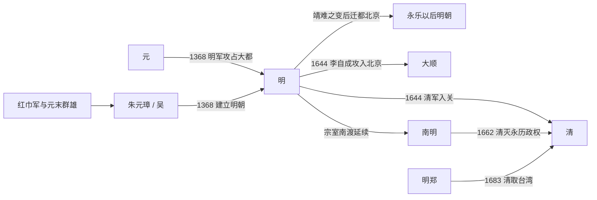

# 明

## 时间

1368年-1644年。1644年北京失守后，宗室与遗臣在南方建立多个南明政权，延续至1662年；郑氏势力继续据守台湾至1683年。

## 别称

大明、明朝。南方延续政权一般称[南明](/%E4%BA%BA%E6%96%87%E7%A7%91%E5%AD%A6/%E5%8E%86%E5%8F%B2-%E4%B8%AD%E5%9B%BD/%E6%9C%9D%E4%BB%A3/%E6%98%8E/%E5%8D%97%E6%98%8E.md)。

## 概括

明朝是元末农民战争后由朱元璋建立的王朝。1368年，朱元璋在应天府称帝，国号大明，同年明军攻占元大都，元廷退居漠北。明初定都南京，永乐时期迁都北京，形成以北京为政治军事中心、南京保留陪都地位的格局。

明前期经历洪武之治、永乐盛世和仁宣之治，中央集权加强，边防、海禁、朝贡、卫所、科举和基层里甲制度成为重要治理框架。中后期内阁和司礼监权力上升，财政、边防、党争、宦官、土地兼并、灾荒和农民起义交织。1644年李自成攻入北京，崇祯帝自缢，明朝全国性统治结束；随后清军入关，南明和明郑继续抗清。

## 演进流程

## 阶段

| 顺序 | 名称 | 时间 | 简要概括 |
|---:|---|---|---|
| 1 | 元末朱元璋势力 / 吴 | 1350年代-1368年 | 朱元璋由红巾军分支起家，击败陈友谅、张士诚等群雄，取得江南和中原主动权。 |
| 2 | 明朝前期 | 1368年-1435年 | 洪武、永乐、仁宣时期，制度奠基、北方边防和国家治理结构成型。 |
| 3 | 明朝中期 | 1435年-1572年 | 土木堡之变后政治和边防转折，内阁、宦官、边镇、财政问题逐渐凸显。 |
| 4 | 明朝后期 | 1572年-1644年 | 张居正改革后财政压力复起，辽东战事、党争、灾荒和农民起义导致统治崩溃。 |
| 5 | [南明](/%E4%BA%BA%E6%96%87%E7%A7%91%E5%AD%A6/%E5%8E%86%E5%8F%B2-%E4%B8%AD%E5%9B%BD/%E6%9C%9D%E4%BB%A3/%E6%98%8E/%E5%8D%97%E6%98%8E.md) | 1644年-1662年 | 弘光、隆武、绍武、永历等政权在南方延续明朝法统，最终被清消灭。 |
| 6 | 明郑 | 1661年-1683年 | 郑成功、郑经、郑克塽据守台湾，以明朝正朔抗清，1683年降清。 |

## 统治结构

| 角色 | 说明 |
|---|---|
| 君主 | 朱氏皇帝，掌最高政治合法性和任免权。 |
| 中枢行政 | 洪武废中书省和丞相，六部直接对皇帝负责；后内阁逐渐成为票拟和政务中枢。 |
| 宦官机构 | 司礼监等机构在中后期参与批红、传旨和特务监察，与内阁形成复杂权力关系。 |
| 军事体系 | 卫所制、边镇、京营和地方募兵并存，后期边饷和辽东军费成为财政重压。 |
| 地方治理 | 省、府、州、县体系运行成熟，布政使司、按察使司、都指挥使司分掌地方行政、司法和军事。 |

## 说明

- 1368年，朱元璋在应天府称帝，建立明朝；同年攻占元大都，元廷退居漠北。
- 1421年，明成祖朱棣迁都顺天府北京，应天府改为南京并保留陪都地位。
- 明朝商品经济、城市、手工业和白银流通发展，晚明文化呈现世俗化和商业化特征。
- 明朝灭亡与辽东战事、财政危机、土地兼并、灾荒、农民起义、党争和军政失序有关。
- 1644年以后，南明和明郑属于明朝法统延续，但不再拥有全国性统治。

## 相关

- [明皇帝世系](/%E4%BA%BA%E6%96%87%E7%A7%91%E5%AD%A6/%E5%8E%86%E5%8F%B2-%E4%B8%AD%E5%9B%BD/%E6%9C%9D%E4%BB%A3/%E6%98%8E/%E4%B8%96%E7%B3%BB.md)
- [南明](/%E4%BA%BA%E6%96%87%E7%A7%91%E5%AD%A6/%E5%8E%86%E5%8F%B2-%E4%B8%AD%E5%9B%BD/%E6%9C%9D%E4%BB%A3/%E6%98%8E/%E5%8D%97%E6%98%8E.md)
- [明末势力](/%E4%BA%BA%E6%96%87%E7%A7%91%E5%AD%A6/%E5%8E%86%E5%8F%B2-%E4%B8%AD%E5%9B%BD/%E6%9C%9D%E4%BB%A3/%E6%98%8E/%E6%98%8E%E6%9C%AB%E5%8A%BF%E5%8A%9B.md)
