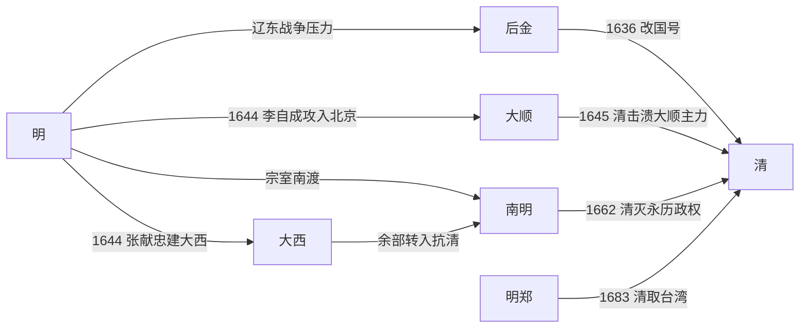

# 明末势力

## 时间

约17世纪初-1683年。

## 概括

明末势力是明朝后期崩溃过程中同时出现的地方军政集团、农民军、满洲政权、南明宗室政权和海上郑氏集团的统称。明朝灭亡不是单一事件，而是辽东战事、财政危机、农民起义、清军入关和南方抗清连续作用的结果。

## 主要势力

| 势力 | 时间 | 代表人物 | 简要概括 |
|---|---|---|---|
| 明朝中央 | 1368年-1644年 | 崇祯帝朱由检 | 试图整顿阉党、财政和军政，但同时面对辽东战事、农民起义和财政崩溃。 |
| 后金 / 清 | 1616年起 | 努尔哈赤、皇太极、多尔衮 | 建州女真兴起，建立后金，1636年改国号清，1644年入关。 |
| 大顺 | 1644年-1645年左右 | 李自成 | 农民军政权，1644年攻入北京，迫使崇祯帝自缢，后被清军和地方势力击败。 |
| 大西 | 1644年-1647年左右 | 张献忠 | 农民军政权，活动于四川等地；余部后来部分参与南明抗清。 |
| 南明 | 1644年-1662年 | 朱由崧、朱聿键、朱由榔 | 明宗室在南方建立的延续政权，内部割裂，最终被清消灭。 |
| 明郑 | 1661年-1683年 | 郑成功、郑经、郑克塽 | 郑氏集团据守台湾，奉明朝正朔抗清，1683年降清。 |

## 演变关系

## 说明

- 后金 / 清是明朝东北边防压力的主要来源，最终借吴三桂开关和山海关战役进入中原。
- 大顺直接导致北京失守和崇祯帝自缢，但其统治未能稳定，迅速被清军击败。
- 大西余部在张献忠死后分化，部分力量与南明永历政权合作抗清。
- 南明内部拥立体系复杂，弘光、隆武、绍武、永历等政权彼此接续但并不稳定。
- 明郑延续抗清至台湾，是明亡后持续时间最长的反清力量之一。

## 相关

- [明](/%E4%BA%BA%E6%96%87%E7%A7%91%E5%AD%A6/%E5%8E%86%E5%8F%B2-%E4%B8%AD%E5%9B%BD/%E6%9C%9D%E4%BB%A3/%E6%98%8E/README.md)
- [南明](/%E4%BA%BA%E6%96%87%E7%A7%91%E5%AD%A6/%E5%8E%86%E5%8F%B2-%E4%B8%AD%E5%9B%BD/%E6%9C%9D%E4%BB%A3/%E6%98%8E/%E5%8D%97%E6%98%8E.md)
