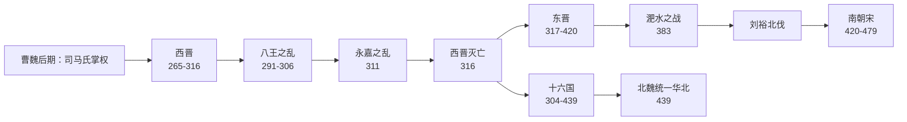

# 晋

> 导航：[晋](/%E4%BA%BA%E6%96%87%E7%A7%91%E5%AD%A6/%E5%8E%86%E5%8F%B2-%E4%B8%AD%E5%9B%BD/%E6%9C%9D%E4%BB%A3/%E6%99%8B/README.md) / [西晋](/%E4%BA%BA%E6%96%87%E7%A7%91%E5%AD%A6/%E5%8E%86%E5%8F%B2-%E4%B8%AD%E5%9B%BD/%E6%9C%9D%E4%BB%A3/%E6%99%8B/%E8%A5%BF%E6%99%8B.md) / [东晋](/%E4%BA%BA%E6%96%87%E7%A7%91%E5%AD%A6/%E5%8E%86%E5%8F%B2-%E4%B8%AD%E5%9B%BD/%E6%9C%9D%E4%BB%A3/%E6%99%8B/%E4%B8%9C%E6%99%8B.md) / [八王之乱](/%E4%BA%BA%E6%96%87%E7%A7%91%E5%AD%A6/%E5%8E%86%E5%8F%B2-%E4%B8%AD%E5%9B%BD/%E6%9C%9D%E4%BB%A3/%E6%99%8B/%E5%85%AB%E7%8E%8B%E4%B9%8B%E4%B9%B1.md) / [晋君主世系](/%E4%BA%BA%E6%96%87%E7%A7%91%E5%AD%A6/%E5%8E%86%E5%8F%B2-%E4%B8%AD%E5%9B%BD/%E6%9C%9D%E4%BB%A3/%E6%99%8B/%E4%B8%96%E7%B3%BB.md) / [十六国](/%E4%BA%BA%E6%96%87%E7%A7%91%E5%AD%A6/%E5%8E%86%E5%8F%B2-%E4%B8%AD%E5%9B%BD/%E6%9C%9D%E4%BB%A3/%E6%99%8B/%E5%8D%81%E5%85%AD%E5%9B%BD/README.md)

## 概括

晋（265年—420年）由司马氏建立，上承三国，下启南北朝。它通常分为两个阶段：西晋定都洛阳，一度灭吴统一全国；东晋定都建康，偏安江南，与北方十六国长期对峙。

两晋的主线是：司马氏在曹魏后期掌权 → 司马炎代魏建晋 → 西晋灭吴统一 → 宗室与外戚内斗引发八王之乱 → 永嘉之乱和西晋灭亡 → 晋室南渡建立东晋 → 东晋与十六国对峙、北伐和淝水之战 → 刘裕代晋建立南朝宋。

## 演进流程

## 阶段导览

| 顺序 | 名称 | 时间 | 都城 | 简要概括 |
|---:|---|---|---|---|
| 1 | [司马氏掌权](/%E4%BA%BA%E6%96%87%E7%A7%91%E5%AD%A6/%E5%8E%86%E5%8F%B2-%E4%B8%AD%E5%9B%BD/%E6%9C%9D%E4%BB%A3/%E6%99%8B/%E4%B8%96%E7%B3%BB.md#%E8%BF%BD%E5%B0%8A%E5%B8%9D%E4%B8%8E%E5%A5%A0%E5%9F%BA%E8%80%85) | 249年—265年 | 洛阳 | 高平陵之变后，司马懿、司马师、司马昭逐步控制曹魏政权，为代魏建晋奠定基础。 |
| 2 | [西晋](/%E4%BA%BA%E6%96%87%E7%A7%91%E5%AD%A6/%E5%8E%86%E5%8F%B2-%E4%B8%AD%E5%9B%BD/%E6%9C%9D%E4%BB%A3/%E6%99%8B/%E8%A5%BF%E6%99%8B.md) | 265年—316年 | 洛阳；末期长安 | 司马炎代魏建国，280年灭吴统一；此后因宗室分封、外戚干政和八王之乱而迅速衰败，316年亡于汉赵。 |
| 3 | [八王之乱](/%E4%BA%BA%E6%96%87%E7%A7%91%E5%AD%A6/%E5%8E%86%E5%8F%B2-%E4%B8%AD%E5%9B%BD/%E6%9C%9D%E4%BB%A3/%E6%99%8B/%E5%85%AB%E7%8E%8B%E4%B9%8B%E4%B9%B1.md) | 291年—306年 | 洛阳为中心 | 西晋宗室诸王与外戚围绕皇权、辅政权和中央控制权展开连年内战，耗尽国力。 |
| 4 | [东晋](/%E4%BA%BA%E6%96%87%E7%A7%91%E5%AD%A6/%E5%8E%86%E5%8F%B2-%E4%B8%AD%E5%9B%BD/%E6%9C%9D%E4%BB%A3/%E6%99%8B/%E4%B8%9C%E6%99%8B.md) | 317年—420年 | 建康 | 晋室南渡后依靠江南士族立国，长期处在士族政治、权臣专政和北伐压力中；420年刘裕代晋。 |
| 5 | [十六国](/%E4%BA%BA%E6%96%87%E7%A7%91%E5%AD%A6/%E5%8E%86%E5%8F%B2-%E4%B8%AD%E5%9B%BD/%E6%9C%9D%E4%BB%A3/%E6%99%8B/%E5%8D%81%E5%85%AD%E5%9B%BD/README.md) | 304年—439年 | 多中心 | 与西晋末年、东晋时期并行的北方割据格局，包含前赵、后赵、前秦、后秦、北凉等政权。 |

## 核心线索

- **短暂统一**：280年西晋灭东吴，结束三国鼎立，但统一时间很短。
- **宗室政治失控**：西晋大封同姓诸王，本意是拱卫皇室，实际造成地方军事化和中央权力碎片化。
- **门阀士族兴起**：东晋政权高度依赖王、谢、桓、庾等士族，皇权长期受士族和权臣制约。
- **北方民族与政权重组**：西晋末年北方大量内迁族群和地方军事集团建立政权，形成十六国格局。
- **江南开发**：北方人口南迁推动江南地区开发，增强了南方政权的经济和文化基础。

## 相关笔记

- [晋君主世系](/%E4%BA%BA%E6%96%87%E7%A7%91%E5%AD%A6/%E5%8E%86%E5%8F%B2-%E4%B8%AD%E5%9B%BD/%E6%9C%9D%E4%BB%A3/%E6%99%8B/%E4%B8%96%E7%B3%BB.md)
- [西晋](/%E4%BA%BA%E6%96%87%E7%A7%91%E5%AD%A6/%E5%8E%86%E5%8F%B2-%E4%B8%AD%E5%9B%BD/%E6%9C%9D%E4%BB%A3/%E6%99%8B/%E8%A5%BF%E6%99%8B.md)
- [东晋](/%E4%BA%BA%E6%96%87%E7%A7%91%E5%AD%A6/%E5%8E%86%E5%8F%B2-%E4%B8%AD%E5%9B%BD/%E6%9C%9D%E4%BB%A3/%E6%99%8B/%E4%B8%9C%E6%99%8B.md)
- [八王之乱](/%E4%BA%BA%E6%96%87%E7%A7%91%E5%AD%A6/%E5%8E%86%E5%8F%B2-%E4%B8%AD%E5%9B%BD/%E6%9C%9D%E4%BB%A3/%E6%99%8B/%E5%85%AB%E7%8E%8B%E4%B9%8B%E4%B9%B1.md)
- [十六国](/%E4%BA%BA%E6%96%87%E7%A7%91%E5%AD%A6/%E5%8E%86%E5%8F%B2-%E4%B8%AD%E5%9B%BD/%E6%9C%9D%E4%BB%A3/%E6%99%8B/%E5%8D%81%E5%85%AD%E5%9B%BD/README.md)
- [晋的中枢机构与地方区划](/_%E5%BE%85%E6%95%B4%E7%90%86/%E4%BA%BA%E6%96%87%E7%A7%91%E5%AD%A6/%E5%8E%86%E5%8F%B2-%E4%B8%AD%E5%9B%BD/%E5%88%B6%E5%BA%A6%E3%80%81%E5%AE%98%E8%A1%94%E3%80%81%E8%A1%8C%E6%94%BF%E5%8C%BA%E5%88%92/%E5%90%84%E6%9C%9D%E4%BB%A3%E4%B8%AD%E6%9E%A2%E6%9C%BA%E6%9E%84%E5%8F%8A%E5%9C%B0%E6%96%B9%E5%8C%BA%E5%88%92/%E6%99%8B.md)
