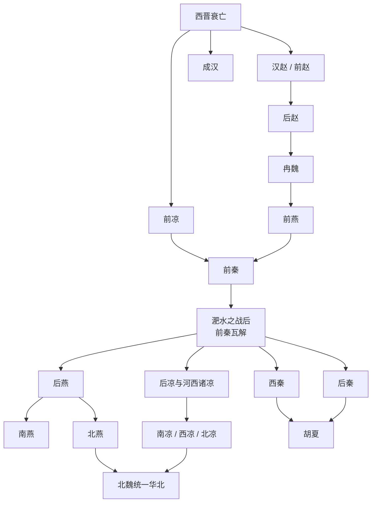

# 十六国

> 导航：[晋](/%E4%BA%BA%E6%96%87%E7%A7%91%E5%AD%A6/%E5%8E%86%E5%8F%B2-%E4%B8%AD%E5%9B%BD/%E6%9C%9D%E4%BB%A3/%E6%99%8B/README.md) / [政权索引](/%E4%BA%BA%E6%96%87%E7%A7%91%E5%AD%A6/%E5%8E%86%E5%8F%B2-%E4%B8%AD%E5%9B%BD/%E6%9C%9D%E4%BB%A3/%E6%99%8B/%E5%8D%81%E5%85%AD%E5%9B%BD/%E6%94%BF%E6%9D%83/README.md) / [十六国时空图](/%E4%BA%BA%E6%96%87%E7%A7%91%E5%AD%A6/%E5%8E%86%E5%8F%B2-%E4%B8%AD%E5%9B%BD/%E6%9C%9D%E4%BB%A3/%E6%99%8B/%E5%8D%81%E5%85%AD%E5%9B%BD/%E5%8D%81%E5%85%AD%E5%9B%BD%E6%97%B6%E7%A9%BA%E5%9B%BE.md) / [淝水之战前](/%E4%BA%BA%E6%96%87%E7%A7%91%E5%AD%A6/%E5%8E%86%E5%8F%B2-%E4%B8%AD%E5%9B%BD/%E6%9C%9D%E4%BB%A3/%E6%99%8B/%E5%8D%81%E5%85%AD%E5%9B%BD/%E6%B7%9D%E6%B0%B4%E4%B9%8B%E6%88%98%E5%89%8D.md) / [淝水之战后](/%E4%BA%BA%E6%96%87%E7%A7%91%E5%AD%A6/%E5%8E%86%E5%8F%B2-%E4%B8%AD%E5%9B%BD/%E6%9C%9D%E4%BB%A3/%E6%99%8B/%E5%8D%81%E5%85%AD%E5%9B%BD/%E6%B7%9D%E6%B0%B4%E4%B9%8B%E6%88%98%E5%90%8E.md)

## 概括

十六国是西晋末年至北魏统一华北以前，北方和巴蜀地区多个割据政权并立的时代。它与[东晋](/%E4%BA%BA%E6%96%87%E7%A7%91%E5%AD%A6/%E5%8E%86%E5%8F%B2-%E4%B8%AD%E5%9B%BD/%E6%9C%9D%E4%BB%A3/%E6%99%8B/%E4%B8%9C%E6%99%8B.md)基本同时存在，时间大致从刘渊建立汉赵（304年）到北魏灭北凉、统一华北（439年）。

“十六国”并非这一时期全部政权的总数，而是传统史书选取的十六个主要政权；此外还有冉魏、代、西燕、翟魏等重要但通常不列入“十六国”的政权。

## 目录结构

| 笔记 | 作用 |
|---|---|
| [十六国时空图](/%E4%BA%BA%E6%96%87%E7%A7%91%E5%AD%A6/%E5%8E%86%E5%8F%B2-%E4%B8%AD%E5%9B%BD/%E6%9C%9D%E4%BB%A3/%E6%99%8B/%E5%8D%81%E5%85%AD%E5%9B%BD/%E5%8D%81%E5%85%AD%E5%9B%BD%E6%97%B6%E7%A9%BA%E5%9B%BE.md) | 解释时空图、地域轴和关键转折。 |
| [淝水之战前](/%E4%BA%BA%E6%96%87%E7%A7%91%E5%AD%A6/%E5%8E%86%E5%8F%B2-%E4%B8%AD%E5%9B%BD/%E6%9C%9D%E4%BB%A3/%E6%99%8B/%E5%8D%81%E5%85%AD%E5%9B%BD/%E6%B7%9D%E6%B0%B4%E4%B9%8B%E6%88%98%E5%89%8D.md) | 按阶段概括前秦统一北方以前的政权。 |
| [淝水之战后](/%E4%BA%BA%E6%96%87%E7%A7%91%E5%AD%A6/%E5%8E%86%E5%8F%B2-%E4%B8%AD%E5%9B%BD/%E6%9C%9D%E4%BB%A3/%E6%99%8B/%E5%8D%81%E5%85%AD%E5%9B%BD/%E6%B7%9D%E6%B0%B4%E4%B9%8B%E6%88%98%E5%90%8E.md) | 按阶段概括前秦瓦解后至北魏统一华北的政权。 |
| [政权索引](/%E4%BA%BA%E6%96%87%E7%A7%91%E5%AD%A6/%E5%8E%86%E5%8F%B2-%E4%B8%AD%E5%9B%BD/%E6%9C%9D%E4%BB%A3/%E6%99%8B/%E5%8D%81%E5%85%AD%E5%9B%BD/%E6%94%BF%E6%9D%83/README.md) | 进入每个政权的单独笔记和世系表。 |

## 五胡

| 名称 | 说明 |
|---|---|
| 匈奴 | 汉赵、胡夏等政权与匈奴或匈奴铁弗部有关。 |
| 鲜卑 | 前燕、后燕、南燕、西秦、南凉、代等政权多由鲜卑集团建立。 |
| 羯 | 后赵由羯族石勒建立。 |
| 氐 | 成汉、前秦、后凉等政权与氐族集团有关。 |
| 羌 | 后秦由羌族姚氏建立。 |

## 演进流程

## 政权导览

十六国传统范围可用口诀记忆：**两赵三秦，四燕五凉，成汉胡夏**。具体政权页与世系表统一收在 [政权索引](/%E4%BA%BA%E6%96%87%E7%A7%91%E5%AD%A6/%E5%8E%86%E5%8F%B2-%E4%B8%AD%E5%9B%BD/%E6%9C%9D%E4%BB%A3/%E6%99%8B/%E5%8D%81%E5%85%AD%E5%9B%BD/%E6%94%BF%E6%9D%83/README.md)，这里仅保留分类入口，避免在总览页重复维护详细清单。

| 类别 | 政权 |
|---|---|
| 两赵 | [汉赵（前赵）](/%E4%BA%BA%E6%96%87%E7%A7%91%E5%AD%A6/%E5%8E%86%E5%8F%B2-%E4%B8%AD%E5%9B%BD/%E6%9C%9D%E4%BB%A3/%E6%99%8B/%E5%8D%81%E5%85%AD%E5%9B%BD/%E6%94%BF%E6%9D%83/%E6%B1%89%E8%B5%B5%EF%BC%88%E5%89%8D%E8%B5%B5%EF%BC%89.md)、[后赵](/%E4%BA%BA%E6%96%87%E7%A7%91%E5%AD%A6/%E5%8E%86%E5%8F%B2-%E4%B8%AD%E5%9B%BD/%E6%9C%9D%E4%BB%A3/%E6%99%8B/%E5%8D%81%E5%85%AD%E5%9B%BD/%E6%94%BF%E6%9D%83/%E5%90%8E%E8%B5%B5.md) |
| 三秦 | [前秦](/%E4%BA%BA%E6%96%87%E7%A7%91%E5%AD%A6/%E5%8E%86%E5%8F%B2-%E4%B8%AD%E5%9B%BD/%E6%9C%9D%E4%BB%A3/%E6%99%8B/%E5%8D%81%E5%85%AD%E5%9B%BD/%E6%94%BF%E6%9D%83/%E5%89%8D%E7%A7%A6.md)、[后秦](/%E4%BA%BA%E6%96%87%E7%A7%91%E5%AD%A6/%E5%8E%86%E5%8F%B2-%E4%B8%AD%E5%9B%BD/%E6%9C%9D%E4%BB%A3/%E6%99%8B/%E5%8D%81%E5%85%AD%E5%9B%BD/%E6%94%BF%E6%9D%83/%E5%90%8E%E7%A7%A6.md)、[西秦](/%E4%BA%BA%E6%96%87%E7%A7%91%E5%AD%A6/%E5%8E%86%E5%8F%B2-%E4%B8%AD%E5%9B%BD/%E6%9C%9D%E4%BB%A3/%E6%99%8B/%E5%8D%81%E5%85%AD%E5%9B%BD/%E6%94%BF%E6%9D%83/%E8%A5%BF%E7%A7%A6.md) |
| 四燕 | [前燕](/%E4%BA%BA%E6%96%87%E7%A7%91%E5%AD%A6/%E5%8E%86%E5%8F%B2-%E4%B8%AD%E5%9B%BD/%E6%9C%9D%E4%BB%A3/%E6%99%8B/%E5%8D%81%E5%85%AD%E5%9B%BD/%E6%94%BF%E6%9D%83/%E5%89%8D%E7%87%95.md)、[后燕](/%E4%BA%BA%E6%96%87%E7%A7%91%E5%AD%A6/%E5%8E%86%E5%8F%B2-%E4%B8%AD%E5%9B%BD/%E6%9C%9D%E4%BB%A3/%E6%99%8B/%E5%8D%81%E5%85%AD%E5%9B%BD/%E6%94%BF%E6%9D%83/%E5%90%8E%E7%87%95.md)、[南燕](/%E4%BA%BA%E6%96%87%E7%A7%91%E5%AD%A6/%E5%8E%86%E5%8F%B2-%E4%B8%AD%E5%9B%BD/%E6%9C%9D%E4%BB%A3/%E6%99%8B/%E5%8D%81%E5%85%AD%E5%9B%BD/%E6%94%BF%E6%9D%83/%E5%8D%97%E7%87%95.md)、[北燕](/%E4%BA%BA%E6%96%87%E7%A7%91%E5%AD%A6/%E5%8E%86%E5%8F%B2-%E4%B8%AD%E5%9B%BD/%E6%9C%9D%E4%BB%A3/%E6%99%8B/%E5%8D%81%E5%85%AD%E5%9B%BD/%E6%94%BF%E6%9D%83/%E5%8C%97%E7%87%95.md) |
| 五凉 | [前凉](/%E4%BA%BA%E6%96%87%E7%A7%91%E5%AD%A6/%E5%8E%86%E5%8F%B2-%E4%B8%AD%E5%9B%BD/%E6%9C%9D%E4%BB%A3/%E6%99%8B/%E5%8D%81%E5%85%AD%E5%9B%BD/%E6%94%BF%E6%9D%83/%E5%89%8D%E5%87%89.md)、[后凉](/%E4%BA%BA%E6%96%87%E7%A7%91%E5%AD%A6/%E5%8E%86%E5%8F%B2-%E4%B8%AD%E5%9B%BD/%E6%9C%9D%E4%BB%A3/%E6%99%8B/%E5%8D%81%E5%85%AD%E5%9B%BD/%E6%94%BF%E6%9D%83/%E5%90%8E%E5%87%89.md)、[南凉](/%E4%BA%BA%E6%96%87%E7%A7%91%E5%AD%A6/%E5%8E%86%E5%8F%B2-%E4%B8%AD%E5%9B%BD/%E6%9C%9D%E4%BB%A3/%E6%99%8B/%E5%8D%81%E5%85%AD%E5%9B%BD/%E6%94%BF%E6%9D%83/%E5%8D%97%E5%87%89.md)、[西凉](/%E4%BA%BA%E6%96%87%E7%A7%91%E5%AD%A6/%E5%8E%86%E5%8F%B2-%E4%B8%AD%E5%9B%BD/%E6%9C%9D%E4%BB%A3/%E6%99%8B/%E5%8D%81%E5%85%AD%E5%9B%BD/%E6%94%BF%E6%9D%83/%E8%A5%BF%E5%87%89.md)、[北凉](/%E4%BA%BA%E6%96%87%E7%A7%91%E5%AD%A6/%E5%8E%86%E5%8F%B2-%E4%B8%AD%E5%9B%BD/%E6%9C%9D%E4%BB%A3/%E6%99%8B/%E5%8D%81%E5%85%AD%E5%9B%BD/%E6%94%BF%E6%9D%83/%E5%8C%97%E5%87%89.md) |
| 成汉胡夏 | [成汉](/%E4%BA%BA%E6%96%87%E7%A7%91%E5%AD%A6/%E5%8E%86%E5%8F%B2-%E4%B8%AD%E5%9B%BD/%E6%9C%9D%E4%BB%A3/%E6%99%8B/%E5%8D%81%E5%85%AD%E5%9B%BD/%E6%94%BF%E6%9D%83/%E6%88%90%E6%B1%89.md)、[胡夏](/%E4%BA%BA%E6%96%87%E7%A7%91%E5%AD%A6/%E5%8E%86%E5%8F%B2-%E4%B8%AD%E5%9B%BD/%E6%9C%9D%E4%BB%A3/%E6%99%8B/%E5%8D%81%E5%85%AD%E5%9B%BD/%E6%94%BF%E6%9D%83/%E8%83%A1%E5%A4%8F.md) |
| 其他相关政权 | [冉魏](/%E4%BA%BA%E6%96%87%E7%A7%91%E5%AD%A6/%E5%8E%86%E5%8F%B2-%E4%B8%AD%E5%9B%BD/%E6%9C%9D%E4%BB%A3/%E6%99%8B/%E5%8D%81%E5%85%AD%E5%9B%BD/%E6%94%BF%E6%9D%83/%E5%86%89%E9%AD%8F.md)、[代](/%E4%BA%BA%E6%96%87%E7%A7%91%E5%AD%A6/%E5%8E%86%E5%8F%B2-%E4%B8%AD%E5%9B%BD/%E6%9C%9D%E4%BB%A3/%E6%99%8B/%E5%8D%81%E5%85%AD%E5%9B%BD/%E6%94%BF%E6%9D%83/%E4%BB%A3.md)、[西燕](/%E4%BA%BA%E6%96%87%E7%A7%91%E5%AD%A6/%E5%8E%86%E5%8F%B2-%E4%B8%AD%E5%9B%BD/%E6%9C%9D%E4%BB%A3/%E6%99%8B/%E5%8D%81%E5%85%AD%E5%9B%BD/%E6%94%BF%E6%9D%83/%E8%A5%BF%E7%87%95.md)、[翟魏](/%E4%BA%BA%E6%96%87%E7%A7%91%E5%AD%A6/%E5%8E%86%E5%8F%B2-%E4%B8%AD%E5%9B%BD/%E6%9C%9D%E4%BB%A3/%E6%99%8B/%E5%8D%81%E5%85%AD%E5%9B%BD/%E6%94%BF%E6%9D%83/%E7%BF%9F%E9%AD%8F.md)、[谯蜀](/%E4%BA%BA%E6%96%87%E7%A7%91%E5%AD%A6/%E5%8E%86%E5%8F%B2-%E4%B8%AD%E5%9B%BD/%E6%9C%9D%E4%BB%A3/%E6%99%8B/%E5%8D%81%E5%85%AD%E5%9B%BD/%E6%94%BF%E6%9D%83/%E8%B0%AF%E8%9C%80.md)、[仇池](/%E4%BA%BA%E6%96%87%E7%A7%91%E5%AD%A6/%E5%8E%86%E5%8F%B2-%E4%B8%AD%E5%9B%BD/%E6%9C%9D%E4%BB%A3/%E6%99%8B/%E5%8D%81%E5%85%AD%E5%9B%BD/%E6%94%BF%E6%9D%83/%E4%BB%87%E6%B1%A0.md) |

## 相关笔记

- [政权索引](/%E4%BA%BA%E6%96%87%E7%A7%91%E5%AD%A6/%E5%8E%86%E5%8F%B2-%E4%B8%AD%E5%9B%BD/%E6%9C%9D%E4%BB%A3/%E6%99%8B/%E5%8D%81%E5%85%AD%E5%9B%BD/%E6%94%BF%E6%9D%83/README.md)
- [十六国时空图](/%E4%BA%BA%E6%96%87%E7%A7%91%E5%AD%A6/%E5%8E%86%E5%8F%B2-%E4%B8%AD%E5%9B%BD/%E6%9C%9D%E4%BB%A3/%E6%99%8B/%E5%8D%81%E5%85%AD%E5%9B%BD/%E5%8D%81%E5%85%AD%E5%9B%BD%E6%97%B6%E7%A9%BA%E5%9B%BE.md)
- [淝水之战前](/%E4%BA%BA%E6%96%87%E7%A7%91%E5%AD%A6/%E5%8E%86%E5%8F%B2-%E4%B8%AD%E5%9B%BD/%E6%9C%9D%E4%BB%A3/%E6%99%8B/%E5%8D%81%E5%85%AD%E5%9B%BD/%E6%B7%9D%E6%B0%B4%E4%B9%8B%E6%88%98%E5%89%8D.md)
- [淝水之战后](/%E4%BA%BA%E6%96%87%E7%A7%91%E5%AD%A6/%E5%8E%86%E5%8F%B2-%E4%B8%AD%E5%9B%BD/%E6%9C%9D%E4%BB%A3/%E6%99%8B/%E5%8D%81%E5%85%AD%E5%9B%BD/%E6%B7%9D%E6%B0%B4%E4%B9%8B%E6%88%98%E5%90%8E.md)
- [晋](/%E4%BA%BA%E6%96%87%E7%A7%91%E5%AD%A6/%E5%8E%86%E5%8F%B2-%E4%B8%AD%E5%9B%BD/%E6%9C%9D%E4%BB%A3/%E6%99%8B/README.md)
- [东晋](/%E4%BA%BA%E6%96%87%E7%A7%91%E5%AD%A6/%E5%8E%86%E5%8F%B2-%E4%B8%AD%E5%9B%BD/%E6%9C%9D%E4%BB%A3/%E6%99%8B/%E4%B8%9C%E6%99%8B.md)
