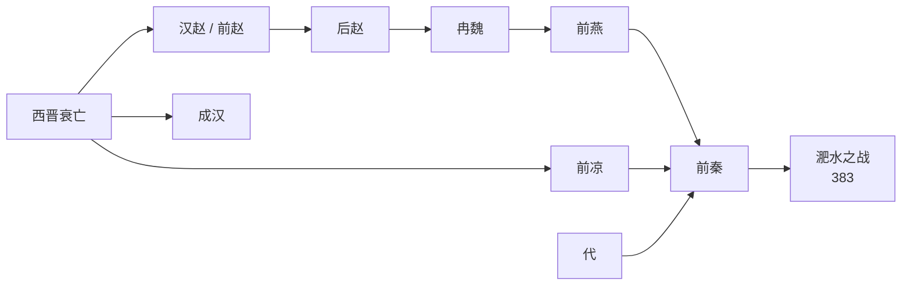

# 淝水之战前

> 导航：[晋](/%E4%BA%BA%E6%96%87%E7%A7%91%E5%AD%A6/%E5%8E%86%E5%8F%B2-%E4%B8%AD%E5%9B%BD/%E6%9C%9D%E4%BB%A3/%E6%99%8B/README.md) / [十六国](/%E4%BA%BA%E6%96%87%E7%A7%91%E5%AD%A6/%E5%8E%86%E5%8F%B2-%E4%B8%AD%E5%9B%BD/%E6%9C%9D%E4%BB%A3/%E6%99%8B/%E5%8D%81%E5%85%AD%E5%9B%BD/README.md) / [政权索引](/%E4%BA%BA%E6%96%87%E7%A7%91%E5%AD%A6/%E5%8E%86%E5%8F%B2-%E4%B8%AD%E5%9B%BD/%E6%9C%9D%E4%BB%A3/%E6%99%8B/%E5%8D%81%E5%85%AD%E5%9B%BD/%E6%94%BF%E6%9D%83/README.md) / [十六国时空图](/%E4%BA%BA%E6%96%87%E7%A7%91%E5%AD%A6/%E5%8E%86%E5%8F%B2-%E4%B8%AD%E5%9B%BD/%E6%9C%9D%E4%BB%A3/%E6%99%8B/%E5%8D%81%E5%85%AD%E5%9B%BD/%E5%8D%81%E5%85%AD%E5%9B%BD%E6%97%B6%E7%A9%BA%E5%9B%BE.md) / [淝水之战前](/%E4%BA%BA%E6%96%87%E7%A7%91%E5%AD%A6/%E5%8E%86%E5%8F%B2-%E4%B8%AD%E5%9B%BD/%E6%9C%9D%E4%BB%A3/%E6%99%8B/%E5%8D%81%E5%85%AD%E5%9B%BD/%E6%B7%9D%E6%B0%B4%E4%B9%8B%E6%88%98%E5%89%8D.md) / [淝水之战后](/%E4%BA%BA%E6%96%87%E7%A7%91%E5%AD%A6/%E5%8E%86%E5%8F%B2-%E4%B8%AD%E5%9B%BD/%E6%9C%9D%E4%BB%A3/%E6%99%8B/%E5%8D%81%E5%85%AD%E5%9B%BD/%E6%B7%9D%E6%B0%B4%E4%B9%8B%E6%88%98%E5%90%8E.md)

## 概括

淝水之战前，北方政权演变的主线是：西晋崩溃后，汉赵 / 前赵、成汉、前凉等先后形成；后赵灭前赵并一度控制北方大部；后赵内乱后，冉魏短暂出现，前燕进入中原；氐族苻氏建立前秦，并在苻坚时期相继灭前燕、前凉、代，基本统一北方。

这一阶段的终点是383年淝水之战。战前，前秦已经成为北方最强政权，东晋则据有江南，南北对峙进入决定性时刻。

## 演进流程

## 政权表

| 政权 | 民族 / 统治集团 | 都城 | 今地 | 建立者 | 亡国君主 | 时间 | 立于 | 亡于 | 说明 |
|---|---|---|---|---|---|---|---|---|---|
| [汉赵 / 前赵](/%E4%BA%BA%E6%96%87%E7%A7%91%E5%AD%A6/%E5%8E%86%E5%8F%B2-%E4%B8%AD%E5%9B%BD/%E6%9C%9D%E4%BB%A3/%E6%99%8B/%E5%8D%81%E5%85%AD%E5%9B%BD/%E6%94%BF%E6%9D%83/%E6%B1%89%E8%B5%B5%EF%BC%88%E5%89%8D%E8%B5%B5%EF%BC%89.md) | 匈奴刘氏 | 平阳；长安 | 山西临汾；陕西西安 | 刘渊；刘曜 | 刘熙 | 304年—329年 | 西晋 | 后赵 | 刘渊建汉，刘聪灭西晋；刘曜改国号赵，后被后赵灭。 |
| [后赵](/%E4%BA%BA%E6%96%87%E7%A7%91%E5%AD%A6/%E5%8E%86%E5%8F%B2-%E4%B8%AD%E5%9B%BD/%E6%9C%9D%E4%BB%A3/%E6%99%8B/%E5%8D%81%E5%85%AD%E5%9B%BD/%E6%94%BF%E6%9D%83/%E5%90%8E%E8%B5%B5.md) | 羯族石氏 | 襄国；邺 | 河北邢台；河北临漳 / 河南安阳 | 石勒 | 石祗 | 319年—351年 | 前赵 | 冉魏 | 石勒建国并灭前赵，石虎后内乱，终为冉魏取代。 |
| [冉魏](/%E4%BA%BA%E6%96%87%E7%A7%91%E5%AD%A6/%E5%8E%86%E5%8F%B2-%E4%B8%AD%E5%9B%BD/%E6%9C%9D%E4%BB%A3/%E6%99%8B/%E5%8D%81%E5%85%AD%E5%9B%BD/%E6%94%BF%E6%9D%83/%E5%86%89%E9%AD%8F.md) | 汉族冉氏 | 邺 | 河北临漳 / 河南安阳 | 冉闵 | 冉智 | 350年—352年 | 后赵 | 前燕 | 冉闵取代后赵，旋被前燕灭。 |
| [成汉](/%E4%BA%BA%E6%96%87%E7%A7%91%E5%AD%A6/%E5%8E%86%E5%8F%B2-%E4%B8%AD%E5%9B%BD/%E6%9C%9D%E4%BB%A3/%E6%99%8B/%E5%8D%81%E5%85%AD%E5%9B%BD/%E6%94%BF%E6%9D%83/%E6%88%90%E6%B1%89.md) | 氐族李氏 | 成都 | 四川成都 | 李特；李雄；李寿 | 李势 | 303年—347年 | 西晋 | 东晋 | 李氏据巴蜀，李寿改国号汉，后为东晋桓温所灭。 |
| [前凉](/%E4%BA%BA%E6%96%87%E7%A7%91%E5%AD%A6/%E5%8E%86%E5%8F%B2-%E4%B8%AD%E5%9B%BD/%E6%9C%9D%E4%BB%A3/%E6%99%8B/%E5%8D%81%E5%85%AD%E5%9B%BD/%E6%94%BF%E6%9D%83/%E5%89%8D%E5%87%89.md) | 汉族张氏 | 姑臧 | 甘肃武威 | 张轨；张骏 | 张天锡 | 314年—376年 | 西晋 | 前秦 | 张氏长期据凉州，后被前秦吞并。 |
| [前燕](/%E4%BA%BA%E6%96%87%E7%A7%91%E5%AD%A6/%E5%8E%86%E5%8F%B2-%E4%B8%AD%E5%9B%BD/%E6%9C%9D%E4%BB%A3/%E6%99%8B/%E5%8D%81%E5%85%AD%E5%9B%BD/%E6%94%BF%E6%9D%83/%E5%89%8D%E7%87%95.md) | 鲜卑慕容氏 | 龙城；蓟；邺 | 辽宁朝阳；北京；河北临漳 / 河南安阳 | 慕容皝 | 慕容暐 | 337年—370年 | 北方鲜卑势力 | 前秦 | 慕容氏由辽西入主中原，灭冉魏，后被前秦灭。 |
| [代 / 拓跋代](/%E4%BA%BA%E6%96%87%E7%A7%91%E5%AD%A6/%E5%8E%86%E5%8F%B2-%E4%B8%AD%E5%9B%BD/%E6%9C%9D%E4%BB%A3/%E6%99%8B/%E5%8D%81%E5%85%AD%E5%9B%BD/%E6%94%BF%E6%9D%83/%E4%BB%A3.md) | 鲜卑拓跋氏 | 云中；盛乐 | 内蒙古；和林格尔一带 | 拓跋猗卢；拓跋什翼犍 | 拓跋什翼犍 | 315年—376年 | 拓跋鲜卑 | 前秦 | 拓跋氏由部落联盟转为国家，被前秦灭；后复国为北魏。 |
| [前秦](/%E4%BA%BA%E6%96%87%E7%A7%91%E5%AD%A6/%E5%8E%86%E5%8F%B2-%E4%B8%AD%E5%9B%BD/%E6%9C%9D%E4%BB%A3/%E6%99%8B/%E5%8D%81%E5%85%AD%E5%9B%BD/%E6%94%BF%E6%9D%83/%E5%89%8D%E7%A7%A6.md) | 氐族苻氏 | 长安 | 陕西西安 | 苻健 | 苻崇 | 351年—394年 | 后赵旧地 | 后秦、西秦 | 苻坚时基本统一北方；淝水败后瓦解，后亡于后秦、西秦压力。 |

## 关键线索

- **北方统一的两次尝试**：后赵曾控制北方大部，前秦在苻坚时期更接近统一北方。
- **中原中心的争夺**：洛阳、邺、长安是政权正统和军事控制的核心节点。
- **河西的独立性**：前凉在西晋灭亡后长期据守凉州，直到前秦扩张才被吞并。
- **巴蜀的独立性**：成汉据有四川，直到东晋桓温入蜀才被消灭。
- **前秦的高峰与危机**：苻坚统一北方后南征东晋，淝水之战失败导致北方重新分裂。

## 相关笔记

- [十六国](/%E4%BA%BA%E6%96%87%E7%A7%91%E5%AD%A6/%E5%8E%86%E5%8F%B2-%E4%B8%AD%E5%9B%BD/%E6%9C%9D%E4%BB%A3/%E6%99%8B/%E5%8D%81%E5%85%AD%E5%9B%BD/README.md)
- [十六国时空图](/%E4%BA%BA%E6%96%87%E7%A7%91%E5%AD%A6/%E5%8E%86%E5%8F%B2-%E4%B8%AD%E5%9B%BD/%E6%9C%9D%E4%BB%A3/%E6%99%8B/%E5%8D%81%E5%85%AD%E5%9B%BD/%E5%8D%81%E5%85%AD%E5%9B%BD%E6%97%B6%E7%A9%BA%E5%9B%BE.md)
- [淝水之战后](/%E4%BA%BA%E6%96%87%E7%A7%91%E5%AD%A6/%E5%8E%86%E5%8F%B2-%E4%B8%AD%E5%9B%BD/%E6%9C%9D%E4%BB%A3/%E6%99%8B/%E5%8D%81%E5%85%AD%E5%9B%BD/%E6%B7%9D%E6%B0%B4%E4%B9%8B%E6%88%98%E5%90%8E.md)
- [东晋](/%E4%BA%BA%E6%96%87%E7%A7%91%E5%AD%A6/%E5%8E%86%E5%8F%B2-%E4%B8%AD%E5%9B%BD/%E6%9C%9D%E4%BB%A3/%E6%99%8B/%E4%B8%9C%E6%99%8B.md)
