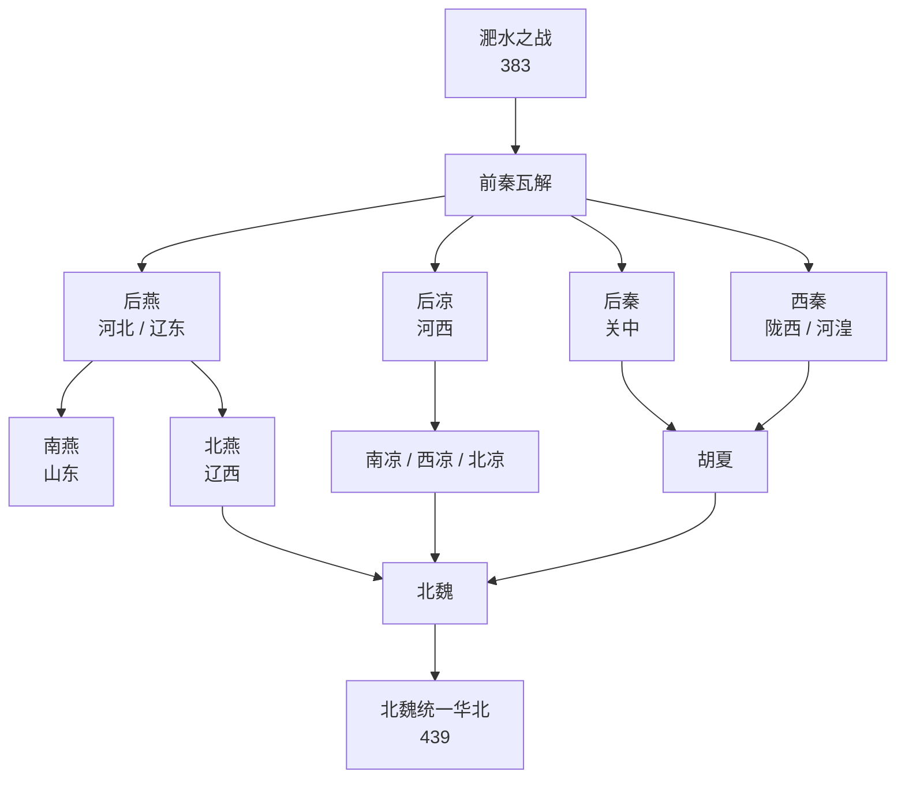

# 淝水之战后

> 导航：[晋](%E4%BA%BA%E6%96%87%E7%A7%91%E5%AD%A6/%E5%8E%86%E5%8F%B2-%E4%B8%AD%E5%9B%BD/%E6%9C%9D%E4%BB%A3/%E6%99%8B/README.md) / [十六国](%E4%BA%BA%E6%96%87%E7%A7%91%E5%AD%A6/%E5%8E%86%E5%8F%B2-%E4%B8%AD%E5%9B%BD/%E6%9C%9D%E4%BB%A3/%E6%99%8B/%E5%8D%81%E5%85%AD%E5%9B%BD/README.md) / [政权索引](%E4%BA%BA%E6%96%87%E7%A7%91%E5%AD%A6/%E5%8E%86%E5%8F%B2-%E4%B8%AD%E5%9B%BD/%E6%9C%9D%E4%BB%A3/%E6%99%8B/%E5%8D%81%E5%85%AD%E5%9B%BD/%E6%94%BF%E6%9D%83/README.md) / [十六国时空图](%E4%BA%BA%E6%96%87%E7%A7%91%E5%AD%A6/%E5%8E%86%E5%8F%B2-%E4%B8%AD%E5%9B%BD/%E6%9C%9D%E4%BB%A3/%E6%99%8B/%E5%8D%81%E5%85%AD%E5%9B%BD/%E5%8D%81%E5%85%AD%E5%9B%BD%E6%97%B6%E7%A9%BA%E5%9B%BE.md) / [淝水之战前](%E4%BA%BA%E6%96%87%E7%A7%91%E5%AD%A6/%E5%8E%86%E5%8F%B2-%E4%B8%AD%E5%9B%BD/%E6%9C%9D%E4%BB%A3/%E6%99%8B/%E5%8D%81%E5%85%AD%E5%9B%BD/%E6%B7%9D%E6%B0%B4%E4%B9%8B%E6%88%98%E5%89%8D.md) / [淝水之战后](%E4%BA%BA%E6%96%87%E7%A7%91%E5%AD%A6/%E5%8E%86%E5%8F%B2-%E4%B8%AD%E5%9B%BD/%E6%9C%9D%E4%BB%A3/%E6%99%8B/%E5%8D%81%E5%85%AD%E5%9B%BD/%E6%B7%9D%E6%B0%B4%E4%B9%8B%E6%88%98%E5%90%8E.md)

## 概括

383年淝水之战后，前秦由统一北方的强权迅速瓦解，原来被前秦压制或吞并的地方势力重新兴起。关中出现后秦，河北、辽东出现后燕和北燕，山东出现南燕，河西形成后凉、南凉、西凉、北凉并立，陇西有西秦，河套与关中北部有胡夏。与此同时，北魏从代国旧部中重新崛起，最终在439年灭北凉，统一华北。

## 演进流程

## 政权表

| 政权 | 民族 / 统治集团 | 都城 | 今地 | 建立者 | 亡国君主 | 时间 | 立于 | 亡于 | 说明 |
|---|---|---|---|---|---|---|---|---|---|
| [后燕](%E4%BA%BA%E6%96%87%E7%A7%91%E5%AD%A6/%E5%8E%86%E5%8F%B2-%E4%B8%AD%E5%9B%BD/%E6%9C%9D%E4%BB%A3/%E6%99%8B/%E5%8D%81%E5%85%AD%E5%9B%BD/%E6%94%BF%E6%9D%83/%E5%90%8E%E7%87%95.md) | 鲜卑慕容氏 | 中山；龙城 | 河北定州；辽宁朝阳 | 慕容垂 | 慕容熙；高云 | 384年—407年 | 前燕、前秦旧势力 | 北燕 | 慕容垂复燕，后受北魏重创，最终被北燕取代。 |
| [西燕](%E4%BA%BA%E6%96%87%E7%A7%91%E5%AD%A6/%E5%8E%86%E5%8F%B2-%E4%B8%AD%E5%9B%BD/%E6%9C%9D%E4%BB%A3/%E6%99%8B/%E5%8D%81%E5%85%AD%E5%9B%BD/%E6%94%BF%E6%9D%83/%E8%A5%BF%E7%87%95.md) | 鲜卑慕容氏 | 长子 | 山西长治 | 慕容泓 | 慕容永 | 384年—394年 | 前燕、前秦旧势力 | 后燕 | 前燕余部在关中、河东立国，后被后燕灭。 |
| [北燕](%E4%BA%BA%E6%96%87%E7%A7%91%E5%AD%A6/%E5%8E%86%E5%8F%B2-%E4%B8%AD%E5%9B%BD/%E6%9C%9D%E4%BB%A3/%E6%99%8B/%E5%8D%81%E5%85%AD%E5%9B%BD/%E6%94%BF%E6%9D%83/%E5%8C%97%E7%87%95.md) | 汉族冯氏；高氏 | 龙城 | 辽宁朝阳 | 高云；冯跋 | 冯弘 | 407年—436年 | 后燕 | 北魏 | 承后燕辽西旧地，冯氏掌权，后被北魏灭。 |
| [南燕](%E4%BA%BA%E6%96%87%E7%A7%91%E5%AD%A6/%E5%8E%86%E5%8F%B2-%E4%B8%AD%E5%9B%BD/%E6%9C%9D%E4%BB%A3/%E6%99%8B/%E5%8D%81%E5%85%AD%E5%9B%BD/%E6%94%BF%E6%9D%83/%E5%8D%97%E7%87%95.md) | 鲜卑慕容氏 | 滑台；广固 | 河南安阳；山东益都 | 慕容德 | 慕容超 | 398年—410年 | 后燕 | 东晋 | 后燕南部分支，据山东，后被刘裕灭。 |
| [后秦](%E4%BA%BA%E6%96%87%E7%A7%91%E5%AD%A6/%E5%8E%86%E5%8F%B2-%E4%B8%AD%E5%9B%BD/%E6%9C%9D%E4%BB%A3/%E6%99%8B/%E5%8D%81%E5%85%AD%E5%9B%BD/%E6%94%BF%E6%9D%83/%E5%90%8E%E7%A7%A6.md) | 羌族姚氏 | 长安 | 陕西西安 | 姚苌 | 姚泓 | 384年—417年 | 前秦 | 东晋 | 姚苌据关中建国，姚兴时较盛，后被刘裕灭。 |
| [西秦](%E4%BA%BA%E6%96%87%E7%A7%91%E5%AD%A6/%E5%8E%86%E5%8F%B2-%E4%B8%AD%E5%9B%BD/%E6%9C%9D%E4%BB%A3/%E6%99%8B/%E5%8D%81%E5%85%AD%E5%9B%BD/%E6%94%BF%E6%9D%83/%E8%A5%BF%E7%A7%A6.md) | 鲜卑乞伏氏 | 勇士；金城；苑川；南安 | 甘肃榆中；甘肃兰州；甘肃陇西 | 乞伏国仁 | 乞伏慕末 | 385年—400年；409年—431年 | 前秦 | 胡夏 | 乞伏氏据陇西、河湟，曾亡后复国，最终被胡夏灭。 |
| [后凉](%E4%BA%BA%E6%96%87%E7%A7%91%E5%AD%A6/%E5%8E%86%E5%8F%B2-%E4%B8%AD%E5%9B%BD/%E6%9C%9D%E4%BB%A3/%E6%99%8B/%E5%8D%81%E5%85%AD%E5%9B%BD/%E6%94%BF%E6%9D%83/%E5%90%8E%E5%87%89.md) | 氐族吕氏 | 姑臧 | 甘肃武威 | 吕光 | 吕隆 | 386年—403年 | 前秦 | 后秦 | 吕光据河西建国，后受诸凉与后秦夹击而亡。 |
| [南凉](%E4%BA%BA%E6%96%87%E7%A7%91%E5%AD%A6/%E5%8E%86%E5%8F%B2-%E4%B8%AD%E5%9B%BD/%E6%9C%9D%E4%BB%A3/%E6%99%8B/%E5%8D%81%E5%85%AD%E5%9B%BD/%E6%94%BF%E6%9D%83/%E5%8D%97%E5%87%89.md) | 鲜卑秃发氏 | 广武；乐都；西平；姑臧 | 甘肃兰州；青海乐都；青海西宁；甘肃武威 | 秃发乌孤 | 秃发傉檀 | 397年—414年 | 后凉衰落 | 西秦 | 河西鲜卑政权，后被西秦乘虚攻灭。 |
| [西凉](%E4%BA%BA%E6%96%87%E7%A7%91%E5%AD%A6/%E5%8E%86%E5%8F%B2-%E4%B8%AD%E5%9B%BD/%E6%9C%9D%E4%BB%A3/%E6%99%8B/%E5%8D%81%E5%85%AD%E5%9B%BD/%E6%94%BF%E6%9D%83/%E8%A5%BF%E5%87%89.md) | 汉族李氏 | 敦煌；酒泉 | 甘肃敦煌；甘肃酒泉 | 李暠 | 李恂 | 400年—421年 | 河西割据 | 北凉 | 李氏据敦煌、酒泉，后被北凉灭。 |
| [北凉](%E4%BA%BA%E6%96%87%E7%A7%91%E5%AD%A6/%E5%8E%86%E5%8F%B2-%E4%B8%AD%E5%9B%BD/%E6%9C%9D%E4%BB%A3/%E6%99%8B/%E5%8D%81%E5%85%AD%E5%9B%BD/%E6%94%BF%E6%9D%83/%E5%8C%97%E5%87%89.md) | 卢水胡沮渠氏等 | 建康；张掖；姑臧 | 甘肃高台；甘肃张掖；甘肃武威 | 段业；沮渠蒙逊 | 沮渠牧犍；沮渠安周 | 397年—439年；高昌北凉至460年 | 河西割据 | 北魏；柔然 | 河西最后强权，439年本土亡于北魏；高昌余部460年亡。 |
| [胡夏](%E4%BA%BA%E6%96%87%E7%A7%91%E5%AD%A6/%E5%8E%86%E5%8F%B2-%E4%B8%AD%E5%9B%BD/%E6%9C%9D%E4%BB%A3/%E6%99%8B/%E5%8D%81%E5%85%AD%E5%9B%BD/%E6%94%BF%E6%9D%83/%E8%83%A1%E5%A4%8F.md) | 匈奴铁弗赫连氏 | 高平；统万 | 宁夏固原；陕西靖边 | 赫连勃勃 | 赫连定 | 407年—431年 | 铁弗部、后秦北境 | 北魏、吐谷浑 | 赫连氏据统万城并夺长安，后被北魏、吐谷浑夹击而亡。 |
| [翟魏](%E4%BA%BA%E6%96%87%E7%A7%91%E5%AD%A6/%E5%8E%86%E5%8F%B2-%E4%B8%AD%E5%9B%BD/%E6%9C%9D%E4%BB%A3/%E6%99%8B/%E5%8D%81%E5%85%AD%E5%9B%BD/%E6%94%BF%E6%9D%83/%E7%BF%9F%E9%AD%8F.md) | 丁零翟氏 | 滑台 | 河南安阳 | 翟辽 | 翟钊 | 388年—392年 | 前秦瓦解 | 后燕 | 丁零翟氏据滑台，周旋诸国，后被后燕灭。 |

## 关键线索

- **前秦瓦解后的多中心格局**：关中、河北、河西、陇西、山东、辽东同时出现割据政权。
- **燕系政权分化**：后燕、西燕、南燕、北燕都与慕容鲜卑或其旧部有关，但分布在不同区域。
- **河西诸凉并立**：后凉瓦解后，南凉、西凉、北凉相互竞争，最终北凉胜出，又被北魏吞并。
- **东晋北伐的成果**：刘裕先后灭南燕、后秦，但东晋没有长期控制关中。
- **北魏收束北方**：北魏先后压制后燕、灭北燕、灭胡夏余势、灭北凉，最终统一华北。

## 相关笔记

- [十六国](%E4%BA%BA%E6%96%87%E7%A7%91%E5%AD%A6/%E5%8E%86%E5%8F%B2-%E4%B8%AD%E5%9B%BD/%E6%9C%9D%E4%BB%A3/%E6%99%8B/%E5%8D%81%E5%85%AD%E5%9B%BD/README.md)
- [十六国时空图](%E4%BA%BA%E6%96%87%E7%A7%91%E5%AD%A6/%E5%8E%86%E5%8F%B2-%E4%B8%AD%E5%9B%BD/%E6%9C%9D%E4%BB%A3/%E6%99%8B/%E5%8D%81%E5%85%AD%E5%9B%BD/%E5%8D%81%E5%85%AD%E5%9B%BD%E6%97%B6%E7%A9%BA%E5%9B%BE.md)
- [淝水之战前](%E4%BA%BA%E6%96%87%E7%A7%91%E5%AD%A6/%E5%8E%86%E5%8F%B2-%E4%B8%AD%E5%9B%BD/%E6%9C%9D%E4%BB%A3/%E6%99%8B/%E5%8D%81%E5%85%AD%E5%9B%BD/%E6%B7%9D%E6%B0%B4%E4%B9%8B%E6%88%98%E5%89%8D.md)
- [东晋](%E4%BA%BA%E6%96%87%E7%A7%91%E5%AD%A6/%E5%8E%86%E5%8F%B2-%E4%B8%AD%E5%9B%BD/%E6%9C%9D%E4%BB%A3/%E6%99%8B/%E4%B8%9C%E6%99%8B.md)
