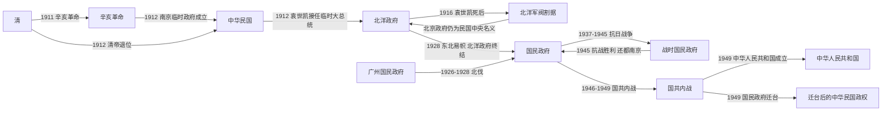

# 民国

## 时间

1912年-1949年。本目录按中国大陆近现代史的朝代 / 政权更替口径，重点整理中华民国在中国大陆的历史阶段。

## 别称

中华民国、民国时期。1912年初为南京临时政府，1912年-1928年通常称北洋政府时期，1927年-1949年通常称国民政府时期或南京国民政府时期。

## 概括

民国时期始于辛亥革命后清帝退位和中华民国建立，结束于1949年中华人民共和国成立和国民政府迁台。它是中国从帝制王朝向现代国家转型的关键阶段，政治上经历临时政府、北洋政府、军阀割据、国民政府、抗日战争和国共内战；制度上尝试共和、宪政、政党政治、训政、地方自治和现代行政建设；社会经济上则伴随城市化、现代教育、工业化尝试和长期战争破坏。

民国不是稳定统一的单一政权阶段，而是多个政治中心和军事集团竞争的时期。北洋政府继承清末新军和中央官僚体系，却受军阀政治牵制；国民政府通过北伐取得名义统一，但地方实力派、对日战争和国共冲突持续改变国家结构。

## 演进流程

## 阶段

| 顺序 | 名称 | 时间 | 简要概括 |
|---:|---|---|---|
| 1 | 南京临时政府 | 1912年1月-1912年4月 | 孙中山任临时大总统，中华民国临时政府成立；为促成清帝退位，政权移交袁世凯。 |
| 2 | [北洋时期](/%E4%BA%BA%E6%96%87%E7%A7%91%E5%AD%A6/%E5%8E%86%E5%8F%B2-%E4%B8%AD%E5%9B%BD/%E6%9C%9D%E4%BB%A3/%E6%B0%91%E5%9B%BD/%E5%8C%97%E6%B4%8B%E6%97%B6%E6%9C%9F.md) | 1912年-1928年 | 北洋集团掌握北京中央政府，袁世凯、皖系、直系、奉系等势力先后主导政局。 |
| 3 | [国民政府时期](/%E4%BA%BA%E6%96%87%E7%A7%91%E5%AD%A6/%E5%8E%86%E5%8F%B2-%E4%B8%AD%E5%9B%BD/%E6%9C%9D%E4%BB%A3/%E6%B0%91%E5%9B%BD/%E5%9B%BD%E6%B0%91%E6%94%BF%E5%BA%9C%E6%97%B6%E6%9C%9F.md) | 1927年-1949年 | 国民政府经北伐取得名义统一，经历南京十年、抗日战争和国共内战，1949年迁台。 |

## 统治结构

### 国家元首

| 阶段 | 角色 | 说明 |
|---|---|---|
| 南京临时政府 | 临时大总统 | 孙中山任临时大总统，后由袁世凯接任。 |
| 北洋时期 | 临时大总统、大总统、摄政或临时执政等 | 袁世凯、黎元洪、冯国璋、徐世昌、曹锟、段祺瑞等先后主导或担任国家元首。 |
| 国民政府时期 | 国民政府主席、国民政府委员会、总统 | 国民党以党国体制组织政权，1948年行宪后设总统、副总统。 |

### 政府首脑与行政中枢

| 阶段 | 角色 | 说明 |
|---|---|---|
| 北洋时期 | 国务总理、内阁 | 形式上实行责任内阁，但常受军阀、总统和国会斗争影响。 |
| 国民政府时期 | 行政院院长 | 五院制下行政院为最高行政机关，实际权力与国民党中枢、军事委员会和蒋介石个人权威密切相关。 |

### 实际最高领导人与军事集团

| 阶段 | 实际权力核心 | 说明 |
|---|---|---|
| 北洋时期 | 北洋军阀及各派首领 | 袁世凯死后，皖系、直系、奉系等军阀控制中央或地方。 |
| 国民政府时期 | 国民党中枢、军事委员会、地方实力派 | 南京国民政府名义统一全国，但桂系、阎锡山、冯玉祥、东北军等地方势力仍有独立性。 |

## 说明

- 1912年1月1日，中华民国临时政府在南京成立。
- 1912年2月12日，清帝退位，清朝结束。
- 袁世凯掌权后，北京成为中央政治中心；1916年袁世凯死后，北洋集团分裂为多个军阀派系。
- 1926年国民革命军北伐，1928年东北易帜后，南京国民政府取得名义统一。
- 1937年全面抗日战争爆发，国民政府迁都重庆，战时体制加强。
- 1945年抗战胜利后国共冲突升级，1949年中华人民共和国成立，国民政府迁往台湾。

## 相关

- [北洋时期](/%E4%BA%BA%E6%96%87%E7%A7%91%E5%AD%A6/%E5%8E%86%E5%8F%B2-%E4%B8%AD%E5%9B%BD/%E6%9C%9D%E4%BB%A3/%E6%B0%91%E5%9B%BD/%E5%8C%97%E6%B4%8B%E6%97%B6%E6%9C%9F.md)
- [北洋军阀](/%E4%BA%BA%E6%96%87%E7%A7%91%E5%AD%A6/%E5%8E%86%E5%8F%B2-%E4%B8%AD%E5%9B%BD/%E6%9C%9D%E4%BB%A3/%E6%B0%91%E5%9B%BD/%E5%8C%97%E6%B4%8B%E5%86%9B%E9%98%80.md)
- [国民政府时期](/%E4%BA%BA%E6%96%87%E7%A7%91%E5%AD%A6/%E5%8E%86%E5%8F%B2-%E4%B8%AD%E5%9B%BD/%E6%9C%9D%E4%BB%A3/%E6%B0%91%E5%9B%BD/%E5%9B%BD%E6%B0%91%E6%94%BF%E5%BA%9C%E6%97%B6%E6%9C%9F.md)
- [清](/%E4%BA%BA%E6%96%87%E7%A7%91%E5%AD%A6/%E5%8E%86%E5%8F%B2-%E4%B8%AD%E5%9B%BD/%E6%9C%9D%E4%BB%A3/%E6%B8%85/README.md)
