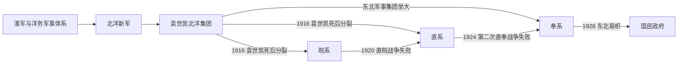

# 北洋军阀

## 时间

约1912年-1928年。其政治影响可追溯到清末北洋新军，余波延续到国民政府初期的地方实力派格局。

## 概括

北洋军阀是由清末北洋新军系统发展出的军事政治集团。袁世凯掌握北洋军后，以其为基础控制清末和民国初年政局。袁世凯死后，北洋集团失去统一核心，分裂为皖系、直系、奉系等派系，各派通过军队、地盘、财政和北京中央政府展开竞争。

北洋军阀并不是单一组织，而是以北洋军事系统为共同来源的派系网络。它承接晚清新军、淮军和地方督抚政治，又开启民国军阀割据格局。

## 主要派系

| 派系 | 代表人物 | 主要地盘 / 影响 | 概括 |
|---|---|---|---|
| 袁系核心 | 袁世凯 | 北京中央政府、北洋军 | 袁世凯在世时维持北洋集团统一，是民国初年最强政治军事力量。 |
| 皖系 | 段祺瑞、徐树铮 | 安徽系人脉、北京政府、参战军 | 1916年后主导北京政局，1920年直皖战争失败后衰落。 |
| 直系 | 冯国璋、曹锟、吴佩孚 | 直隶、湖北、河南等 | 直皖战争后兴起，与奉系多次争夺中央控制权。 |
| 奉系 | 张作霖、张学良 | 东北 | 以东北为基地，第二次直奉战争后入关影响北京政局，1928年东北易帜后归附南京国民政府。 |
| 其他相关势力 | 阎锡山、冯玉祥等 | 山西、西北等 | 与北洋政局密切互动，但不完全等同于传统北洋嫡系。 |

## 说明

- 北洋军阀的根源在清末袁世凯编练的新建陆军和北洋新军。
- 淮军、洋务军事学堂和清末新政为北洋系统提供了制度和人才基础。
- 袁世凯死后，缺乏共同权威，各派围绕北京政府、总统、国会、财政和铁路借款等资源展开竞争。
- 军阀战争使中央权威衰弱，也加重地方财政、兵役和社会负担。
- 北洋军阀格局的结束，不等于地方军事政治立刻消失；国民政府时期仍有地方实力派和新军阀问题。

## 图像

## 演变关系

## 相关

- [北洋时期](/%E4%BA%BA%E6%96%87%E7%A7%91%E5%AD%A6/%E5%8E%86%E5%8F%B2-%E4%B8%AD%E5%9B%BD/%E6%9C%9D%E4%BB%A3/%E6%B0%91%E5%9B%BD/%E5%8C%97%E6%B4%8B%E6%97%B6%E6%9C%9F.md)
- [淮军](/%E4%BA%BA%E6%96%87%E7%A7%91%E5%AD%A6/%E5%8E%86%E5%8F%B2-%E4%B8%AD%E5%9B%BD/%E6%9C%9D%E4%BB%A3/%E6%B8%85/%E6%B7%AE%E5%86%9B.md)
- [国民政府时期](/%E4%BA%BA%E6%96%87%E7%A7%91%E5%AD%A6/%E5%8E%86%E5%8F%B2-%E4%B8%AD%E5%9B%BD/%E6%9C%9D%E4%BB%A3/%E6%B0%91%E5%9B%BD/%E5%9B%BD%E6%B0%91%E6%94%BF%E5%BA%9C%E6%97%B6%E6%9C%9F.md)
