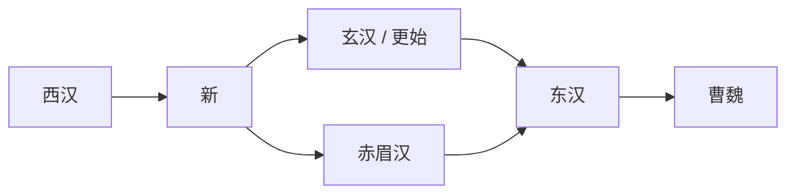

# 汉朝世系

## 概括

本表按政治演变顺序列出西汉、新朝、玄汉、赤眉汉和东汉的主要统治者。西汉、东汉是汉朝正统主线；新朝、玄汉、赤眉汉属于[两汉交替](/%E4%BA%BA%E6%96%87%E7%A7%91%E5%AD%A6/%E5%8E%86%E5%8F%B2-%E4%B8%AD%E5%9B%BD/%E6%9C%9D%E4%BB%A3/%E6%B1%89/%E4%B8%A4%E6%B1%89%E4%BA%A4%E6%9B%BF.md)时期的重要政权节点。

年号制度到汉武帝时期才正式形成。汉初诸帝没有正式年号，表中以“无正式年号”标注；汉武帝以前的“前元、后元”等属于后世整理纪年口径，不等同于成熟年号制度。

## 西汉

|  顺序 | 姓名     | 庙号       | 谥号        | 年号                               | 在位时间                          | 生卒时间              | 与前任关系                   | 关键事件 / 备注 / 说明                                                  |
| --: | ------ | -------- | --------- | -------------------------------- | ----------------------------- | ----------------- | ----------------------- | --------------------------------------------------------------- |
|   1 | **刘邦** | 太祖       | 高皇帝       | 无正式年号                            | 前207年-前202年为汉王；前202年-前195年为皇帝 | 前256年或前247年-前195年 | 秦末起兵，楚汉相争胜出后建立汉朝        | 前202年垓下之战后称帝；定都长安；剪除异姓王，确立汉初秩序。                                 |
|   2 | 刘盈     | 无        | 孝惠皇帝      | 无正式年号                            | 前195年-前188年                   | 前210年-前188年       | 刘邦之子                    | 吕后临朝，汉初休养生息政策延续。                                                |
|   3 | 刘恭     | 无        | 无通行帝谥     | 无正式年号                            | 前188年-前184年                   | 不详-前184年          | 名义上为刘盈之子，继惠帝后被吕后立为皇帝    | 吕后摄政时期傀儡皇帝，后被废杀；史称前少帝。                                          |
|   4 | 刘弘     | 无        | 无通行帝谥     | 无正式年号                            | 前184年-前180年                   | 不详-前180年          | 名义上为刘盈之子，继前少帝后被吕后立为皇帝   | 吕后摄政时期傀儡皇帝，诸吕之乱后被废；史称后少帝。                                       |
|   5 | **刘恒** | 太宗       | 孝文皇帝      | 无正式年号                            | 前180年-前157年                   | 前203年-前157年       | 刘邦之子；诸吕之乱后由大臣迎立，非前任直系继承 | 文景之治开启，轻徭薄赋，恢复社会经济。                                             |
|   6 | 刘启     | 无        | 孝景皇帝      | 无正式年号                            | 前157年-前141年                   | 前188年-前141年       | 刘恒之子                    | 文景之治延续；平定[七国之乱](/%E4%BA%BA%E6%96%87%E7%A7%91%E5%AD%A6/%E5%8E%86%E5%8F%B2-%E4%B8%AD%E5%9B%BD/%E6%9C%9D%E4%BB%A3/%E6%B1%89/%E4%B8%83%E5%9B%BD%E4%B9%8B%E4%B9%B1.md)，削弱诸侯王。 |
|   7 | **刘彻** | 世宗       | 孝武皇帝      | 建元、元光、元朔、元狩、元鼎、元封、太初、天汉、太始、征和、后元 | 前141年-前87年                    | 前156年-前87年        | 刘启之子                    | 汉武盛世；汉匈战争；张骞通西域；推行盐铁、均输、察举等政策；晚年发生巫蛊之祸。                         |
|   8 | 刘弗陵    | 无        | 孝昭皇帝      | 始元、元凤、元平                         | 前87年-前74年                     | 前94年-前74年         | 刘彻之子                    | 霍光辅政，昭宣中兴开始。                                                    |
|   9 | 刘贺     | 无        | 无帝谥；后封海昏侯 | 元平                               | 前74年，约27日                     | 前92年-前59年         | 刘彻之孙、昌邑哀王刘髆之子；继昭帝后被霍光迎立 | 即位后很快被霍光废黜，史称昌邑王、汉废帝。                                           |
|  10 | **刘询** | 中宗       | 孝宣皇帝      | 本始、地节、元康、神爵、五凤、甘露、黄龙             | 前74年-前49年                     | 前91年-前49年         | 刘彻曾孙；继刘贺被废后由霍光迎立        | 昭宣中兴高峰；清除霍氏势力，强化皇权。                                             |
|  11 | 刘奭     | 高宗（后除庙号） | 孝元皇帝      | 初元、永光、建昭、竟宁                      | 前49年-前33年                     | 前75年-前33年         | 刘询之子                    | 西汉后期外戚、儒臣政治影响上升。                                                |
|  12 | 刘骜     | 统宗（后除庙号） | 孝成皇帝      | 建始、河平、阳朔、鸿嘉、永始、元延、绥和             | 前33年-前7年                      | 前51年-前7年          | 刘奭之子                    | 王氏外戚势力扩大，西汉皇权衰弱。                                                |
|  13 | 刘欣     | 无        | 孝哀皇帝      | 建平、太初元将、元寿                       | 前7年-前1年                       | 前25年-前1年          | 刘骜侄，定陶恭王刘康之子；成帝无子后被立    | 西汉后期政治衰弱延续。                                                     |
|  14 | 刘衎     | 元宗（后除庙号） | 孝平皇帝      | 元始                               | 前1年-6年                        | 前9年-6年            | 刘欣堂弟，元帝之孙、中山孝王刘兴之子      | 王莽摄政，西汉皇权被架空。                                                   |
|  15 | 刘婴     | 无        | 孺子        | 居摄、初始                            | 6年-8年，未正式称帝，多为王莽摄政下的皇太子 / 孺子  | 5年-25年            | 刘衎族子；平帝死后由王莽拥立          | 8年王莽篡汉，西汉结束；刘婴未真正亲政。                                            |

## 新朝与两汉交替政权

| 顺序 | 政权 | 姓名 | 庙号 | 谥号 | 年号 | 在位时间 | 生卒时间 | 与前任关系 | 关键事件 / 备注 / 说明 |
|---:|---|---|---|---|---|---|---|---|---|
| 1 | 新 | 王莽 | 新始祖（一作新太祖） | 无通行传统帝谥；称建兴帝 | 始建国、天凤、地皇 | 9年-23年 | 前45年-23年 | 原为西汉外戚和摄政者，代刘婴称帝 | 建立新朝，推行复古改制；政策频繁更张，最终在绿林、赤眉等起义中败亡。 |
| 2 | 玄汉 / 更始政权 | 刘玄 | 延宗（正统性有争议） | 武顺王 | 更始 | 23年-25年 | 不详-25年 | 西汉宗室，被绿林军拥立；继新朝崩溃后控制长安 | 推翻新朝后未能稳定天下，后被赤眉军击败。 |
| 3 | 赤眉汉 | 刘盆子 | 无 | 无通行帝谥 | 建世 | 25年-27年 | 10年-不详 | 西汉宗室，被赤眉军拥立；与更始政权并立后入长安 | 赤眉军拥立的皇帝，后向东汉投降。 |

## 东汉

| 顺序 | 姓名 | 庙号 | 谥号 | 年号 | 在位时间 | 生卒时间 | 与前任关系 | 关键事件 / 备注 / 说明 |
|---:|---|---|---|---|---|---|---|---|
| 1 | **刘秀** | 世祖 | 光武皇帝 | 建武、建武中元 | 25年-57年 | 前5年-57年 | 西汉宗室，长沙定王刘发之后；在两汉交替中建立东汉 | 定都洛阳；平定群雄，开创光武中兴。 |
| 2 | 刘庄 | 显宗 | 孝明皇帝 | 永平 | 57年-75年 | 28年-75年 | 刘秀之子 | 明章之治开始；东汉国力稳定。 |
| 3 | 刘炟 | 肃宗 | 孝章皇帝 | 建初、元和、章和 | 75年-88年 | 58年-88年 | 刘庄之子 | 明章之治延续。 |
| 4 | 刘肇 | 穆宗（后除庙号） | 孝和皇帝 | 永元、元兴 | 88年-105年 | 79年-105年 | 刘炟之子 | 窦氏外戚被清除，宦官影响上升。 |
| 5 | 刘隆 | 无 | 孝殇皇帝 | 延平 | 105年-106年 | 105年-106年 | 刘肇之子 | 幼主即位，外戚临朝格局加重。 |
| 6 | 刘祜 | 恭宗（后除庙号） | 孝安皇帝 | 永初、元初、永宁、建光、延光 | 106年-125年 | 94年-125年 | 刘隆堂兄，清河孝王刘庆之子 | 外戚、宦官政治继续发展。 |
| 7 | 刘懿 | 无 | 无通行帝谥 | 延光 | 125年 | 不详-125年 | 刘祜堂兄弟辈宗室，济北惠王刘寿之子；阎太后迎立 | 在位很短，后被宦官集团废黜，史称少帝。 |
| 8 | 刘保 | 敬宗（后除庙号） | 孝顺皇帝 | 永建、阳嘉、永和、汉安、建康 | 125年-144年 | 115年-144年 | 刘祜之子；继刘懿被废后即位 | 梁氏外戚兴起。 |
| 9 | 刘炳 | 无 | 孝冲皇帝 | 建康、永憙 | 144年-145年 | 143年-145年 | 刘保之子 | 幼主，梁太后临朝。 |
| 10 | 刘缵 | 无 | 孝质皇帝 | 本初 | 145年-146年 | 138年-146年 | 刘炳族兄，勃海孝王刘鸿之子 | 被梁冀毒杀。 |
| 11 | 刘志 | 威宗 | 孝桓皇帝 | 建和、和平、元嘉、永兴、永寿、延熹、永康 | 146年-167年 | 132年-167年 | 刘缵族兄，蠡吾侯刘翼之子；梁冀拥立 | 诛梁冀后宦官势力扩大；党锢之祸发生。 |
| 12 | 刘宏 | 无 | 孝灵皇帝 | 建宁、熹平、光和、中平 | 168年-189年 | 156年-189年 | 刘志族子，解渎亭侯刘苌之子 | 十常侍专权；党锢之祸延续；184年黄巾之乱。 |
| 13 | 刘辩 | 无 | 弘农怀王 | 光熹、昭宁、永汉 | 189年 | 176年-190年 | 刘宏之子 | 董卓入京后被废为弘农王，后被迫自杀；史称少帝。 |
| 14 | 刘协 | 无 | 孝献皇帝 | 中平、初平、兴平、建安、延康 | 189年-220年 | 181年-234年 | 刘辩异母弟，刘宏之子；董卓废少帝后拥立 | 董卓乱政后长期被权臣控制；曹操迎至许都；220年曹丕篡汉，东汉灭亡。 |

## 追尊人物

| 姓名 | 庙号 | 谥号 | 生卒时间 | 关系 | 说明 |
|---|---|---|---|---|---|
| 刘煓 | 始祖 | 大皇帝 | 约前271年-前197年 | 刘邦之父 | 刘邦称帝后尊为太上皇，死后追尊。不是汉朝实际在位皇帝。 |

## 说明

- “在位时间（可多次）”用于区分刘邦“汉王 / 皇帝”、嬴政“秦王 / 皇帝”这类身份变化；本表在刘邦条目中保留两段。
- 刘恭、刘弘、刘懿、刘辩等统治者在正统性、称号或实际权力上存在特殊性，但为保持政权顺序，仍列入表中。
- 新朝、玄汉、赤眉汉不等同于西汉或东汉正统主线，但属于两汉政权更替的关键节点。

## 演变关系

