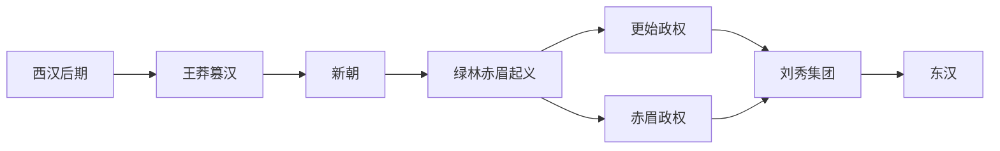

# 两汉交替

## 时间

8年-27年

## 概括

两汉交替指西汉灭亡后，新朝、绿林、赤眉、更始政权和刘秀集团相继兴起，最终由刘秀建立东汉、重新统一天下的过程。它不是简单的王朝改名，而是西汉后期政治失衡、王莽改制失败、社会危机爆发和地方军事集团重组的结果。

## 演变流程

## 主要阶段

| 阶段 | 时间 | 说明 |
|---|---|---|
| 王莽掌权 | 西汉末年-8年 | 王莽以外戚和摄政身份逐步控制朝政，最终代汉称帝。 |
| 新朝改制 | 9年-23年 | 王莽建立新朝，推行王田、币制、官名和行政区划等改革，实际执行混乱。 |
| 起义扩散 | 17年以后 | 绿林、赤眉等起义兴起，地方秩序崩溃。 |
| 昆阳之战 | 23年 | 绿林军击败新朝主力，王莽政权迅速瓦解。 |
| 更始政权 | 23年-25年 | 刘玄被拥立为更始帝，但政权组织松散，难以整合天下。 |
| 赤眉入长安 | 25年 | 赤眉军拥立刘盆子，进入长安，更始政权灭亡。 |
| 刘秀建东汉 | 25年-27年 | 刘秀称帝后逐步击败赤眉和各地割据势力，东汉秩序确立。 |

## 主要势力

| 势力 | 代表人物 | 说明 |
|---|---|---|
| 新朝 | 王莽 | 代西汉而立，试图以复古改制解决社会问题，但加剧混乱。 |
| 绿林军 | 王匡、王凤、刘玄、刘秀等 | 起于荆州一带，拥立刘玄为更始帝，是推翻新朝的主力之一。 |
| 赤眉军 | 樊崇、刘盆子等 | 起于山东一带，后拥立刘盆子，攻入长安。 |
| 更始政权 | 刘玄 | 名义上恢复汉室，但组织和控制力不足。 |
| 刘秀集团 | 刘秀、邓禹、冯异、耿弇、吴汉等 | 以河北为基础，逐步统一天下，建立东汉。 |

## 关键事件

| 事件 | 时间 | 影响 |
|---|---|---|
| 王莽篡汉 | 8年 | 西汉结束，新朝建立。 |
| 绿林、赤眉兴起 | 17年以后 | 新朝基层治理瓦解，天下动乱。 |
| 昆阳之战 | 23年 | 新朝主力被击败，王莽政权走向灭亡。 |
| 王莽被杀 | 23年 | 新朝灭亡。 |
| 刘秀称帝 | 25年 | 东汉建立，定都洛阳。 |
| 赤眉失败 | 27年 | 刘秀基本解决最主要的反对力量之一。 |

## 说明

- 王莽改制的许多目标带有复古理想，但政策频繁更张、执行成本过高，反而激化社会矛盾。
- 绿林、赤眉并非统一政党式组织，而是多支起义集团和地方军事力量的集合。
- 刘秀能胜出，关键在于以河北为根据地，逐步获得地方豪强、军功集团和士人的支持。

## 演变关系

- 前一节点：[西汉](人文科学/历史-中国/朝代/汉/西汉.md)。
- 后一节点：[东汉](人文科学/历史-中国/朝代/汉/东汉.md)。
