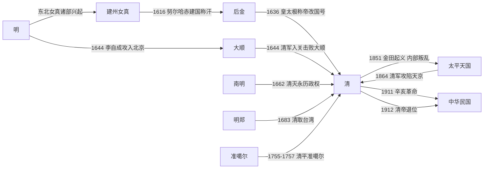

# 清

## 时间

1616年-1912年。1616年努尔哈赤建立后金，1636年皇太极改国号为大清，1644年清军入关并迁都北京，1912年清帝退位。

## 别称

后金、大清、清朝。1636年以前通常称后金，1644年以后进入以北京为都城的全国性统治阶段。

## 概括

清朝是由建州女真、满洲贵族建立的统一王朝，也是中国最后一个君主制王朝。它从东北边疆政权发展为全国性政权，入关后先后消灭大顺、大西、南明、明郑等势力，逐步完成全国统一。

清前期通过八旗、绿营、理藩院、驻藏大臣、将军辖区、盟旗等多种制度统合满洲、汉地、蒙古、新疆、西藏和东北等区域，基本奠定近代中国版图。清中期君主专制和中央集权达到高峰，但人口增长、财政压力、吏治败坏、白莲教起义等问题逐渐积累。1840年鸦片战争后，清朝进入晚清危机，列强入侵、内乱、地方军事集团兴起、洋务与新政改革交织，最终在辛亥革命中瓦解。

## 演进流程

## 阶段

| 顺序 | 名称 | 时间 | 简要概括 |
|---:|---|---|---|
| 1 | 后金与清入关前 | 1616年-1644年 | 努尔哈赤统一女真并建后金，皇太极改国号为清，完成满洲共同体和八旗国家的制度成型。 |
| 2 | 清初统一与秩序重建 | 1644年-1683年 | 清军入关后迁都北京，消灭大顺、大西、南明、三藩和明郑，完成全国统一。 |
| 3 | 康雍乾时期 | 1661年-1796年 | 康熙、雍正、乾隆三朝完成边疆扩张、制度整合和财政治理，统一多民族国家格局巩固。 |
| 4 | 嘉道以来的内外压力 | 1796年-1850年 | 白莲教起义、吏治和财政问题暴露，鸦片贸易与鸦片战争使清朝进入近代危机。 |
| 5 | 咸同光时期 | 1850年-1908年 | 太平天国、捻军、西北回乱、列强战争与洋务运动交错，湘军、淮军等地方武装影响上升。 |
| 6 | 清末新政与灭亡 | 1901年-1912年 | 庚子后推行新政、预备立宪和新军改革，但财政、铁路国有、民族与革命运动矛盾激化，辛亥革命后清帝退位。 |

## 统治结构

| 角色 | 说明 |
|---|---|
| 君主 | 爱新觉罗氏皇帝为最高统治者，兼具满洲贵族首领和中国皇帝双重合法性。 |
| 中枢行政 | 内阁、六部、都察院等沿用明制；雍正以后军机处成为高效机要中枢。 |
| 旗务与宗室 | 八旗既是军事组织，也是满洲、蒙古、汉军旗人的身份和俸饷体系；宗人府管理皇族事务。 |
| 边疆治理 | 理藩院、驻藏大臣、伊犁将军、乌里雅苏台将军、盛京将军等制度分别处理蒙古、西藏、新疆、东北等事务。 |
| 地方治理 | 省、府、州、县体系延续并扩大，总督、巡抚掌地方军政；晚清地方督抚和湘淮集团权力上升。 |
| 军事体系 | 八旗与绿营为传统正规军，晚清又出现团练、湘军、淮军、新军等武装。 |

## 说明

- 1616年，努尔哈赤在赫图阿拉称汗，建立后金，年号天命。
- 1636年，皇太极在盛京称帝，改国号为大清，并将族称由女真改为满洲。
- 1644年，李自成攻入北京，明朝全国性统治结束；吴三桂降清，多尔衮率清军入关，顺治帝迁都北京。
- 清初先后消灭大顺、大西、南明、三藩和明郑，1683年清取台湾后统一格局基本形成。
- 清前期通过平定准噶尔、治理蒙古和新疆、加强西藏管理等措施，巩固统一多民族国家版图。
- 1840年以后，鸦片战争和一系列不平等条约削弱主权，太平天国等内乱又推动地方军事集团坐大。
- 1911年辛亥革命爆发，1912年2月12日清帝退位，君主制在中国历史上的全国性统治结束。

## 相关

- [清皇帝世系](/%E4%BA%BA%E6%96%87%E7%A7%91%E5%AD%A6/%E5%8E%86%E5%8F%B2-%E4%B8%AD%E5%9B%BD/%E6%9C%9D%E4%BB%A3/%E6%B8%85/%E4%B8%96%E7%B3%BB.md)
- [八旗](/%E4%BA%BA%E6%96%87%E7%A7%91%E5%AD%A6/%E5%8E%86%E5%8F%B2-%E4%B8%AD%E5%9B%BD/%E6%9C%9D%E4%BB%A3/%E6%B8%85/%E5%85%AB%E6%97%97.md)
- [准噶尔](/%E4%BA%BA%E6%96%87%E7%A7%91%E5%AD%A6/%E5%8E%86%E5%8F%B2-%E4%B8%AD%E5%9B%BD/%E6%9C%9D%E4%BB%A3/%E6%B8%85/%E5%87%86%E5%99%B6%E5%B0%94.md)
- [太平天国](/%E4%BA%BA%E6%96%87%E7%A7%91%E5%AD%A6/%E5%8E%86%E5%8F%B2-%E4%B8%AD%E5%9B%BD/%E6%9C%9D%E4%BB%A3/%E6%B8%85/%E5%A4%AA%E5%B9%B3%E5%A4%A9%E5%9B%BD.md)
- [清末团练](/%E4%BA%BA%E6%96%87%E7%A7%91%E5%AD%A6/%E5%8E%86%E5%8F%B2-%E4%B8%AD%E5%9B%BD/%E6%9C%9D%E4%BB%A3/%E6%B8%85/%E6%B8%85%E6%9C%AB%E5%9B%A2%E7%BB%83.md)
- [湘军](/%E4%BA%BA%E6%96%87%E7%A7%91%E5%AD%A6/%E5%8E%86%E5%8F%B2-%E4%B8%AD%E5%9B%BD/%E6%9C%9D%E4%BB%A3/%E6%B8%85/%E6%B9%98%E5%86%9B.md)
- [淮军](/%E4%BA%BA%E6%96%87%E7%A7%91%E5%AD%A6/%E5%8E%86%E5%8F%B2-%E4%B8%AD%E5%9B%BD/%E6%9C%9D%E4%BB%A3/%E6%B8%85/%E6%B7%AE%E5%86%9B.md)
- [民国](/%E4%BA%BA%E6%96%87%E7%A7%91%E5%AD%A6/%E5%8E%86%E5%8F%B2-%E4%B8%AD%E5%9B%BD/%E6%9C%9D%E4%BB%A3/%E6%B0%91%E5%9B%BD/README.md)
