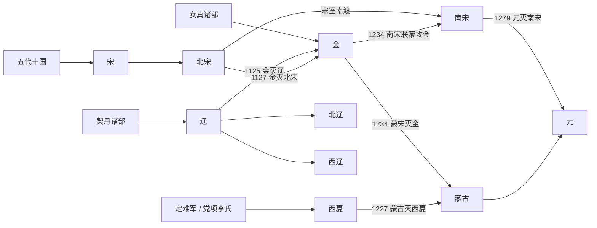

# 辽宋金西夏

## 概括

辽宋金西夏时期大致从辽朝建立的 916 年延续到南宋灭亡的 1279 年，是唐末五代之后到元朝统一之前的多政权并立时代。中原、北方草原、东北女真、西北党项与江南政权长期互动，形成战争、和议、册封、贸易和文化交流并存的格局。

这一时期不能只按单一王朝线索理解：宋朝在经济、城市、文化、科举和理学方面高度发展，但军事和边防长期受辽、金、西夏与蒙古压力；辽、金、西夏都建立了兼具本族制度和汉地制度的复合型国家；蒙古兴起后先后灭西夏、金、南宋，最终完成元朝统一。

## 演进流程

## 政权顺序

| 顺序 | 名称 | 时间 | 简要概括 |
|---:|---|---|---|
| 1 | [辽](%E8%BE%BD/README.md) | 916年-1125年 | 契丹耶律阿保机建立，控制东北、漠南与燕云地区，实行南北面官等复合制度。1125年被金灭亡。 |
| 2 | [北宋](%E5%AE%8B/%E5%8C%97%E5%AE%8B.md) | 960年-1127年 | 赵匡胤代后周建国，结束五代十国主要分裂局面；与辽、西夏长期并立，1127年靖康之变后灭亡。 |
| 3 | [西夏](%E8%A5%BF%E5%A4%8F/README.md) | 1038年-1227年 | 党项李元昊称帝建国，控制河西、陕北与宁夏一带，在宋、辽、金之间保持独立；1227年亡于蒙古。 |
| 4 | [金](%E9%87%91/README.md) | 1115年-1234年 | 女真完颜阿骨打建国，先灭辽、北宋，后与南宋对峙；13世纪受蒙古打击，1234年亡于蒙宋夹击。 |
| 5 | [南宋](%E5%AE%8B/%E5%8D%97%E5%AE%8B.md) | 1127年-1279年 | 赵构南渡后重建宋朝，定都临安，与金、蒙古长期对峙；1279年崖山海战后灭亡。 |
| 6 | [西辽](%E8%BE%BD/%E8%A5%BF%E8%BE%BD.md) | 1132年-1218年 | 耶律大石西迁中亚建立，又称喀喇契丹；1218年被蒙古灭亡。 |

## 目录

| 目录 | 内容 |
|---|---|
| [宋](%E5%AE%8B/README.md) | 北宋、南宋与宋朝皇帝世系。 |
| [辽](%E8%BE%BD/README.md) | 辽、北辽、西辽与契丹皇帝世系。 |
| [金](%E9%87%91/README.md) | 金朝概括与皇帝世系。 |
| [西夏](%E8%A5%BF%E5%A4%8F/README.md) | 党项李氏、西夏概括与皇帝世系。 |

## 关键关系

- 辽与北宋以澶渊之盟维持长期边境秩序，形成宋辽并立格局。
- 西夏位于宋、辽、金之间，常通过战争、称臣、册封和贸易维持独立空间。
- 金兴起后改变北方格局，先后灭辽、北宋，迫使宋朝南迁。
- 蒙古兴起后逐步吞并西夏、金与南宋，结束多政权并立时代。
